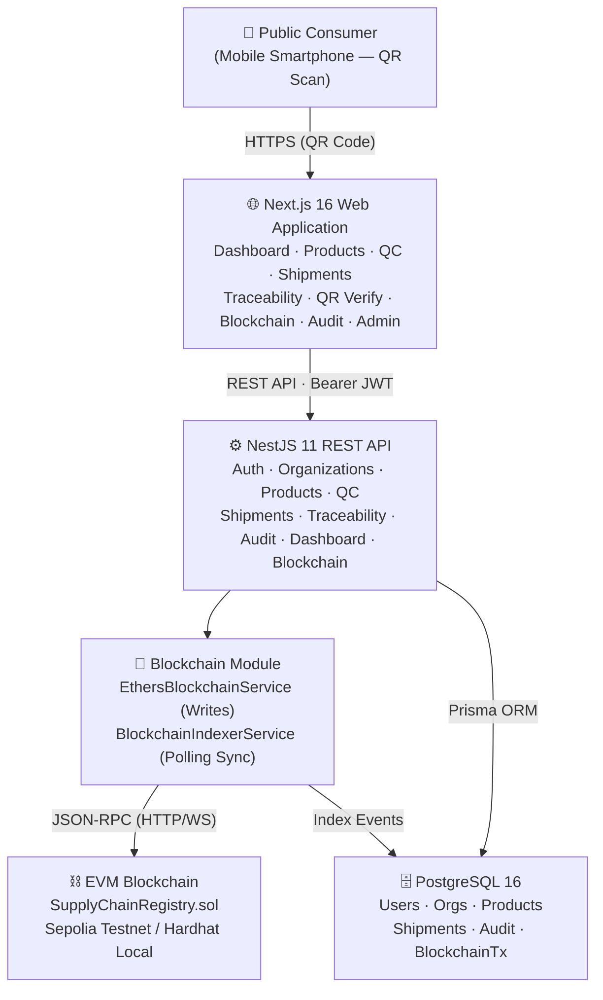
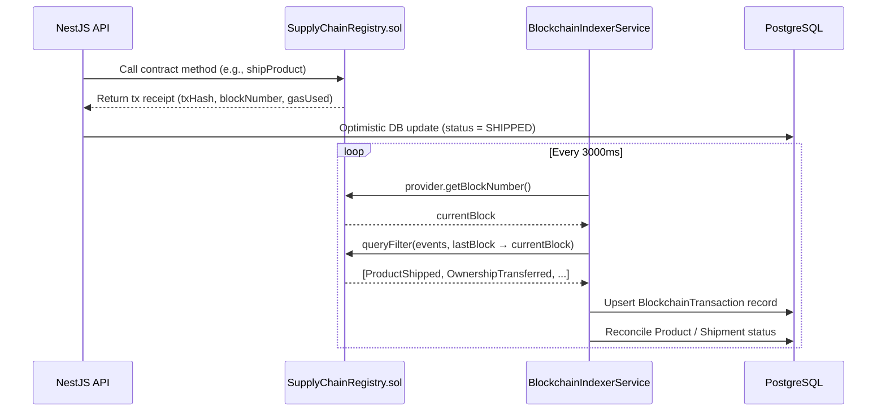
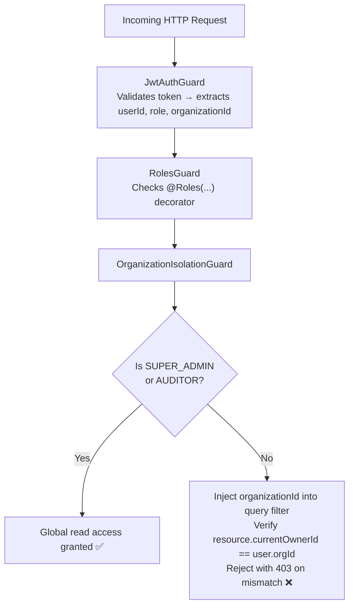
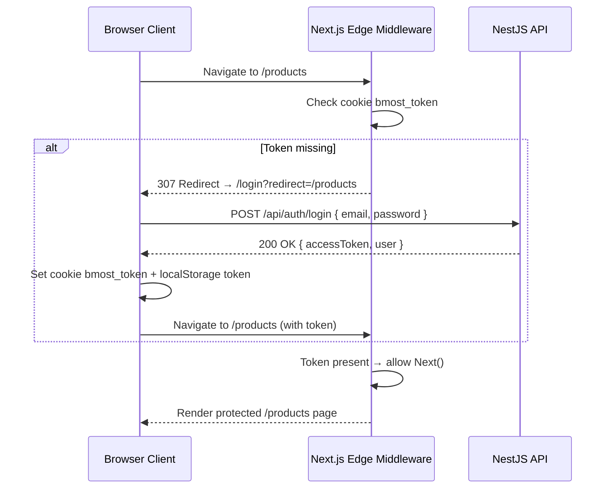
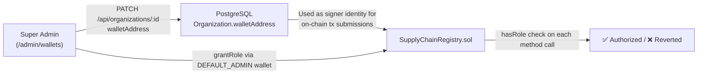
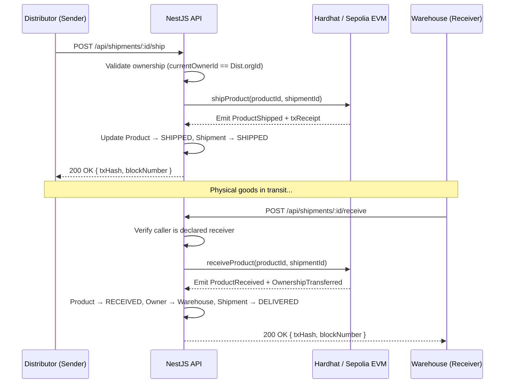
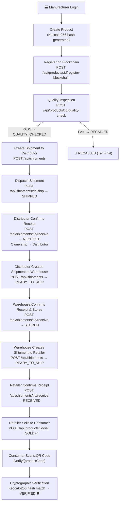

# System Architecture Specification

> **Last Updated**: September 26, 2026

## 1. High-Level System Architecture

B-MOST is built as a **Modular Monolith** organized within a pnpm monorepo workspace. It unites a high-velocity relational database for application queries with an immutable Ethereum Virtual Machine (EVM) blockchain for multi-organization trust and verification.



> [!NOTE]
> The current production deployment uses **Ethereum Sepolia Testnet** (Chain ID `11155111`) at contract address `0x74fd4f89b8ab7a3100b3291b7aeb43448f13c43a`. The local **Hardhat** node (Chain ID `31337`, port `8545`) is available for development and testing.

---

## 2. Monorepo Structure

```text
B-MOST/
├── apps/
│   ├── api/                          # NestJS 11 REST Backend
│   │   ├── prisma/                   # Prisma schema & migrations
│   │   │   ├── schema.prisma
│   │   │   └── migrations/
│   │   ├── src/
│   │   │   ├── audit/                # Audit logging module & controller
│   │   │   ├── auth/                 # JWT authentication, guards & strategies
│   │   │   ├── blockchain/           # Smart contract adapter & indexing service
│   │   │   ├── common/               # Decorators, filters, interceptors, guards
│   │   │   ├── dashboard/            # Executive analytics & metrics
│   │   │   ├── organizations/        # Multi-tenant organization CRUD
│   │   │   ├── prisma/               # PrismaClient provider
│   │   │   ├── products/             # Product lifecycle & registration
│   │   │   ├── public-verify/        # Unauthenticated QR verification endpoints
│   │   │   ├── quality-checks/       # QC inspection submission & history
│   │   │   ├── shipments/            # Shipment management & custody dispatch
│   │   │   ├── traceability/         # Authoritative provenance & hash matching
│   │   │   ├── users/                # User management & roles
│   │   │   ├── app.module.ts         # Root NestJS module
│   │   │   └── main.ts               # Application entry point with Swagger
│   │   └── test/                     # End-to-end (e2e) test suites & integration
│   │
│   └── web/                          # Next.js 16 (App Router) Frontend
│       ├── app/
│       │   ├── admin/
│       │   │   └── wallets/          # Super Admin: wallet address management UI
│       │   ├── audit/                # Compliance & audit trail UI
│       │   ├── blockchain/           # Live blockchain explorer UI
│       │   ├── login/                # Authentication & login portal
│       │   ├── products/             # Product catalog, new product, detail
│       │   ├── quality/              # Quality control portal
│       │   ├── shipments/            # Logistics & shipment tracking
│       │   ├── traceability/         # Multi-actor provenance search
│       │   ├── verify/               # Public QR consumer verification
│       │   ├── page.tsx              # Executive dashboard (/)
│       │   └── layout.tsx            # Root layout with Navbar
│       ├── components/               # Reusable UI components, Navbar, modals
│       ├── hooks/                    # React custom hooks (useAuth, useWallet)
│       ├── lib/                      # Axios API client, blockchain utils, thai-locale
│       ├── middleware.ts             # Route guard & authentication middleware
│       └── test/                     # Vitest UI test suites
│
├── packages/
│   └── contracts/                    # Smart Contracts Workspace
│       ├── contracts/
│       │   └── SupplyChainRegistry.sol
│       ├── scripts/
│       │   └── deploy.ts
│       ├── deployments/
│       │   └── hardhat.json          # Latest deployment addresses
│       ├── test/
│       │   └── SupplyChainRegistry.test.ts
│       └── hardhat.config.ts         # EVM compiler & network settings
│
├── docs/                             # Comprehensive system documentation
├── docker-compose.yml                # Full production stack (4 containers)
├── docker-compose.dev.yml            # Development stack with source sync
├── pnpm-workspace.yaml               # Monorepo workspace configuration
└── tsconfig.base.json                # Shared TypeScript compiler options
```

---

## 3. Technology Stack

### 3.1 Frontend Web Application
- **Framework**: Next.js 16.0 (App Router architecture with React Server & Client Components)
- **Styling**: Tailwind CSS 3.4 with custom design tokens for enterprise typography and badges
- **Icons**: Lucide React for consistent SVG iconography
- **State Management & Data Fetching**: TanStack Query (React Query) v5 + Axios client
- **Forms & Validation**: React Hook Form with Zod schemas
- **QR Code Engine**: `qrcode.react` for vector QR code rendering and download utilities
- **Testing**: Vitest + React Testing Library

### 3.2 Backend REST API
- **Framework**: NestJS 11.0 (TypeScript modular architecture)
- **Database ORM**: Prisma Client 6.5
- **Relational Database**: PostgreSQL 16 running on port 5433
- **Authentication**: Passport.js, Passport-JWT, bcryptjs for hashing (10 rounds)
- **API Documentation**: `@nestjs/swagger` with OpenAPI 3.0 specs at `/api/docs`
- **Validation**: `class-validator` and `class-transformer` globally configured with strict whitelisting

### 3.3 Blockchain & Ledger
- **Smart Contract Language**: Solidity `^0.8.24`
- **Development & Testing Framework**: Hardhat 2.22
- **Standard Libraries**: OpenZeppelin Contracts v5 (AccessControl)
- **Client Integration Library**: Ethers.js v6 for JSON-RPC provider and contract invocation
- **Local EVM Node**: Hardhat Network on port 8545 (Chain ID 31337)
- **Production Network**: Ethereum Sepolia Testnet (Chain ID 11155111)

---

## 4. Architectural Boundaries & Principles

### 4.1 Strict Separation of Concerns
1. **Frontend Boundary**: The Next.js frontend has zero direct connection to PostgreSQL or the EVM RPC node. All communications flow through the NestJS REST API.
2. **Blockchain Boundary**: Other NestJS business modules (`ProductsModule`, `ShipmentsModule`, `QualityChecksModule`) never invoke raw JSON-RPC commands. They depend strictly on the `BlockchainService` interface.
3. **Database Boundary**: Only backend services interact with Prisma ORM.

### 4.2 Dual-Layer Data Responsibility Matrix
- **PostgreSQL**: Acts as the authoritative index for fast search, pagination, relational queries, user identity, and UI layout metadata.
- **Blockchain**: Acts as the authoritative source of truth for **proof of existence**, **cryptographic integrity**, **ownership custody**, and **irreversible state transitions**.

---

## 5. Blockchain Integration & Indexer Architecture



### 5.1 Deterministic Cryptographic Fingerprint

To verify that operational product records in PostgreSQL have not been altered, B-MOST computes a deterministic Keccak-256 hash:

$$\text{ProductHash} = \text{keccak256}\Big(\text{productCode} \parallel \text{serialNumber} \parallel \text{manufacturerId} \parallel \text{name}\Big)$$

When queried via `/api/traceability/:code` or `/api/public/verify/:productCode`:
1. The backend recalculates the Keccak-256 hash from the live PostgreSQL record.
2. The backend queries the smart contract via `getProduct(productId)`.
3. If the recalculated hash exactly matches `product.productHash` stored on-chain, the system returns `VERIFIED`. If any character was altered in PostgreSQL, the status returns `MISMATCH`.

---

## 6. Multi-Tenant Data Isolation



Every database write and state modification verifies that the caller's organization owns the resource:
- Manufacturers can only register products under their own organization ID.
- Organizations can only create shipments for products currently in their legal ownership.
- Only the declared shipment receiver can execute the `receive` action to transfer custody.

### 6.1 Frontend Edge Route Guarding & Authentication Lifecycle



- **Public Whitelist**: `/login`, `/verify`, `/verify/:code`, static assets (`/_next`, `/favicon.ico`) bypass Edge middleware.
- **Route Aliasing**: Middleware automatically rewrites legacy paths (e.g., `/dashboard` ──► `/`, `/quality-checks` ──► `/quality`).
- **Profile Synchronization**: The client `useAuth` hook validates the active session on initial load against `GET /api/auth/me`. If the token is invalid or expired, the user is cleanly logged out and redirected.

---

## 7. Wallet Address & On-Chain Role Management

Super Admins can manage organization and user wallet addresses via `/admin/wallets`. This is a two-layer process:



> [!IMPORTANT]
> Setting a wallet address in `/admin/wallets` does **not** automatically grant on-chain roles. The `DEFAULT_ADMIN_ROLE` holder must separately call `grantRole` on the smart contract. See [WALLET_ROLES.md](WALLET_ROLES.md) for current address-to-role mapping.

---

## 8. End-to-End Sequence: Custody Transfer



---

## 9. Complete Supply Chain Workflow



---

## 10. Resilience & Error Handling

1. **Transactional Reversions**: All multi-step database mutations use Prisma interactive transactions (`prisma.$transaction`) to prevent orphan states if an operation aborts mid-flight.
2. **Blockchain Timeout Protection**: Blockchain RPC invocations are handled with timeout fallbacks and translated into clean HTTP error payloads:
   - `PRODUCT_NOT_FOUND` (404)
   - `INVALID_STATE_TRANSITION` (400)
   - `UNAUTHORIZED_ACTION` (403)
   - `TRANSACTION_FAILED` (500)
3. **Audit Log Resiliency**: Audit logging is implemented through a global `AuditInterceptor`. If an audit record insertion encounters an internal database glitch, it fails gracefully without blocking the user's primary transaction.
4. **Blockchain Indexer Recovery**: On API restart, the `BlockchainIndexerService` replays all events from the last indexed block number stored in PostgreSQL, ensuring no on-chain events are permanently missed during downtime.
