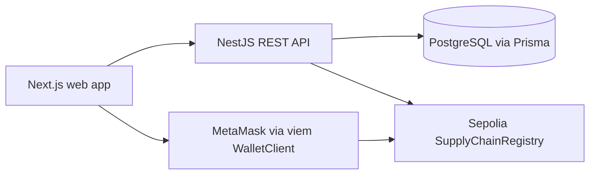

# System architecture

## Components

```mermaid
flowchart LR
  Browser[Next.js web app] --> API[NestJS REST API]
  Browser --> Wallet[MetaMask via viem WalletClient]
  Wallet --> Chain[Sepolia SupplyChainRegistry]
  API --> DB[(PostgreSQL via Prisma)]
  API --> Chain
```

The web app uses JWT-protected API resources and a browser wallet for blockchain writes. The API handles authentication, application permissions, organization checks, action preparation, chain reads, receipt/event verification, database synchronization, audit data, and blockchain event indexing. `BlockchainService.getSigner()` is disabled and throws; ordinary writes use the connected wallet.

## Transaction flow

```mermaid
sequenceDiagram
  participant Web as Web app
  participant API as NestJS API
  participant Wallet as MetaMask/viem
  participant Chain as Sepolia
  participant DB as PostgreSQL
  Web->>API: POST /api/blockchain/actions/prepare (JWT, action, entityId)
  API->>DB: Check user, organization, record and state; save 15-minute intent
  API->>Chain: Read contract state and simulate requested call
  API-->>Web: Function, args, expected wallet, contract, chain ID, intent ID
  Web->>Wallet: Ask connected account to sign
  Wallet->>Chain: Submit transaction
  Web->>API: POST /api/blockchain/actions/confirm (intent ID, tx hash)
  API->>Chain: Verify transaction, receipt and expected event/state
  API->>DB: Synchronize IDs, status, ownership and transaction record
  API-->>Web: verified / synced result
```

`confirm` checks the sender wallet, target contract, successful receipt, prepared call data for direct calls, and expected event or resulting chain state. An on-chain success can precede database synchronization; if confirmation fails, retry with the same intent and hash or investigate chain and DB state before creating another transaction. The indexer listens for contract events when Sepolia RPC is available.

## Data boundary

PostgreSQL holds organization and user accounts, product and shipment UUIDs, details, quality checks, intents, transactions, and audit logs. The contract holds numeric product/shipment IDs, hashes, owner wallet, status, and event history. The API compares on-chain and database references before writes. See [database IDs](DATABASE.md#database-and-blockchain-identifiers).

## Current limitations

- Older product and shipment REST routes still exist and call legacy services, but those services depend on the disabled backend signer, so they cannot perform blockchain writes. Product registration and quality-write routes explicitly return HTTP 410. Use the wallet action endpoints. Swagger descriptions on older routes may still describe previous behavior.
- The checked-in Sepolia ABI comments say function selectors and reads were checked against the deployed address, while events remain unverified. Confirm event compatibility against deployment before relying on a new event-based integration.
- Hardhat's local chain is useful for contract tests; the web and API blockchain configuration is fixed to Sepolia.
