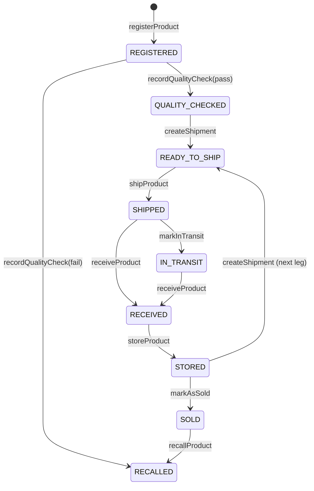
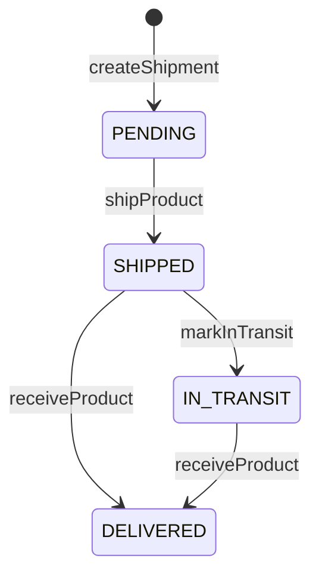
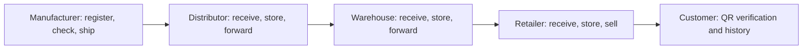

# Blockchain and product lifecycle

## Network and contract

The application targets Ethereum Sepolia (`11155111`) and `SupplyChainRegistry` at `0x74fd4f89b8ab7a3100b3291b7aeb43448f13c43a`. The API and web client contain this fixed address and validate the configured public chain values. The contract source is [`SupplyChainRegistry.sol`](../packages/contracts/contracts/SupplyChainRegistry.sol); checked-in Sepolia ABIs are in `apps/api/src/blockchain/constants/` and `apps/web/lib/blockchain/`.

Contract addresses, ABIs, public wallet addresses, and transaction hashes are public. Keep private keys, seed phrases, private RPC credentials, JWT secrets, and database passwords secret. The Hardhat package supports local contract development and tests; it is not the normal app network.

## Contract roles and application roles

The contract declares `DEFAULT_ADMIN_ROLE`, `MANUFACTURER_ROLE`, `DISTRIBUTOR_ROLE`, `WAREHOUSE_ROLE`, `RETAILER_ROLE`, `LOGISTICS_ROLE`, and `AUDITOR_ROLE`. `DEFAULT_ADMIN_ROLE` manages grants and revocations through OpenZeppelin AccessControl. The contract constructor gives the initial admin every listed role. The current API role-management prepare endpoint only offers grant/revoke of Distributor, Warehouse, and Retailer roles; it requires application `SUPER_ADMIN` plus an admin wallet on chain.

Application roles come from Prisma: `SUPER_ADMIN`, `ORG_ADMIN`, `MANUFACTURER`, `DISTRIBUTOR`, `WAREHOUSE`, `RETAILER`, `AUDITOR`, and `VIEWER`. An application role does **not** grant an on-chain role. Wallet actions require the JWT user wallet to match the connected MetaMask account; organization ownership and contract checks also apply. The [wallet guide](WALLET_ROLES.md) explains assignment.

| Action | App permission in the prepared-action path | Contract requirement | Required product state |
| --- | --- | --- | --- |
| `registerProduct` | `SUPER_ADMIN` or `MANUFACTURER`, manufacturer organization wallet | `MANUFACTURER_ROLE` | New unique product code |
| `recordQualityCheck` | `SUPER_ADMIN`, `MANUFACTURER`, or `AUDITOR`, with API organization checks | `AUDITOR_ROLE`, `MANUFACTURER_ROLE`, or current owner | `REGISTERED` |
| `createShipment` | `SUPER_ADMIN`, `MANUFACTURER`, `DISTRIBUTOR`, or `WAREHOUSE`; current owner organization wallet | Current owner or `DEFAULT_ADMIN_ROLE` | `QUALITY_CHECKED` or `STORED` |
| `shipProduct` / `markInTransit` | `SUPER_ADMIN`, `MANUFACTURER`, `DISTRIBUTOR`, or `WAREHOUSE`; sender/carrier wallet | Current owner, carrier, `LOGISTICS_ROLE`, or admin | `READY_TO_SHIP` / `SHIPPED` |
| `receiveProduct` | `SUPER_ADMIN`, `DISTRIBUTOR`, `WAREHOUSE`, or `RETAILER`; receiver organization wallet | Receiver or admin | `SHIPPED` or `IN_TRANSIT` |
| `storeProduct` | `SUPER_ADMIN`, `DISTRIBUTOR`, `WAREHOUSE`, or `RETAILER` | Current owner | `RECEIVED` |
| `markAsSold` | `SUPER_ADMIN` or `RETAILER` | Current owner | `STORED` |
| `transferOwnership` | `SUPER_ADMIN`, `MANUFACTURER`, `DISTRIBUTOR`, `WAREHOUSE`, or `RETAILER`; current owner organization wallet | Current owner | Any except `SOLD` or `RECALLED`; status unchanged |
| `recallProduct` | `SUPER_ADMIN`, `MANUFACTURER`, or `AUDITOR` | Manufacturer, current owner, `AUDITOR_ROLE`, or admin | Any except already `RECALLED`, including `SOLD` |

The contract authorizes many actions by **wallet identity**, not by the corresponding named role. For example, a Distributor wallet can create a shipment by being current owner even without `DISTRIBUTOR_ROLE`.

## Product states

`recallProduct` can also move any non-recalled state to `RECALLED`; `transferOwnership` changes only owner. There is no `RECALLED` exit in the contract. `IN_TRANSIT` is optional before receipt.

## Shipment states

`CANCELLED` exists in Solidity and Prisma enums but no contract method sets it. A shipment is a single delivery leg for one product. Receipt sets `DELIVERED`, changes product owner to the receiver, and sets product status `RECEIVED`.

## Supply-chain flow

Each downstream organization works with the **same product** and creates a new shipment after receiving and storing it. No downstream registration is needed. Public verification reads product code or serial number through the API; authenticated traceability includes broader details.

## Transaction protocol

The web app asks the API to prepare an action, uses MetaMask and viem `WalletClient` to send it, waits for a receipt, then sends the hash to the API for confirmation and synchronization. See [architecture](ARCHITECTURE.md#transaction-flow) and [API](API.md#blockchain-actions). Product and shipment contract IDs differ from their database UUIDs; see [database model](DATABASE.md#database-and-blockchain-identifiers).
