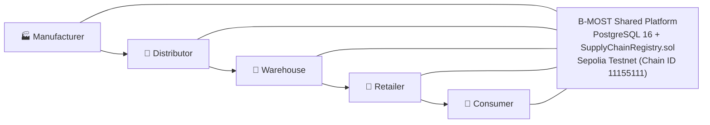
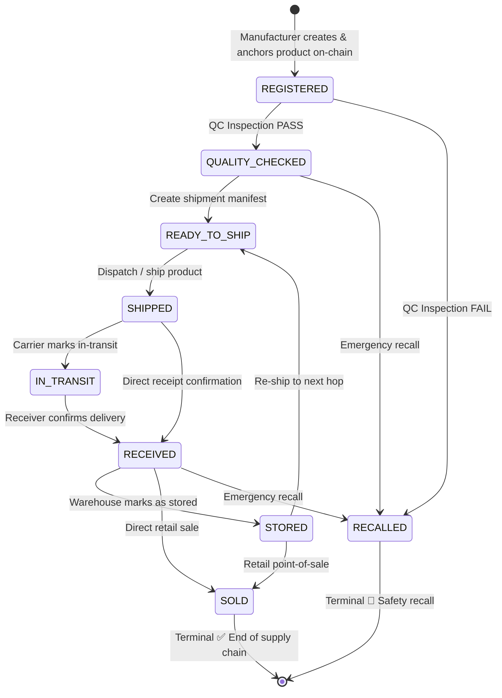

# Product Requirements Document (PRD)

> **Last Updated**: September 26, 2026

## 1. Project Overview

### Project Title
**Blockchain-Based Multi-Organization Supply Chain Traceability Platform (B-MOST)**

### Thai Title
**ระบบติดตามและตรวจสอบห่วงโซ่อุปทานหลายองค์กรด้วยเทคโนโลยีบล็อกเชน**

### System Vision
B-MOST is an enterprise-grade, web-based supply-chain provenance and traceability platform. It integrates a relational PostgreSQL operational layer with an Ethereum Virtual Machine (EVM) Smart Contract ledger to deliver transparent, tamper-resistant, verifiable, and auditable tracking of physical goods as they flow through multiple independent organizations.

---

## 2. Problem Statement

Traditional supply chain management systems rely on siloed, centralized databases maintained by individual corporate entities. This decentralized ownership of siloed data causes fundamental operational challenges:

1. **Information Asymmetry & Disjointed Silos**: Each enterprise keeps its own records in proprietary ERPs or localized spreadsheets. Reconciling discrepancies across partners requires lengthy manual audits.
2. **Data Tampering & Fraud Vulnerability**: Centralized databases can be modified retroactively by malicious actors or database administrators with privileged credentials. There is no cryptographic proof that records have not been altered.
3. **Counterfeits & Gray Market Products**: Downstream retailers and end consumers cannot definitively verify product authenticity, batch provenance, or cold-chain inspection certificates.
4. **Inefficient Recalls**: When a safety defect or contaminated batch occurs, tracing affected serial numbers back through multiple tiers of suppliers and distributors can take weeks.
5. **Auditing Friction**: Regulators and compliance auditors must manually request and verify paper trails or export logs across distinct organizational boundaries.

---

## 3. Proposed Solution

B-MOST resolves these challenges using a **Dual-Layer Storage Architecture**:

- **Off-Chain Operational Layer (PostgreSQL 16 via Prisma ORM)**: Stores user credentials, multi-tenant organization profiles, high-velocity shipment tracking details, extended descriptions, audit logs, and search indexes for sub-millisecond query response times.
- **On-Chain Immutable Ledger (Ethereum / EVM via `SupplyChainRegistry.sol`)**: Anchors critical lifecycle events (product registration, quality inspection certifications, custody transfers, retail sales, and safety recalls) together with a deterministic Keccak-256 cryptographic hash of product specifications.
- **Continuous Event Synchronization (Blockchain Indexer Service)**: Automatically monitors on-chain events (`ProductRegistered`, `QualityChecked`, `ProductShipped`, `ProductReceived`, `OwnershipTransferred`, `ProductSold`, `ProductRecalled`) and updates the relational database in real time.
- **Cryptographic Authenticity Verification**: Consumers scan a dynamic QR code (`/verify/{productCode}`) that recalculates the product's cryptographic fingerprint from current operational data and validates it against the immutable on-chain hash.

---

## 4. User Personas & Organizational Roles

### 4.1 Organizational Types

| Organization Type | Description | Primary Supply Chain Role |
|---|---|---|
| **MANUFACTURER** | Industrial fabricator / producer | Originates products, generates serial numbers, runs initial quality inspections. |
| **DISTRIBUTOR** | Wholesale logistics & distribution | Receives batches from manufacturers, organizes regional dispatches. |
| **WAREHOUSE** | Storage, cross-docking & staging | Holds inventory in staging facilities, tracks incoming/outgoing shipments. |
| **RETAILER** | Point-of-sale merchant / storefront | Receives packaged goods from warehouses, executes consumer sales. |
| **LOGISTICS** | Third-party carrier / freight forwarder | Transports goods between facilities without taking legal ownership. |
| **AUDITOR** | Independent inspection / regulatory body | Inspects compliance, verifies certificates, issues recalls across any tenant. |

### 4.2 User Roles & Access Rights

| Role | Permitted Actions |
|---|---|
| **SUPER_ADMIN** | Global platform administration: manage all organizations, assign wallet addresses via `/admin/wallets`, access global audit logs and blockchain metrics. |
| **ORG_ADMIN** | Organization administration: create and manage staff users within their organization, view tenant-specific records and shipments. |
| **MANUFACTURER** | Create products, register products on-chain, perform QC checks, create and ship dispatches. |
| **DISTRIBUTOR** | Receive dispatched products, transfer product custody, create outbound shipments to warehouses or retailers. |
| **WAREHOUSE** | Receive shipments, mark inventory as stored/warehoused, dispatch stored inventory to retail endpoints. |
| **RETAILER** | Receive warehouse shipments, sell items to consumers via `POST /api/products/:id/sell`, inspect provenance. |
| **AUDITOR** | Read-only inspection across all organizational tenants, trigger emergency product recalls (`POST /api/products/:id/recall`). |
| **VIEWER** | Read-only internal observer within an organization. |
| **CONSUMER** (Public) | Unauthenticated external actor scanning product QR codes (`/verify/[code]`) to verify authenticity. |

---

## 5. Product Lifecycle State Machine

The product lifecycle is strictly enforced by both NestJS business guards and the EVM smart contract logic:

### State Definitions:
1. **`REGISTERED` (0)**: Product metadata created by manufacturer and anchored to the blockchain with Keccak-256 hash.
2. **`QUALITY_CHECKED` (1)**: Product has passed formal quality inspection with recorded inspector credentials and notes.
3. **`READY_TO_SHIP` (2)**: Shipment record created linking sender, receiver, and carrier; waiting for physical pickup.
4. **`SHIPPED` (3)**: Dispatched from facility; custody transfer initiated.
5. **`IN_TRANSIT` (4)**: Carrier confirms goods are actively in transit.
6. **`RECEIVED` (5)**: Recipient confirms physical delivery; ownership automatically transfers to receiver.
7. **`STORED` (6)**: Goods placed in warehouse inventory or stockroom ready for downstream movement or sale.
8. **`SOLD` (7)**: Retailer has sold the unit to the end consumer. Final positive terminal state.
9. **`RECALLED` (8)**: Product revoked due to failed QC inspection, contamination, or safety alert. Reversible only by administrative override.

---

## 6. Functional Requirements

### FR-01: Authentication & Identity Management
- The system must provide secure JWT-based authentication with bcrypt-hashed passwords.
- Users must receive an access token containing `id`, `email`, `role`, and `organizationId`.
- An authenticated `/api/auth/me` endpoint must return the active user profile and organization details.

### FR-02: Multi-Tenant Organization Isolation
- Each organization must operate inside an isolated tenant boundary (`OrganizationIsolationGuard`).
- Non-admin users cannot query, modify, ship, or inspect products owned by other organizations.
- Organization entities must support registered Ethereum wallet addresses (`walletAddress`) for on-chain identity verification.

### FR-03: Product Management & Deterministic Hashing
- Manufacturers can register products with unique `productCode` and `serialNumber` values.
- A deterministic Keccak-256 hash must be generated over product metadata (`productCode`, `serialNumber`, `name`, `manufacturerId`) and stored on-chain.
- The system generates downloadable QR codes pointing to `/verify/{productCode}`.

### FR-04: On-Chain Product Anchoring
- Products must be registrable onto the `SupplyChainRegistry.sol` smart contract via `POST /api/products/:id/register-blockchain`.
- Once confirmed on-chain, the transaction receipt, block number, gas used, and blockchain product ID are indexed in PostgreSQL.

### FR-05: Quality Control & Assurance Inspections
- Authorized inspectors (`AUDITOR`, `MANUFACTURER`, `ORG_ADMIN`) can record PASS/FAIL inspection results.
- Successful inspections transition product status to `QUALITY_CHECKED`.
- Failed inspections transition product status to `RECALLED` and emit on-chain `ProductRecalled` alerts.
- Submissions create an immutable on-chain record via `recordQualityCheck(...)`.

### FR-06: Shipment & Multi-Hop Custody Transfers
- Organizations can create shipments specifying sender, recipient, carrier, origin, and destination.
- Senders dispatch shipments via `POST /api/shipments/:id/ship`, triggering `shipProduct(...)` on-chain.
- Receivers confirm receipt via `POST /api/shipments/:id/receive`, triggering `receiveProduct(...)` on-chain.
- Receipt automatically updates `currentOwnerId` in PostgreSQL and `currentOwner` on-chain to the recipient organization.

### FR-07: Retail Point of Sale Execution
- Retailers holding units in `STORED` or `RECEIVED` status can mark items as sold to consumers via `POST /api/products/:id/sell`.
- Executes `markAsSold(...)` on-chain and updates product status to `SOLD`.

### FR-08: Emergency Recalls
- Authorized auditors, manufacturers, or admins can recall products via `POST /api/products/:id/recall`.
- Executes `recallProduct(...)` on-chain with documented justification.

### FR-09: End-to-End Traceability & Provenance
- The `/api/traceability/:code` endpoint returns the complete lifecycle history, chronological event timeline, and custodial ownership chain.
- Performs real-time cryptographic hash verification: compares current PostgreSQL hash against on-chain smart contract hash.

### FR-10: Public Consumer QR Verification
- A public unauthenticated endpoint `GET /api/public/verify/:productCode` allows consumers to inspect goods.
- Exposes sanitized public metadata (product name, description, category, manufacturer, current status, verified badges, supply chain milestones).
- Strictly filters out sensitive internal data (passwords, internal IDs, user emails, organization billing addresses).

### FR-11: Blockchain Explorer & Node Inspection
- Internal explorer endpoints expose live network status (`GET /api/blockchain/status`), node block height, gas stats, and confirmed transaction ledger (`GET /api/blockchain/transactions`).
- Detailed transaction receipts and block headers can be inspected by hash and block number.

### FR-12: Declarative Audit Logging
- All significant business events (logins, creates, updates, status changes, transfers) must be captured by an `AuditInterceptor` with the `@Audit()` decorator.
- Logs capture actor ID, organization ID, action name, target entity, client IP address, and sanitized metadata payload.

### FR-13: Executive Dashboard & Analytics
- Provides real-time operational statistics (`GET /api/dashboard/statistics`) with zero fake data.
- Aggregates lifecycle stage distributions, shipment counts, organization participation, and 7-day transaction velocity.

### FR-14: Wallet Address & On-Chain Role Management
- Super Admins can assign and update Ethereum wallet addresses for organizations and users via `PATCH /api/organizations/:id` and `/admin/wallets` in the UI.
- Wallet-to-role mapping on the smart contract must be managed separately by the `DEFAULT_ADMIN_ROLE` holder.
- Current wallet assignments and on-chain roles are documented in [WALLET_ROLES.md](WALLET_ROLES.md).

---

## 7. Non-Functional Requirements

### 7.1 Security & Cryptography
- Passwords must be hashed using bcrypt with at least 10 salt rounds.
- Smart contract operations must enforce caller authorization via OpenZeppelin `AccessControl`.
- Smart contract private keys must be stored strictly in environment variables, never committed to VCS.
- Input validation must be strictly enforced using class-validator pipes with `whitelist: true` and `forbidNonWhitelisted: true`.

### 7.2 Performance & Responsiveness
- Relational API queries must return within 100ms under standard loads.
- Blockchain transactions must execute asynchronously with optimistic database updates or polling indexers to prevent HTTP request timeouts.
- Database indexes must cover all foreign keys, status fields, codes, and serial numbers.

### 7.3 Reliability & Tamper Resistance
- A supply chain action cannot be considered verified unless backed by a confirmed on-chain transaction receipt.
- Failed blockchain transactions must revert corresponding database state changes.
- PostgreSQL database transactions (`prisma.$transaction`) must be used for multi-table updates.

### 7.4 Usability & Accessibility
- The Web UI must follow enterprise SaaS standards: responsive Tailwind layout, accessible ARIA labels, Lucide icons, clear empty/loading/error states.
- The consumer verification view must be mobile-optimized for instant smartphone QR code camera scans.
- All user-facing strings must be Thai-first with critical technical terms preserved in English.

---

## 8. On-Chain vs. Off-Chain Data Matrix

| Data Item | Off-Chain (PostgreSQL) | On-Chain (EVM Contract) | Rationale |
|---|:---:|:---:|---|
| User Credentials & Passwords | ✅ | ❌ | High security, confidentiality, GDPR compliance |
| Organization Contact & Billing | ✅ | ❌ | High velocity, mutable operational information |
| Organization Wallet Address | ✅ | ✅ | Used to verify signature on-chain |
| Product Code & Serial Number | ✅ | ✅ | Unique identification across both systems |
| Product Full Description & Images | ✅ | ❌ | Heavy payload; prohibitively expensive for gas |
| Deterministic Keccak-256 Hash | ✅ | ✅ | Cryptographic anchor proving off-chain data integrity |
| Current Product Owner (Address) | ✅ | ✅ | Legal custody transfer proof |
| Product Lifecycle State Enum | ✅ | ✅ | Business rule enforcement on-chain |
| Quality Inspection Notes & Result | ✅ | ✅ | Tamper-proof compliance record |
| Shipment Logistics Details (Origin/Dest) | ✅ | ❌ | High operational detail |
| Audit Trail & Client IP Addresses | ✅ | ❌ | Sensitive compliance log |
| Historical Event Sequence | ✅ | ✅ | Immutable audit trail on smart contract |

---

## 9. Success Criteria & Verification

The B-MOST platform meets all defined success criteria when:
1. A manufacturer can register a physical product and anchor its deterministic hash on-chain.
2. An auditor or manufacturer can record a formal quality inspection that is confirmed on-chain.
3. Multi-hop shipments can be dispatched, tracked in transit, and received with automatic custody transfer across at least three distinct organizations (Manufacturer → Distributor → Warehouse → Retailer).
4. A retailer can finalize the product lifecycle by marking the item as `SOLD`.
5. An unauthenticated consumer can scan a generated QR code on a mobile device and receive instant verification confirming that the physical goods match the smart contract state with 100% hash parity.
6. The entire automated test suite (contract tests, API unit tests, e2e suites, and complete integration flow) passes with 100% success.
7. Super Admin can successfully manage wallet addresses via `/admin/wallets` and verify on-chain role assignments via `GET /api/blockchain/roles/{wallet}`.
