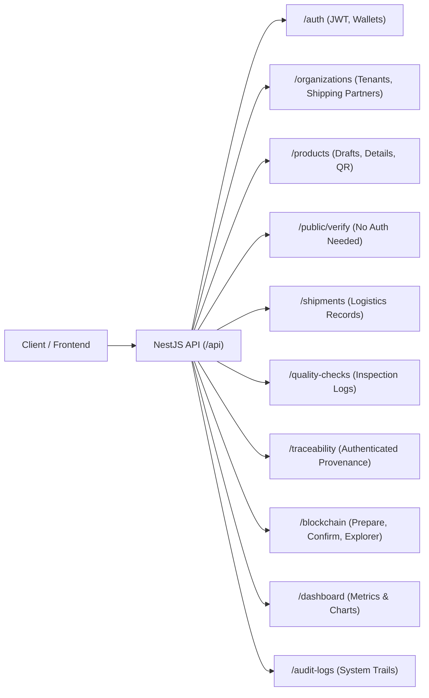

# REST API Overview & Integration Guide

The B-MOST backend API is implemented with NestJS 11 and TypeScript. It exposes RESTful resources, coordinates blockchain action preparation and confirmation, provides OpenAPI/Swagger documentation, and enforces relational integrity via Prisma ORM.

---

## 1. General API Conventions

| Parameter | Specification |
| --- | --- |
| **Base URL** | `http://localhost:4000/api` (Production: configurable via `NEXT_PUBLIC_API_URL`) |
| **API Documentation** | Interactive Swagger UI available at [`http://localhost:4000/api/docs`](http://localhost:4000/api/docs) |
| **Data Format** | JSON (`Content-Type: application/json`) |
| **Validation** | Global NestJS `ValidationPipe` with `whitelist: true`, `forbidNonWhitelisted: true`, and `transform: true` |
| **Date Format** | ISO 8601 UTC (`YYYY-MM-DDTHH:mm:ss.sssZ`) |

---

## 2. Authentication & Authorization

Protected endpoints require a JSON Web Token (JWT) passed in the `Authorization` header:
```http
Authorization: Bearer <your-jwt-token>
```

### 2.1 Core Authentication Endpoints
- `POST /api/auth/login`: Authenticates with email and password; returns JWT token and user profile.
- `GET /api/auth/me`: Returns the currently authenticated user profile, organization details, and assigned `walletAddress`.
- `PUT /api/auth/users/:id/wallet`: (Super Admin only) Updates the public Ethereum wallet address associated with a user account.

---

## 3. Major API Resource Groups



### 3.1 Authentication & Tenants (`/api/auth`, `/api/organizations`)
- Manage multi-tenant organizations (`OrganizationType`: `MANUFACTURER`, `DISTRIBUTOR`, `WAREHOUSE`, `RETAILER`, `LOGISTICS`, `AUDITOR`).
- `GET /api/organizations/shipping-partners`: Retrieves eligible logistics partners with registered wallet addresses for shipment manifests.

### 3.2 Product Lifecycle & Draft Management (`/api/products`)
- `POST /api/products`: Creates an unregistered product draft (`blockchainProductId: null`).
- `GET /api/products`: Lists products with filters for category, status, and draft/registered state.
- `GET /api/products/:id`: Retrieves full product details, including manufacturer, owner, quality checks, and shipment history.
- `GET /api/products/:id/qr`: Returns PNG binary of QR code encoding the public verification URL.
- `DELETE /api/products/:id`: Deletes a draft product (rejected if product is already registered on-chain).

### 3.3 Public Consumer Verification (`/api/public/verify`)
- **Unauthenticated**: No JWT required.
- `GET /api/public/verify/:productCode`: Returns public provenance summary, verifying data against both PostgreSQL and Sepolia contract.
- `GET /api/public/verify/:productCode/qr`: Generates public verification QR image.

### 3.4 Blockchain Actions & Operations (`/api/blockchain`)
- `POST /api/blockchain/actions/prepare`: Prepares and simulates a client-signed action; issues a 15-minute `intentId`.
- `POST /api/blockchain/actions/confirm`: Verifies transaction receipt and synchronizes database state.
- `POST /api/blockchain/verify-transaction`: Independently inspects an on-chain transaction hash.
- `GET /api/blockchain/roles/:wallet`: (Super Admin) Checks on-chain AccessControl roles for an address.
- `POST /api/blockchain/roles/prepare`: (Super Admin) Prepares `grantRole` / `revokeRole` calldata.
- `GET /api/blockchain/status`: Returns RPC node connection state, current block, and contract address.
- `GET /api/blockchain/blocks/:blockNumber`: Retrieves raw block details from Sepolia.
- `GET /api/blockchain/transactions`: Lists indexed supply chain transactions.
- `POST /api/blockchain/sync`: (Super Admin) Scans historical block ranges for contract events.

### 3.5 Operational & Compliance Resources
- `/api/quality-checks`: Read inspection records.
- `/api/shipments`: Read logistics manifests and delivery status.
- `/api/traceability`: Authenticated in-depth product lineage and custody timeline.
- `/api/dashboard`: Aggregated KPIs (total products, active shipments, quality pass rates, activity feed).
- `/api/audit-logs`: Immutable system interaction records with actor, IP, and timestamp.

---

## 4. Modern Action Flow vs Legacy Endpoints

> [!WARNING]
> **Legacy Write Routes Return HTTP 410 (Gone) or Throw Service Unavailable.**
> Normal business state changes are signed via MetaMask using the prepared action flow.

- **Explicitly Deprecated (HTTP 410 Gone)**:
  - `POST /api/products/:id/register-blockchain`
  - `POST /api/products/:id/quality-check`
  - `POST /api/quality-checks`
- **Legacy Service Routes**: Routes calling older internal methods rely on `BlockchainService.getSigner()`, which is deliberately disabled and throws `ServiceUnavailableException`.
- **Active Production Path**: All state transitions must use:
  ```text
  POST /api/blockchain/actions/prepare  →  MetaMask Signing  →  POST /api/blockchain/actions/confirm
  ```
