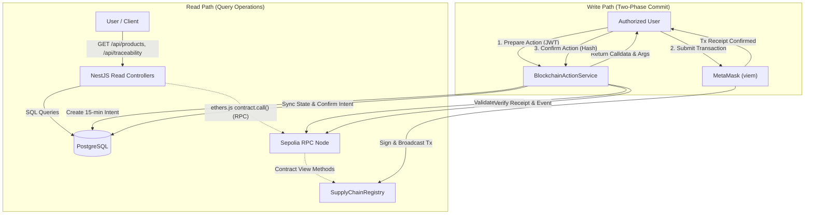

# Blockchain Architecture

This document details the blockchain architecture of the B-MOST platform, explaining how Ethereum Sepolia testnet, the `SupplyChainRegistry` smart contract, and off-chain services interact.

---

## 1. Network & Deployment Reference

| Property | Value | Notes |
| --- | --- | --- |
| **Network Name** | Ethereum Sepolia Testnet | Primary operational network |
| **Chain ID** | `11155111` (`0xaa36a7`) | Verified in both frontend and backend |
| **Contract Name** | `SupplyChainRegistry` | OpenZeppelin AccessControl implementation |
| **Deployed Address** | `0x74fd4f89b8ab7a3100b3291b7aeb43448f13c43a` | Fixed deployment address |
| **Explorer** | [Sepolia Etherscan](https://sepolia.etherscan.io/address/0x74fd4f89b8ab7a3100b3291b7aeb43448f13c43a) | Public block explorer |
| **Package Export** | `@b-most/contracts/abi` | Shared workspace ABI package |

---

## 2. On-Chain vs Off-Chain Data Storage Strategy

Smart contracts on Ethereum are optimized for minimal storage and gas efficiency, while relational databases provide flexible searching, pagination, and relational integrity.

| Aspect | On-Chain (Sepolia Smart Contract) | Off-Chain (PostgreSQL Relational DB) |
| --- | --- | --- |
| **Primary Keys** | `productId` (`uint256`), `shipmentId` (`uint256`) | `Product.id` (UUID), `Shipment.id` (UUID) |
| **Integrity Proofs** | `productCode`, `productHash` (`bytes32 keccak256`) | Full product name, description, category, serial number |
| **Ownership** | `currentOwner` (`address`), `manufacturer` (`address`) | `currentOwnerId` (Org UUID), `manufacturerId` (Org UUID) |
| **State Tracking** | Enum: `REGISTERED` (0) through `RECALLED` (8) | Enum: mirrors contract states + draft flag |
| **Logistics** | `sender`, `receiver`, `carrier`, `shippedAt`, `receivedAt` | Full address strings, coordinates, transport details |
| **Audit Trails** | Immutably emitted events + internal event array | Detailed request IP, user ID, timestamp, JSON metadata |

---

## 3. Read & Write Architecture Paths

### 3.1 Read Path
- Ordinary user interface reads (dashboards, product listings, shipment lists) query PostgreSQL directly to provide sub-50ms response times and rich filtering.
- Public product verification (`/api/public/verify/:productCode`) performs both a database lookup and an on-chain sanity check against the smart contract's `getProductByCode()` to prove that the hash matches the ledger.
- The explorer interface (`/api/blockchain/status`, `/api/blockchain/blocks/:number`) queries the Sepolia RPC directly via `ethers.JsonRpcProvider`.

### 3.2 Write Path (Non-Custodial Client Signing)
All state-modifying business actions follow the **Two-Phase Action Protocol**:
1. **Prepare Phase**: The client requests a cryptographically simulated transaction from the API. The API verifies RBAC, checks database draft state, reads live contract status to ensure valid state transitions, records a `BlockchainActionIntent` (valid for 15 minutes), and returns the exact contract function name and ABI-encoded arguments.
2. **Execution Phase**: The client's browser prompts the user via MetaMask. The user inspects gas fees and signs the transaction using their private key. The transaction is broadcast directly to the Sepolia network.
3. **Confirmation & Sync Phase**: Once the transaction receipt indicates success (`status === 1`), the client sends the transaction hash back to `/api/blockchain/actions/confirm`. The backend verifies the receipt, extracts emitted event parameters, and updates the database state atomically.

### 3.3 Rationale for Disabled Backend Signer
Previous architectures relied on server-side wallets signing transactions on behalf of organizations. In B-MOST:
- **`BlockchainService.getSigner()` throws `ServiceUnavailableException`**: The backend does not hold or accept private keys.
- **True Decentralization**: An organization's representative must hold custody of their Ethereum private key in MetaMask.
- **Non-Repudiation**: If a manufacturer recalls a product or a distributor signs for receipt, the cryptographic signature originates from their MetaMask account on-chain, creating undeniable legal proof.

---

## 4. Contract Package & ABI Synchronization

The smart contract workspace is isolated under `packages/contracts`:
- **Source**: `packages/contracts/contracts/SupplyChainRegistry.sol`.
- **Compiled Artifacts**: Generated via Hardhat (`packages/contracts/artifacts/`).
- **Synchronized ABI**: Exported at `packages/contracts/abi/SupplyChainRegistry.json` and consumed by both `apps/api` and `apps/web` via the workspace package `@b-most/contracts/abi`.
- **Validation Script**:
  - `pnpm --filter @b-most/contracts abi:sync`: Compiles the contract and exports the fresh ABI JSON.
  - `pnpm --filter @b-most/contracts abi:check`: CI gate that ensures the committed ABI matches the compiled contract artifact.

---

## 5. Event Indexing & Background Synchronization

To maintain database freshness in case of missed confirmations or direct on-chain activity:
- **`BlockchainIndexerService`**: Connects via WebSocket or polling HTTP provider to listen for contract events:
  - `ProductRegistered`
  - `QualityChecked`
  - `ShipmentCreated`
  - `ProductShipped`
  - `ShipmentInTransit`
  - `ProductReceived`
  - `ProductStored`
  - `ProductSold`
  - `ProductRecalled`
  - `OwnershipTransferred`
- **Historical Sync Endpoint**: `POST /api/blockchain/sync` (Super Admin only) allows scanning a block range (`fromBlock` to `toBlock`) to recover indexed transactions into the `BlockchainTransaction` table.

---

## 6. Information Disclosure Classification

| Classification | Items | Handling Policy |
| --- | --- | --- |
| **Public Information** | Smart Contract Address (`0x74fd...`), ABI JSON, Sepolia Chain ID (`11155111`), Transaction Hashes, Public Wallet Addresses (`0x...`) | Safe to commit in git, include in documentation, and expose in client-side bundles (`NEXT_PUBLIC_*`). |
| **Confidential Secrets** | Ethereum Private Keys, Mnemonic Seed Phrases, Database Passwords, JWT Secret, Hosted RPC API Keys (Alchemy/Infura) | **Never** commit to git, log in consoles, or send to frontend clients. Stored in `.env` or cloud secret managers. |
