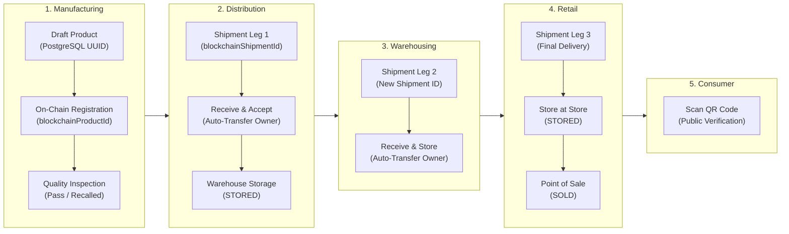
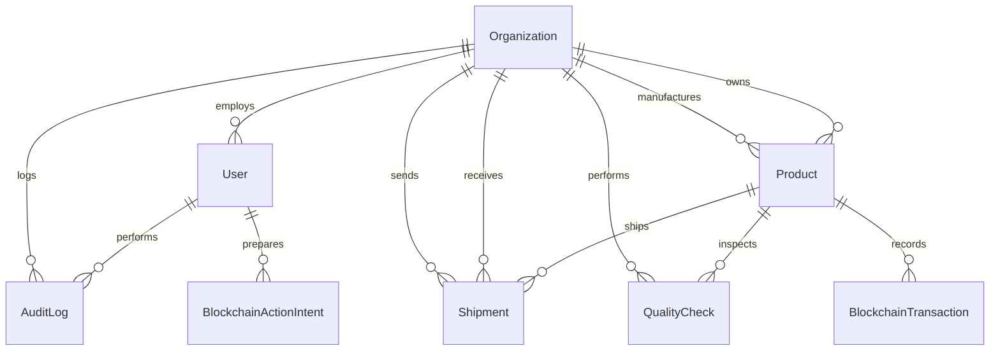
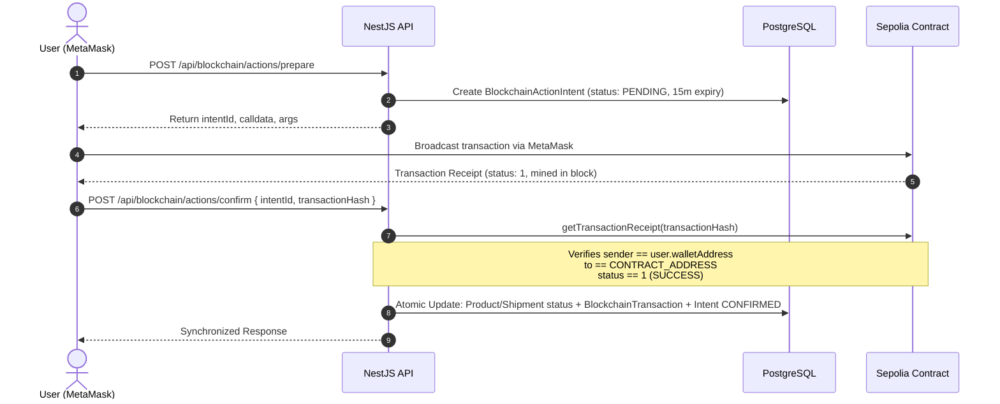

# Data Flow and Persistence Architecture

This document describes how data travels through the B-MOST system, details the Prisma relational schema, and formalizes the distinction between off-chain database identifiers and on-chain blockchain identifiers.

---

## 1. End-to-End Supply Chain Data Flow

The physical and legal journey of a product flows linearly through participating organizations:



### Core Flow Rules
1. **Single Product Origin**: The Manufacturer creates the product record once. Downstream actors (**Distributor**, **Warehouse**, **Retailer**) never create duplicate products; they receive the existing record and update custody via shipments.
2. **Multiple Shipment Legs**: Each handoff between organizations generates a **new `Shipment` record** linked to the same `Product`.
3. **Automatic Ownership Transfer**: When the recipient signs `receiveProduct(productId, shipmentId)`, the smart contract atomically transfers `product.currentOwner` to the recipient address and marks the shipment `DELIVERED`.

---

## 2. Database vs Blockchain Identifiers

> [!IMPORTANT]
> **Never confuse database UUIDs with smart-contract numeric IDs.**
> ```text
> Product.id  !=  Product.blockchainProductId
> Shipment.id !=  Shipment.blockchainShipmentId
> ```

### 2.1 The Product Identity Matrix

| Field | Type | Storage | Description | Example |
| --- | --- | --- | --- | --- |
| `Product.id` | `String` (UUIDv4) | PostgreSQL | Internal database primary key used for foreign keys and REST route params | `e2a5f10b-8d3e-4b21-a3f2-19c0de234567` |
| `Product.productCode` | `String` (Unique) | PostgreSQL & Contract | Human-readable business SKU / tracking code | `PROD-2026-0001` |
| `Product.serialNumber` | `String` (Unique) | PostgreSQL | Physical unit serial number | `SN-99887766` |
| `Product.blockchainProductId` | `String?` (Nullable) | PostgreSQL | On-chain contract numeric ID (`uint256` cast to string). `null` while in draft. | `"1"` |
| `Product.productHash` | `String?` (Hex) | PostgreSQL & Contract | `keccak256` hash of product attributes committed on-chain | `0x4a8f...` |

### 2.2 The Shipment Identity Matrix

| Field | Type | Storage | Description | Example |
| --- | --- | --- | --- | --- |
| `Shipment.id` | `String` (UUIDv4) | PostgreSQL | Internal database primary key | `9bc12345-d876-4123-b123-abcdef987654` |
| `Shipment.shipmentCode` | `String` (Unique) | PostgreSQL & Contract | Business tracking reference | `SHIP-2026-0001` |
| `Shipment.productId` | `String` (UUID) | PostgreSQL FK | References `Product.id` (off-chain UUID) | `e2a5f10b-8d3e-4b21-a3f2-19c0de234567` |
| `Shipment.blockchainShipmentId` | `String?` (Nullable) | PostgreSQL | On-chain contract numeric ID (`uint256` cast to string). `null` prior to creation. | `"1"` |

### 2.3 Uniqueness Constraints in Prisma
The Prisma schema enforces a composite unique constraint to prevent collisions across chains and contracts:
```prisma
@@unique([blockchainChainId, blockchainContractAddress, blockchainProductId])
```

---

## 3. Relational Database Schema (`Prisma`)

The authoritative schema is maintained in [`apps/api/prisma/schema.prisma`](../../apps/api/prisma/schema.prisma).



### 3.1 Key Database Models

1. **`Organization`**:
   - Represents a corporate tenant (`MANUFACTURER`, `DISTRIBUTOR`, `WAREHOUSE`, `RETAILER`, `LOGISTICS`, `AUDITOR`).
   - Stores corporate business code, contact information, and public `walletAddress`.
2. **`User`**:
   - Account identity for login with bcrypt-hashed passwords.
   - Assigned an application `UserRole` and a personal public `walletAddress`.
3. **`Product`**:
   - Holds complete descriptive metadata (name, description, category).
   - Tracks `status` (`REGISTERED`, `QUALITY_CHECKED`, `READY_TO_SHIP`, etc.).
   - Stores synchronization pointers: `blockchainProductId`, `blockchainTxHash`, `blockchainChainId`.
4. **`Shipment`**:
   - Logistics transit leg between `senderOrganization` and `receiverOrganization`, with an optional `carrierOrganization`.
   - References the product via `productId` (foreign key to `Product.id`).
5. **`QualityCheck`**:
   - Inspection log containing inspector name, result (`PASSED` or `FAILED`), notes, and `blockchainTxHash`.
6. **`BlockchainActionIntent`**:
   - Ephemeral ledger coordinator. Stores user ID, action type, prepared arguments, expiration timestamp (15 minutes), and transaction hash upon confirmation.
7. **`BlockchainTransaction`**:
   - Historical ledger of confirmed or indexed on-chain transactions, storing `txHash`, `blockNumber`, `eventType`, and involved entities.
8. **`AuditLog`**:
   - Security record capturing every critical API interaction, actor, IP address, and JSON metadata.

---

## 4. State Synchronization and Reconciliation Guarantees

Because blockchain operations and database commits cannot execute inside a single distributed ACID transaction, B-MOST adopts an **eventual consistency model with idempotency guards**:



### 4.1 Failure Scenarios & Recovery Strategies

| Failure Mode | Impact | Recovery Action |
| --- | --- | --- |
| **User rejects in MetaMask** | No transaction sent on-chain | Intent expires cleanly after 15 minutes; no database modification occurs. |
| **Transaction reverts on-chain** | Gas consumed; state unchanged on-chain | Receipt has `status === 0`. The confirm endpoint rejects with `400 Bad Request`. Database remains untouched. |
| **Network drops before confirm API call** | Transaction mined on-chain, but PostgreSQL not yet updated | The user or UI resubmits `POST /api/blockchain/actions/confirm` with the same `intentId` and `transactionHash`. The endpoint is **idempotent** and will complete the sync. |
| **Intent expires before confirmation** | 15-minute window elapses | Super Admin can trigger manual sync via `POST /api/blockchain/sync`, or the indexer service will capture the event and link it by product code / transaction hash. |

---

## 5. Product Draft Lifecycle

Before committing expensive gas fees on Sepolia, products are managed as drafts:

1. **Draft Creation**: `POST /api/products` creates a database record with `blockchainProductId: null` and status `REGISTERED`.
2. **Draft Modification**: Details can be revised freely while `blockchainProductId` is `null`.
3. **On-Chain Commitment**: The manufacturer clicks "Register on Blockchain". The API prepares `registerProduct(productCode, productHash)`, the user signs via MetaMask, and confirmation sets `blockchainProductId` and `blockchainTxHash`.
4. **Draft Deletion Rules**: A product may only be deleted from PostgreSQL if it has **not** been registered on-chain and has no associated shipment or inspection records.
