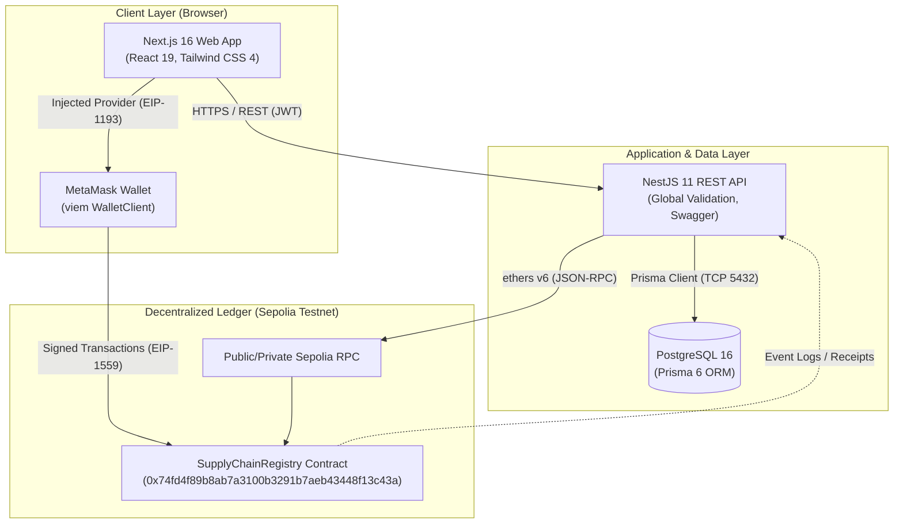

# System Architecture

B-MOST (Blockchain-Based Multi-Organization Supply Chain Traceability Platform) is an enterprise-grade supply-chain tracking system. It integrates modern web technologies, relational persistence for fast operational queries, and Ethereum Sepolia smart contracts for immutable provenance and multi-party trust.

---

## 1. High-Level Component Architecture

The platform consists of four primary tiers:
1. **Frontend Client (`apps/web`)**: Next.js 16 App Router application providing web interfaces for each supply-chain actor, integrated with MetaMask via `viem`.
2. **Backend API (`apps/api`)**: NestJS 11 REST API handling authentication, application-level role-based access control (RBAC), multi-tenant organization boundaries, action preparation, receipt verification, and database synchronization.
3. **Relational Database (PostgreSQL)**: Managed via Prisma ORM for relational queries, user accounts, drafts, audit logs, and search indexing.
4. **Blockchain Layer (Ethereum Sepolia)**: Smart contract (`SupplyChainRegistry`) enforcing ownership transitions, access control, and immutable event logs.

---

## 2. Component Responsibilities and Boundaries

### 2.1 Next.js Web Application (`apps/web`)
- **Technology Stack**: Next.js 16 (App Router), React 19, Tailwind CSS 4, `viem` v2.
- **Primary Roles**:
  - Authenticated portals for Supply Chain Actors (Manufacturer, Distributor, Warehouse, Retailer, Auditor, Admin).
  - Unauthenticated public verification page (`/verify`, `/verify/[code]`) with QR scanner and visual provenance timeline.
  - Client-side transaction management: detects MetaMask, enforces Sepolia chain ID (`11155111`), encodes contract calls, prompts user signatures, and coordinates the two-phase commit with the backend API.
- **Security Boundary**: Runs in the end-user's browser. Contains **no private keys** and **no secrets**. All write operations require user consent and private key signing inside MetaMask.

### 2.2 NestJS Backend API (`apps/api`)
- **Technology Stack**: NestJS 11, TypeScript, Prisma ORM 6, `ethers` v6.
- **Primary Roles**:
  - Authentication via JWT (`POST /api/auth/login`, `/api/auth/me`).
  - Role-based authorization (`RolesGuard`) and organization-level boundary enforcement.
  - Product draft management (allowing editing before on-chain notarization).
  - Two-phase blockchain action coordination (`POST /api/blockchain/actions/prepare` and `POST /api/blockchain/actions/confirm`).
  - Read-only simulation of smart-contract methods using `ethers` before asking the user to submit transactions on-chain.
  - Independent cryptographic verification of transaction receipts, sender addresses, target contract, and emitted events before updating PostgreSQL.
  - Background blockchain event indexing (`BlockchainIndexerService`) and transaction auditing.
- **Disabled Backend Signer**: Server-side custodial signing via `BlockchainService.getSigner()` is explicitly **disabled** and throws an exception. All normal business state changes must be signed by the connected client wallet.

### 2.3 PostgreSQL Database
- **Role**: High-performance operational data store.
- **Stored Data**:
  - Tenant entities (`Organization`), user credentials (`User`), audit trails (`AuditLog`).
  - Full product metadata, descriptions, categories, specifications, and draft statuses.
  - Shipment logistical records, origins, destinations, and timestamps.
  - Blockchain transaction logs (`BlockchainTransaction`) and pending action intents (`BlockchainActionIntent`).
- **Entity Identification**: All database models use standard UUID strings (`id: String @id @default(uuid())`). These identifiers are strictly isolated from on-chain numeric IDs (`Product.blockchainProductId`, `Shipment.blockchainShipmentId`).

### 2.4 Smart Contract Layer (`packages/contracts`)
- **Contract**: `SupplyChainRegistry.sol` deployed on Ethereum Sepolia at `0x74fd4f89b8ab7a3100b3291b7aeb43448f13c43a`.
- **Inheritance**: OpenZeppelin `AccessControl`.
- **Role**: Definitive source of truth for:
  - Product existence, code uniqueness, and cryptographic product hash (`productHash`).
  - Current legal ownership (`currentOwner` Ethereum address).
  - Lifecycle state machine (`status` enum).
  - Quality inspection reports and inspector signatures.
  - Multi-leg shipment records and carrier custody.
  - Comprehensive immutable event history.

---

## 3. Communication Protocols

| Link | Protocol | Data Format | Authentication / Verification |
| --- | --- | --- | --- |
| Web → API | HTTPS / HTTP | JSON (REST) | `Authorization: Bearer <JWT>` header |
| API → Database | PostgreSQL Wire Protocol | Binary / SQL | Database credentials (`DATABASE_URL`, `DIRECT_URL`) |
| Web → MetaMask | EIP-1193 Injected Provider | JavaScript Proxy | User wallet prompt and biometrics / password |
| MetaMask → Sepolia | JSON-RPC over HTTPS/WSS | RLP / Hex | ECDSA signature (`secp256k1`) from sender address |
| API → Sepolia | JSON-RPC over HTTPS | JSON-RPC 2.0 | `BLOCKCHAIN_RPC_URL` (read-only node provider) |

---

## 4. Frontend Route Structure

The web application organizes routes by responsibility in `apps/web/app`:

| Route | Access | Description |
| --- | --- | --- |
| `/login` | Public | Credentials-based login returning JWT token stored in secure session cookie |
| `/`, `/dashboard` | Authenticated | Metrics, KPI cards, recent activity, and pipeline status |
| `/products` | Authenticated | Product catalog, draft listing, status filters, and search |
| `/products/new` | Authenticated (Manufacturer) | Create new draft product metadata |
| `/products/[id]` | Authenticated | Detailed product view, blockchain notarization button, and timeline |
| `/quality`, `/quality-checks` | Authenticated (Auditor/Mfg) | Quality inspection queue, inspection recording, and pass/fail actions |
| `/shipments` | Authenticated | Active shipments, dispatch, in-transit marking, and delivery confirmation |
| `/traceability` | Authenticated | Comprehensive supply chain provenance search with multi-org audit history |
| `/blockchain` | Authenticated | On-chain block and transaction explorer, sync status, and transaction lookup |
| `/audit` | Authenticated | Full immutable system audit logs with actor and IP tracking |
| `/admin/wallets` | Authenticated (Super Admin) | Manage organization and user public Ethereum wallet addresses |
| `/verify`, `/verify/[code]` | Public | Consumer product verification view with authenticity badge and QR link |

---

## 5. Architectural Guarantees & Constraints

1. **Non-Custodial Integrity**: The platform never stores user private keys or seed phrases on servers, in databases, or in frontend builds.
2. **Separation of Operational & Ledger Data**: Rich business documents (extended descriptions, draft revisions, internal notes) reside in PostgreSQL, while lean, tamper-proof state proofs (hashes, status enums, wallet addresses) reside on Sepolia.
3. **Two-Phase Write Safety**: Writes are never committed to the database without cryptographic proof of on-chain finality, preventing phantom inventory or desynchronization.
