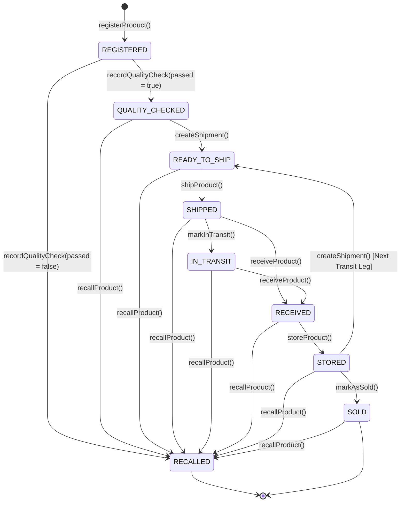
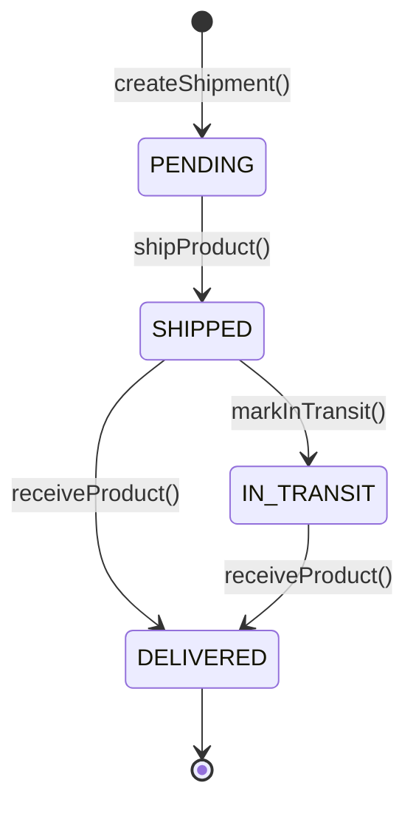

# Product and Shipment Lifecycles

This document describes the finite state machines governing products and shipments within the B-MOST platform, verified against the implementation in `SupplyChainRegistry.sol`.

---

## 1. Product Lifecycle State Machine

### 1.1 Product Status Definitions

| Status | Code | Description | Valid Preceding States | Transition Method |
| --- | --- | --- | --- | --- |
| `REGISTERED` | `0` | Product minted on-chain by authorized Manufacturer. Initial legal owner is the Manufacturer. | None (Initial state) | `registerProduct` |
| `QUALITY_CHECKED` | `1` | Product passed quality inspection by certified Auditor or Manufacturer. | `REGISTERED` | `recordQualityCheck(true)` |
| `READY_TO_SHIP` | `2` | Outbound shipment created by current owner. Packaging and paperwork ready. | `QUALITY_CHECKED`, `STORED` | `createShipment` |
| `SHIPPED` | `3` | Package handed over to logistics carrier and departed shipping facility. | `READY_TO_SHIP` | `shipProduct` |
| `IN_TRANSIT` | `4` | Carrier actively transporting goods across shipping hubs (optional intermediate state). | `SHIPPED` | `markInTransit` |
| `RECEIVED` | `5` | Recipient acknowledged delivery. Ownership atomically transferred to recipient wallet. | `SHIPPED`, `IN_TRANSIT` | `receiveProduct` |
| `STORED` | `6` | Goods safely stored in recipient warehouse bin or retail inventory. | `RECEIVED` | `storeProduct` |
| `SOLD` | `7` | Final purchase completed by consumer at retail point of sale. | `STORED` | `markAsSold` |
| `RECALLED` | `8` | Product recalled due to inspection failure or safety bulletin. **Terminal state**. | Any state except `RECALLED` | `recordQualityCheck(false)` or `recallProduct` |

---

## 2. Multi-Leg Custody Handover Loop

A core feature of the B-MOST lifecycle is that a product can move through multiple intermediate logistics legs:
1. When a product is in state `STORED` (at a Distributor or Warehouse), the current owner can initiate a **new delivery leg** by calling `createShipment()`.
2. This resets the product state to `READY_TO_SHIP`, linked to a brand-new on-chain `Shipment` struct.
3. The cycle repeats: `READY_TO_SHIP` → `SHIPPED` → `IN_TRANSIT` → `RECEIVED` → `STORED`.
4. Only when the final Retailer holds the product in `STORED` can it transition to `SOLD`.

---

## 3. Shipment Lifecycle State Machine

Each shipment represents a distinct physical transit leg between a sender and a receiver:

### 3.1 Shipment Status Definitions

| Status | Code | Meaning | Responsible Caller |
| --- | --- | --- | --- |
| `PENDING` | `0` | Manifest created; awaiting dispatch and carrier pickup | Current Owner / Admin |
| `SHIPPED` | `1` | Goods departed origin facility; tracking started | Sender / Carrier / Logistics / Admin |
| `IN_TRANSIT` | `2` | Carrier confirmed active transportation en route | Carrier / Sender / Logistics / Admin |
| `DELIVERED` | `3` | Destination organization accepted delivery; shipment finalized | Designated Receiver / Admin |
| `CANCELLED` | `4` | Enum placeholder; **no contract function triggers this transition** | Unimplemented |

> [!NOTE]
> `CANCELLED` exists in both Solidity and Prisma enums as a reserved status, but neither the smart contract nor the API implements a shipment cancellation routine. Once created, shipments must be fulfilled to transfer ownership.
