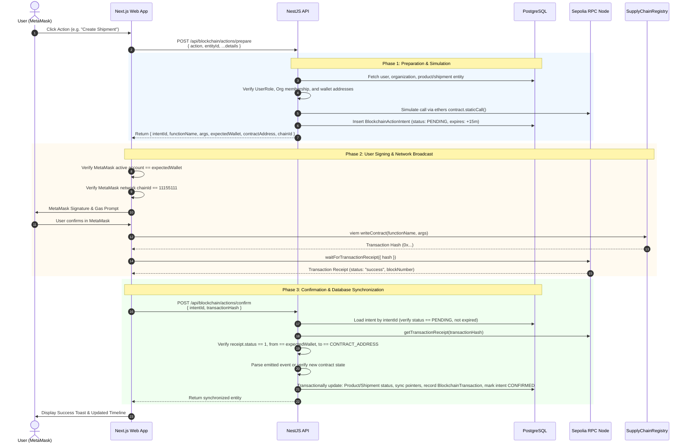

# Blockchain Transaction Protocol & Flow

This document details the two-phase commit protocol used by B-MOST to coordinate browser-based wallet transactions with PostgreSQL database state.

---

## 1. Protocol Architecture & Sequence

Because browsers execute transactions asynchronously on the public Sepolia network, B-MOST avoids custodial backend signing by implementing a **Two-Phase Action Protocol** mediated by `BlockchainActionIntent`:



---

## 2. API Endpoints Specification

### 2.1 Prepare Action
- **Endpoint**: `POST /api/blockchain/actions/prepare`
- **Guards**: `JwtAuthGuard`
- **Request Body (`PrepareBlockchainActionDto`)**:
  ```json
  {
    "action": "createShipment",
    "entityId": "e2a5f10b-8d3e-4b21-a3f2-19c0de234567",
    "receiverOrganizationId": "8f1a2345-d876-4123-b123-abcdef987654",
    "carrierOrganizationId": "7a2b3456-e987-4234-c234-bcdef0123456",
    "shipmentCode": "SHIP-2026-0042",
    "origin": "Bangkok Facility",
    "destination": "Chiang Mai Distribution Center"
  }
  ```
- **Response Payload**:
  ```json
  {
    "intentId": "d9f3b8c2-3e4a-4b78-9012-abcdef123456",
    "functionName": "createShipment",
    "args": ["SHIP-2026-0042", "1", "0x3f073b4f50D2B2486B632DFB4c7005FC449cED14", "0x0000000000000000000000000000000000000000"],
    "expectedWallet": "0x0FcD93659FA339bB05A2A12Ed7000dFD714E0998",
    "contractAddress": "0x74fd4f89b8ab7a3100b3291b7aeb43448f13c43a",
    "chainId": 11155111,
    "expiresAt": "2026-09-27T12:30:00.000Z"
  }
  ```

### 2.2 Confirm Action
- **Endpoint**: `POST /api/blockchain/actions/confirm`
- **Guards**: `JwtAuthGuard`
- **Request Body (`ConfirmBlockchainActionDto`)**:
  ```json
  {
    "intentId": "d9f3b8c2-3e4a-4b78-9012-abcdef123456",
    "transactionHash": "0x6f9b2d8e3c4a1b5d6e7f8a9b0c1d2e3f4a5b6c7d8e9f0a1b2c3d4e5f6a7b8c9d"
  }
  ```
- **Backend Verification Steps**:
  1. Intent existence and expiration check (`expiresAt > now`).
  2. Cryptographic receipt fetch from Sepolia RPC.
  3. `receipt.status === 1` (reverted transactions rejected).
  4. `receipt.to.toLowerCase() === CONTRACT_ADDRESS.toLowerCase()`.
  5. `receipt.from.toLowerCase() === intent.user.walletAddress.toLowerCase()`.
  6. Transaction synchronization: database state updated, new shipment ID populated, intent status marked `CONFIRMED`.

---

## 3. Supported Actions (`UserSignedAction`)

The enum in `apps/api/src/blockchain/dto/blockchain-action.dto.ts` maps directly to smart contract methods:

| Action Enum | Contract Method | Expected Event | Resulting Product State |
| --- | --- | --- | --- |
| `registerProduct` | `registerProduct(string,bytes32)` | `ProductRegistered` | `REGISTERED` |
| `recordQualityCheck` | `recordQualityCheck(uint256,bool,string)` | `QualityChecked` | `QUALITY_CHECKED` / `RECALLED` |
| `createShipment` | `createShipment(string,uint256,address,address)` | `ShipmentCreated` | `READY_TO_SHIP` |
| `shipProduct` | `shipProduct(uint256,uint256)` | `ProductShipped` | `SHIPPED` |
| `markInTransit` | `markInTransit(uint256,uint256)` | `ShipmentInTransit` | `IN_TRANSIT` |
| `receiveProduct` | `receiveProduct(uint256,uint256)` | `ProductReceived` | `RECEIVED` |
| `storeProduct` | `storeProduct(uint256)` | `ProductStored` | `STORED` |
| `markAsSold` | `markAsSold(uint256)` | `ProductSold` | `SOLD` |
| `transferOwnership` | `transferOwnership(uint256,address)` | `OwnershipTransferred` | State unchanged |
| `recallProduct` | `recallProduct(uint256,string)` | `ProductRecalled` | `RECALLED` |

---

## 4. Independent Verification Endpoint

- **Endpoint**: `POST /api/blockchain/verify-transaction`
- **Purpose**: Independently verifies any arbitrary Ethereum transaction hash against the deployed Sepolia contract without requiring an intent ID.
- **Returns**: Transaction confirmation details, block number, sender, gas used, and decoded supply-chain event logs.
