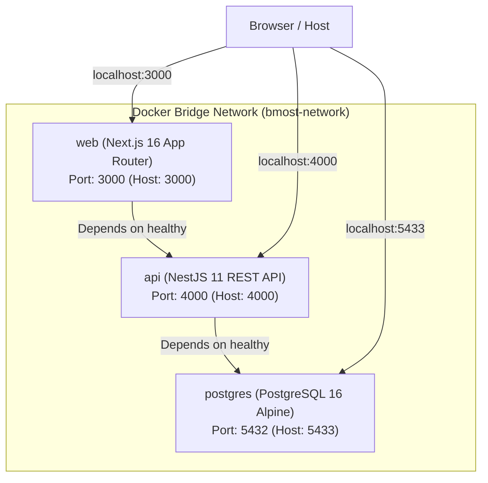

# Docker Development & Container Architecture

B-MOST provides a Docker Compose environment supporting both production-like container execution and a live-reloading development workflow with Docker Compose Watch.

---

## 1. Container Services Overview

The base [`docker-compose.yml`](../../docker-compose.yml) orchestrates three core services:



| Service | Container Name | Image / Build Target | Host Port | Container Port | Healthcheck |
| --- | --- | --- | --- | --- | --- |
| `postgres` | `bmost-postgres` | `postgres:16-alpine` | `5433` | `5432` | `pg_isready -U postgres -d bmost_db` |
| `api` | `bmost-api` | `apps/api/Dockerfile` | `4000` | `4000` | `curl -f http://localhost:4000/api` |
| `web` | `bmost-web` | `apps/web/Dockerfile` | `3000` | `3000` | `wget -q --spider http://127.0.0.1:3000/login` |

---

## 2. Development Workflow (Compose Watch)

The development override file [`docker-compose.dev.yml`](../../docker-compose.dev.yml) configures Docker Compose Watch for rapid iteration without rebuilding full containers on every code change:
- **Hot Code Sync**: Changes in `./apps/api/src`, `./apps/web/app`, `./apps/web/components`, `./apps/web/lib`, etc., are synced directly into the running containers in milliseconds.
- **Auto Rebuild**: Changes to dependencies (`package.json`, `pnpm-lock.yaml`), TypeScript configuration, or Prisma schemas automatically trigger a targeted container rebuild.

### 2.1 Starting the Development Stack
Run this one-line command from the repository root (PowerShell / Bash compatible):

```powershell
docker compose -f docker-compose.yml -f docker-compose.dev.yml up --build --watch
```
Or use the registered pnpm script alias:
```powershell
pnpm docker:dev
```

### 2.2 Verifying Service Availability
Once all services report healthy:
- **Next.js Web Application**: [http://localhost:3000](http://localhost:3000)
- **NestJS REST API**: [http://localhost:4000/api](http://localhost:4000/api)
- **Swagger Interactive API Documentation**: [http://localhost:4000/api/docs](http://localhost:4000/api/docs)
- **PostgreSQL Database**: `localhost:5433` (accessible via pgAdmin, DBeaver, or Prisma Studio on host)

---

## 3. Database URL & Migration Handling

In `docker-compose.yml`, the API container receives internal connection strings pointing to the container hostname `postgres:5432`:
- `DATABASE_URL`: `postgresql://${POSTGRES_USER:-postgres}:${POSTGRES_PASSWORD:-postgres}@postgres:5432/${POSTGRES_DB:-bmost_db}?schema=public`
- `DIRECT_URL`: `postgresql://${POSTGRES_USER:-postgres}:${POSTGRES_PASSWORD:-postgres}@postgres:5432/${POSTGRES_DB:-bmost_db}?schema=public`

On container startup, the API entrypoint executes `prisma migrate deploy` before launching the NestJS server. Because `DIRECT_URL` is passed directly in the Compose configuration, migrations run smoothly inside the container network.

---

## 4. Useful Docker Commands

| Action | Command | Description |
| --- | --- | --- |
| **Start Dev Stack** | `pnpm docker:dev` | Starts stack with Compose Watch enabled |
| **Start Prod Stack** | `pnpm docker:up` | Runs base Compose services in background (`-d`) |
| **Stop All Containers** | `pnpm docker:down` | Gracefully shuts down containers (database volume preserved) |
| **View Live Logs** | `pnpm docker:logs` | Follows combined stdout/stderr log stream (`docker compose logs -f`) |
| **Start DB Only** | `pnpm docker:db` | Starts only PostgreSQL container for host development |
| **Rebuild Images** | `docker compose build --no-cache` | Cleans Docker build cache and compiles fresh images |
| **Wipe Data Volume** | `docker compose down -v` | Shuts down containers and deletes the `postgres_data` volume |
