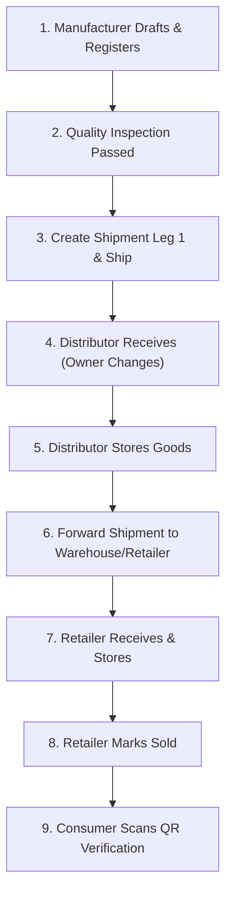

# End-to-End Supply Chain Demonstration Guide

This guide walks through a complete end-to-end lifecycle demonstration of the B-MOST platform, from raw manufacturing to consumer verification.

---

## 1. Demo Scenario Overview

We follow a single physical item (e.g., *Organic Coffee Lot #101*) through four organizational stages:
1. **Manufacturer (`ORG-MFG-001`)**: Drafts, registers on Sepolia, quality-checks, and initiates dispatch.
2. **Distributor (`ORG-DST-001`)**: Receives shipment, updates custody on-chain, stores in regional depot, and forwards.
3. **Warehouse (`ORG-WRH-001`)**: Receives, buffers inventory, and transfers to retail store.
4. **Retailer (`ORG-RTL-001`)**: Accepts delivery, stores on display, and marks sold to consumer.
5. **Consumer**: Scans QR code on public verification portal to inspect the full immutable trail.

---

## 2. Prerequisites & Seed Accounts

Ensure the local stack is running (`pnpm docker:dev` or `pnpm dev`) and the database is seeded (`pnpm db:seed`).

### 2.1 Default Demo Credentials (from `prisma/seed.ts`)
| Role / Actor | Email | Password | Seed Wallet Address |
| --- | --- | --- | --- |
| **Super Admin** | `superadmin@bmost.io` | `Password123!` | Account 1 (`0x0FcD93659FA339bB05A2A12Ed7000dFD714E0998`) |
| **Manufacturer**| `manufacturer@bmost.io`| `Password123!` | Account 1 (`0x0FcD93659FA339bB05A2A12Ed7000dFD714E0998`) |
| **Auditor** | `auditor@bmost.io` | `Password123!` | Account 1 (`0x0FcD93659FA339bB05A2A12Ed7000dFD714E0998`) |
| **Distributor** | `distributor@bmost.io` | `Password123!` | Account 2 (`0x3f073b4f50D2B2486B632DFB4c7005FC449cED14`) |
| **Warehouse** | `warehouse@bmost.io` | `Password123!` | Account 2 (`0x3f073b4f50D2B2486B632DFB4c7005FC449cED14`) |
| **Retailer** | `retailer@bmost.io` | `Password123!` | Account 1 (`0x0FcD93659FA339bB05A2A12Ed7000dFD714E0998`) |

> [!NOTE]
> **Two-Wallet Alternating Constraint**: The contract forbids sending shipments to the same wallet address (`receiver != msg.sender`). Because the default seed fixture assigns Account 1 to Manufacturer and Retailer, and Account 2 to Distributor and Warehouse, test the flow via alternating hops:
> **Manufacturer (Acc 1) → Distributor (Acc 2) → Retailer (Acc 1)**.
> For a full 4-stage test, configure a distinct 3rd wallet for Warehouse via `/admin/wallets`.

---

## 3. Step-by-Step Execution Walkthrough

### Step 1: Draft & Blockchain Registration (Manufacturer)
1. In MetaMask, select **Account 1** and ensure the network is **Sepolia**.
2. Log in at `http://localhost:3000/login` with `manufacturer@bmost.io` / `Password123!`.
3. Go to **Products** (`/products`) → click **"New Product"** (`/products/new`).
4. Enter Product Code (e.g. `DEMO-COFFEE-01`), Serial Number (`SN-COFFEE-01`), and Name. Click **"Save Draft"**.
5. On the product details page, click **"Register on Blockchain"**.
6. MetaMask will prompt to sign `registerProduct`. Approve the transaction.
7. Upon confirmation, the status badge changes to **REGISTERED**, and a `blockchainProductId` is displayed.

### Step 2: Quality Inspection (Auditor / Manufacturer)
1. On the product details page, click **"Record Quality Check"**.
2. Select Result: **Passed**, enter notes (e.g. *Organic certification audit passed*), and submit.
3. MetaMask prompts for `recordQualityCheck`. Approve the transaction.
4. Product status transitions to **QUALITY_CHECKED**.

### Step 3: Outbound Shipment Leg 1 (Manufacturer → Distributor)
1. Click **"Create Shipment"**.
2. Select Destination Organization: **Distributor (`ORG-DST-001`)**.
3. Enter Shipment Code (e.g. `SHIP-MFG-DST-01`), Origin (*Bangkok Factory*), and Destination (*Depot 1*). Submit.
4. MetaMask prompts for `createShipment`. Approve the transaction.
5. Product status transitions to **READY_TO_SHIP**; a new shipment in **PENDING** state is created.
6. Under the shipment card, click **"Ship Product"**. Confirm MetaMask prompt. Product status becomes **SHIPPED**.
7. *(Optional)* Click **"Mark In-Transit"** to simulate transportation. Product status becomes **IN_TRANSIT**.

### Step 4: Inbound Delivery & Ownership Handover (Distributor)
1. Switch MetaMask active account to **Account 2**.
2. Log out and log in as `distributor@bmost.io` / `Password123!`.
3. Navigate to **Shipments** (`/shipments`) or find the product in `/products`.
4. Locate the incoming shipment and click **"Confirm Receipt"**.
5. MetaMask prompts Account 2 to sign `receiveProduct`. Approve the transaction.
6. **On-Chain Result**:
   - Shipment status advances to **DELIVERED**.
   - Product status becomes **RECEIVED**.
   - Product `currentOwner` atomically updates to **Account 2**!

### Step 5: Warehouse Storage (Distributor)
1. On the product details page, click **"Place in Storage"**.
2. MetaMask prompts for `storeProduct`. Approve the transaction.
3. Product status transitions to **STORED**.

### Step 6: Shipment Leg 2 (Distributor → Retailer)
1. With Account 2 selected, click **"Create Shipment"**.
2. Select Destination Organization: **Retailer (`ORG-RTL-001`)** (Account 1).
3. Confirm `createShipment` and `shipProduct` via MetaMask.
4. Product transitions to **SHIPPED**.

### Step 7: Retail Receipt & Final Sale (Retailer)
1. Switch MetaMask back to **Account 1**.
2. Log out and log in as `retailer@bmost.io` / `Password123!`.
3. Confirm receipt of the incoming shipment (`receiveProduct`). Product status becomes **RECEIVED**.
4. Click **"Place in Storage"** (`storeProduct`). Product status becomes **STORED**.
5. Once a customer purchases the item, click **"Mark as Sold"**.
6. MetaMask prompts Account 1 to sign `markAsSold`. Approve the transaction.
7. Product status advances to **SOLD**.

### Step 8: Public Consumer Verification
1. Open a new incognito browser tab (no login required).
2. Visit `http://localhost:3000/verify/DEMO-COFFEE-01`.
3. The page displays:
   - Green Authenticity Badge: **Verified on Sepolia Blockchain**.
   - Current Status: **SOLD**.
   - Complete chronological custody timeline (Manufacturer → Distributor → Retailer).
   - On-chain transaction links pointing to Sepolia Etherscan.
