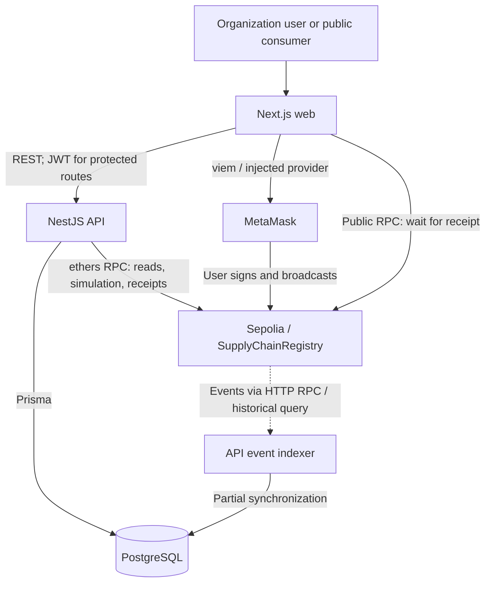

# B-MOST System Architecture

## Audit scope

Phase 1, 2026-09-27. Source inspection and local tests support this document. Live readiness remains a rehearsal requirement; see [CODEX_REVIEW.md](CODEX_REVIEW.md).

## Components and paths



MetaMask is needed for business writes, not ordinary reads or public verification. Browser receipt waiting uses a viem public client with default Sepolia HTTP transport; the API uses its separately configured BLOCKCHAIN_RPC_URL. These RPC paths can fail independently.

Sources: [wallet helper](../../apps/web/lib/blockchain/wallet.ts), [API client](../../apps/web/lib/api.ts), [BlockchainService](../../apps/api/src/blockchain/blockchain.service.ts), [indexer](../../apps/api/src/blockchain/blockchain-indexer.service.ts).

## Data responsibilities

| PostgreSQL / Prisma | SupplyChainRegistry |
| --- | --- |
| Organizations, users, password hashes, application roles and wallet mappings | Wallet AccessControl role membership |
| Product UUID, name, serial, category, description, organization relations | Product numeric ID, code, bytes32 hash, manufacturer/current owner addresses, status, registration time |
| Shipment UUID, organization relations, origin/destination text, chain references | Shipment numeric ID, code, product ID, sender/receiver/carrier addresses, status, timestamps |
| QC rows, inspector display names and organization relations | QC result, inspector address, notes, timestamp |
| Action intents, transaction index, application audit logs | Emitted events and per-product history array |

QC notes and recall reasons are public on-chain strings. SQL audit logs have no cryptographic immutability mechanism. BlockchainTransaction is unique by txHash: it stores one row per transaction, not one row per event. Receiving emits both ProductReceived and OwnershipTransferred.

The product hash is Keccak-256 of canonical JSON containing normalized product code, serial, manufacturer **database UUID**, optional name and category. Description is excluded. API updates restrict hash fields after registration. Hashes commit to selected recorded fields; they do not certify physical authenticity.

Sources: [schema](../../apps/api/prisma/schema.prisma), [hash utility](../../apps/api/src/products/utils/product-hash.util.ts), [ProductsService.create/update](../../apps/api/src/products/products.service.ts), [contract](../../packages/contracts/contracts/SupplyChainRegistry.sol).

## Identity boundaries

| Field | Meaning |
| --- | --- |
| Product.id / Shipment.id | Database UUID |
| blockchainProductId / blockchainShipmentId | Nullable decimal string representing contract uint256 |
| SQL Shipment.productId | Foreign key to Product.id |
| Contract Shipment.productId | Numeric on-chain product ID |
| productCode / shipmentCode | Business code shared by SQL and contract |
| chain ID + contract address + numeric ID | Network-scoped blockchain identity |

Prisma defines a composite unique constraint for the product blockchain reference, not an equivalent constraint for shipments. The active action service checks both kinds against the pinned Sepolia contract.

## Business transaction protocol

```mermaid
sequenceDiagram
    actor User
    participant Web
    participant API as NestJS API
    participant DB as PostgreSQL
    participant Wallet as MetaMask
    participant Chain as Sepolia RPC / Contract
    Web->>API: POST /api/blockchain/actions/prepare (JWT, action, DB entity ID)
    API->>DB: Read user, organization, entity
    API->>Chain: Read live state; simulate from expected wallet
    API->>DB: Save PENDING intent; shipment draft when applicable
    API-->>Web: intentId, functionName, args, expectedWallet, expiresAt
    Web->>Wallet: Check account/network; request transaction
    Wallet->>User: Approval prompt
    User->>Wallet: Approve
    Wallet->>Chain: Sign and broadcast
    Web->>Chain: Wait for successful receipt
    Web->>API: POST /api/blockchain/actions/confirm (intentId, transactionHash)
    API->>Chain: Verify transaction, receipt, expected event and values
    API->>DB: SQL transaction: entity, transaction index, intent, audit log
    API-->>Web: verified=true, synced=true
```

Preparation checks role, wallet mapping, chain reference, live state and contract simulation. It returns function/arguments, not a signed transaction. Direct-call confirmation checks Sepolia, successful receipt, destination, sender, exact function/calldata and expected event values. A mediated-call branch accepts matching events emitted by the configured registry without the direct-call calldata comparison; do not claim every accepted transaction directly targets the registry.

Confirmation is bound to the user and rejects reuse of a transaction hash by another intent. Repeating an already confirmed intent with the same hash succeeds. SQL updates are transactional, but Ethereum and SQL do not share an atomic distributed commit.

Intent expiresAt is set 15 minutes ahead and checked by the browser before submission. confirm() does not enforce that timestamp; no automatic expiry cleanup is implemented here. Rejected prompts can leave pending intents and shipment drafts. Products are saved before registration. A mined transaction persists if API confirmation fails. The browser helper has no durable retry queue.

Backend getSigner() throws. Legacy registration/QC routes return HTTP 410; other old write routes remain and reach disabled signing paths. Business changes should use prepare/sign/confirm. verify-transaction returns synced:false and does not replace confirmation. Contract role preparation is a separate admin API operation.

Sources: [action service](../../apps/api/src/blockchain/blockchain-action.service.ts), [controller](../../apps/api/src/blockchain/blockchain.controller.ts), [verification service](../../apps/api/src/blockchain/blockchain-verification.service.ts), [wallet helper](../../apps/web/lib/blockchain/wallet.ts).

## Permissions

JWT validation reloads the user and checks active user status. RolesGuard and service checks enforce permissions. Browser cookie presence only gates navigation; protected API requests require bearer JWT validation. Application roles do not automatically grant contract roles. Application Super Admin does not bypass contract ownership.

The table describes active action preparation, not legacy route annotations. SA means application SUPER_ADMIN.

| Action | Application roles / checks | Contract authorization / state |
| --- | --- | --- |
| Register | SA, Manufacturer; manufacturer organization (SA exempt from org ID), user/org wallet match | MANUFACTURER_ROLE; unique code, nonzero hash |
| QC | SA, Manufacturer, Auditor; Manufacturer must belong to manufacturer/owner org; external Auditor needs auditor contract role | Auditor role, Manufacturer role or current owner; REGISTERED; pass → QUALITY_CHECKED, fail → RECALLED |
| Create shipment | SA, Manufacturer, Distributor, Warehouse; owner organization, user/org/live owner wallet match | Owner or contract admin; QUALITY_CHECKED or STORED; nonzero receiver different from caller |
| Dispatch / in transit | SA, Manufacturer, Distributor, Warehouse; caller wallet matches sender or carrier | Owner, carrier, LOGISTICS_ROLE or contract admin; matching shipment/product and required state |
| Receive | SA, Distributor, Warehouse, Retailer; receiver organization (SA exempt from org ID), receiver/user wallet match | Receiver or contract admin; SHIPPED or IN_TRANSIT; ownership goes to designated receiver |
| Store | SA, Distributor, Warehouse, Retailer; DB owner wallet and live owner wallet match user | Current owner; RECEIVED → STORED |
| Sell | SA, Retailer; DB owner wallet and live owner wallet match user | Current owner; STORED → SOLD; owner unchanged |
| Manual transfer | SA, Manufacturer, Distributor, Warehouse, Retailer; owner org/wallet, target org wallet | Current owner; different nonzero target; excludes SOLD/RECALLED; state unchanged |
| Recall | SA, Manufacturer, Auditor; nonempty reason | Original manufacturer, current owner, Auditor role or contract admin; any state except RECALLED |

Store and sell preparation check wallet identity without organization-ID equality. Shared wallets therefore weaken organization separation. Contract Distributor/Warehouse/Retailer roles are declared but do not independently gate lifecycle functions. Constructor grants every defined role to the initial admin. ORG_ADMIN can create a SQL product draft in a Manufacturer organization but cannot prepare business blockchain actions.

Product lists normally scope to manufacturer/current owner. Shipment lists include involved parties. Traceability additionally allows shipment participants and QC organizations. Avoid claiming uniform, audited tenant isolation: dashboard scope, for example, treats a user without an organization as global.

Sources: [JWT strategy](../../apps/api/src/auth/strategies/jwt.strategy.ts), [RolesGuard](../../apps/api/src/auth/guards/roles.guard.ts), [action service](../../apps/api/src/blockchain/blockchain-action.service.ts), [contract](../../packages/contracts/contracts/SupplyChainRegistry.sol), [dashboard](../../apps/api/src/dashboard/dashboard.service.ts).

## Verification and synchronization limits

QR payload is a web URL: {WEB_URL}/verify/{URL-encoded productCode}. API QR generation prefers NEXT_PUBLIC_WEB_URL, then WEB_URL, then localhost. GET /api/public/verify/:productCode is unauthenticated. It uppercases input and tries product code then serial; a mixed-case serial saved without uppercasing may not match.

Public verification reads SQL and calls getProductByCode if a blockchain ID exists. Hash matching accepts the chain hash equaling **either the stored hash or the recomputed hash**. A positive badge does not prove all current metadata matches. Its status-name array is outdated: actual states 2–5 are mislabeled and 6–8 become UNKNOWN. The public page displays this field.

The public page receives those chain fields through the API; it does not query the contract directly in the browser. Its displayed transaction hashes can be copied. The authenticated traceability page renders available hashes as text. Neither page supplies a built-in Sepolia explorer link for every milestone. A separate explorer view must use the correct transaction hash for the event being discussed.

Private traceability exposes hashMatch separately. Its API verified flag can be true when an on-chain record exists despite a recomputed hash mismatch; the UI checks both flags for its positive display. Timelines assemble SQL milestones, with chain history available separately. Public milestone badges sometimes rely only on hash presence, and shipment milestones reuse the creation transaction hash. They are not independently verified receipts for every milestone. Public output includes passed QC notes and inspector names.

The indexer uses ethers HTTP JSON-RPC event listeners and explicit historical queries. It is not a WebSocket service or guaranteed instantaneous synchronization. Its recovery is incomplete: QC events do not create QC rows; ownership events do not update SQL currentOwnerId; shipment-created state updates omit STORED products starting another leg. Replay/order and one row per transaction can affect displayed data. Confirmation performs the intended complete SQL update. Startup connection failure returns without a scheduled listener retry in this service.

Sources: [public verification](../../apps/api/src/products/products.service.ts), [QR utility](../../apps/api/src/products/utils/qr-code.util.ts), [traceability service](../../apps/api/src/traceability/traceability.service.ts), [indexer](../../apps/api/src/blockchain/blockchain-indexer.service.ts).

## Configuration and containers

- Application pins Sepolia 11155111 and 0x74fd4f89b8ab7a3100b3291b7aeb43448f13c43a. Backend RPC is private. API/web ABI-ready flags must equal true.
- Compose provides PostgreSQL 16, API port 4000 and web port 3000. DB host port defaults to 5433; container port is 5432. API prefix /api; Swagger /api/docs.
- API entrypoint runs prisma migrate deploy. Seed is optional and Compose defaults automatic seeding to false. Do not reseed during the presentation.
- Production browser settings are build-time arguments. Rebuild for changed public API/network settings. Phone QR demos need reachable web/API URLs, not localhost on the phone.
- Hardhat config uses local networks, chain ID 31337. Local artifacts/tests do not attest to Sepolia deployment bytecode. ABI checking compares local files.
- Development Watch syncs listed application folders and rebuilds for manifests/Prisma; shared contract/ABI changes are not in its Watch rules.

Sources: [Compose](../../docker-compose.yml), [Watch override](../../docker-compose.dev.yml), [web Dockerfile](../../apps/web/Dockerfile), [API entrypoint](../../apps/api/docker-entrypoint.sh), [Hardhat config](../../packages/contracts/hardhat.config.ts), [ABI check](../../packages/contracts/scripts/sync-abi.cjs).

Keep private keys, seed phrases, JWTs/secrets, DB credentials and credential-bearing RPC URLs out of presentation material. Contract address, ABI, chain ID, public wallet addresses and transaction hashes may be shown.
