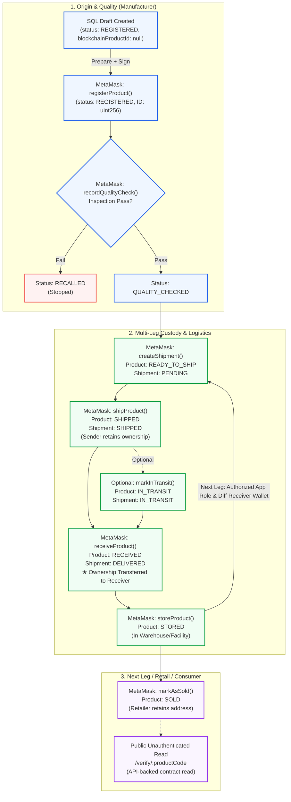
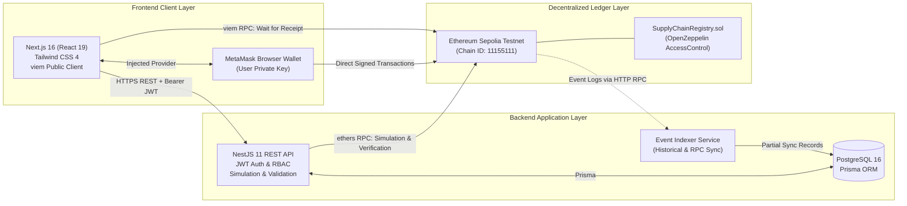
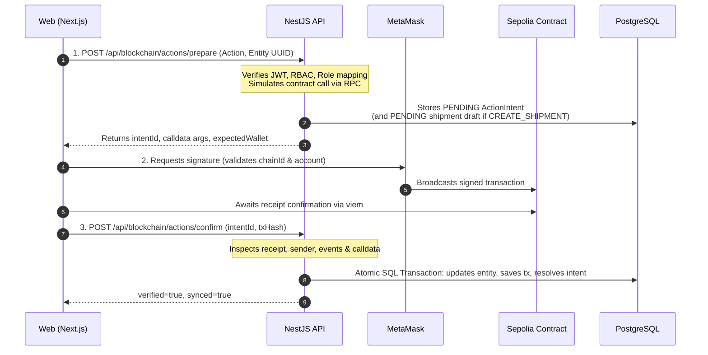

# B-MOST Final Presentation Specification

**B-MOST — Blockchain-Based Multi-Organization Supply Chain Traceability Platform**  
*ระบบติดตามและตรวจสอบห่วงโซ่อุปทานหลายองค์กรด้วยเทคโนโลยีบล็อกเชน*

> **Core Value Proposition:** One Product. One Journey. Verifiable History.

- **Status:** READY_FOR_CODEX_REVIEW
- **Delivered Specification:** 16:9 Presentation, 4 Main Slides, Modern Enterprise Light Theme, Thai-first with English technical labels.
- **Reference Assets:**
  - Full Brand Logo: `apps/web/public/brand_logo.png`
  - Hexagonal Icon Logo: `apps/web/public/icon_logo.png`
- **Delivered Format:** Markdown specification ([PRESENTATION.md](PRESENTATION.md)) containing slide text, layout instructions, Mermaid diagrams, speaker scripts, live demo checklist, and defense Q&A. (Screenshots used: none supplied).

---

# Slide 1 — B-MOST / Problem / Solution / Supply Chain

## Purpose
Introduce B-MOST, frame the multi-enterprise supply chain trust problem (data silos and dispute friction), present B-MOST's hybrid architecture solution ("One Product. One Journey. Verifiable History."), and map the end-to-end supply chain participants.

## Timing
~45 seconds (0:00 – 0:45 of the 3-minute pitch).

## Exact Text
### Header
- **B-MOST**
- Subtitle: *Blockchain Multi-Organization Supply Chain Traceability Platform*
- Thai Headline: *ระบบติดตามและตรวจสอบห่วงโซ่อุปทานหลายองค์กรด้วยเทคโนโลยีบล็อกเชน*
- Tagline: *"One Product. One Journey. Verifiable History."*

### Column 1: The Core Challenge (ปัญหาของห่วงโซ่อุปทานเดิม)
- **Data Silos across Enterprise Boundaries:** ข้อมูลแยกส่วนอยู่ใน ERP/WMS ของแต่ละองค์กร ขาดความเชื่อมโยง
- **Friction in Custody Handoffs:** เมื่อเกิดปัญหาการส่งต่อสินค้าข้ามบริษัท มักเกิดข้อพิพาทและไม่สามารถตรวจสอบความรับผิดชอบย้อนหลังได้อย่างรวดเร็ว
- **Vulnerability to Unauthorized Alterations:** ฐานข้อมูลแบบรวมศูนย์เสี่ยงต่อการถูกแก้ไขข้อมูลประวัติโดยไม่มีหลักฐานอิสระคอยตรวจสอบ

### Column 2: The B-MOST Solution (แนวทางแก้ปัญหาของ B-MOST)
- **One Product Identity:** สินค้าชิ้นหนึ่งมีตัวตนเดียวตลอดเส้นทาง ตั้งแต่การผลิตจนถึงมือผู้บริโภค
- **Hybrid Relational & Ledger Architecture:** จัดเก็บและประมวลผลข้อมูลการทำงานด้วย PostgreSQL (NestJS) ร่วมกับการทอดสมอประวัติสถานะและกรรมสิทธิ์บน Ethereum Sepolia
- **Direct Wallet Attestation:** ทุกการเปลี่ยนมือของสินค้าต้องได้รับการลงนามโดยตรงจากกระเป๋าเงินดิจิทัล (MetaMask) ขององค์กรผู้มีอำนาจ

### Participant Flow Banner (เส้นทางผู้มีส่วนร่วมในห่วงโซ่อุปทาน)
- `[ Manufacturer ]` ──▶ `[ Distributor ]` ──▶ `[ Warehouse ]` ──▶ `[ Retailer ]` ──▶ `[ Consumer / Public ]`
  *(หมายเหตุ: เส้นทางนี้เป็น business scenario ตัวอย่างที่รองรับ โดยสินค้าหนึ่งชิ้นคงตัวตนเดิมข้ามหลาย Shipment leg)*

## Main Message
B-MOST helps reduce cross-enterprise record fragmentation and custody disputes by keeping shared operational records and anchoring key product and custody events on Sepolia. It provides verifiable recorded history; physical facts still require operational checks.

## Visual Hierarchy
1. **Top Bar:** B-MOST Brand Logo (`brand_logo.png`) top-left; primary badge "One Product. One Journey. Verifiable History." top-right.
2. **Body Split (50/50 Grid):**
   - Left Card: Challenge / Problem in muted slate background (`#f8fafc`) with warning accents.
   - Right Card: B-MOST Hybrid Solution in enterprise white/light blue border (`#2563eb`) with emerald success markers.
3. **Bottom Banner:** Horizontal multi-tier participant chain with distinct node badges and directional arrows.

## Diagram Specification
```text
[ Manufacturer ] ──▶ [ Distributor ] ──▶ [ Warehouse ] ──▶ [ Retailer ] ──▶ [ Consumer / Public ]
 (Origin & QC)        (Leg 1 Transit)     (Hub Storage)      (Point of Sale)     (Unauthenticated QR)
```
- Node 1: Manufacturer (Primary Blue badge, Origin & Quality Inspection)
- Node 2: Distributor (Sky Blue badge, Logistics Leg 1)
- Node 3: Warehouse (Indigo badge, Storage & Redistribution)
- Node 4: Retailer (Teal badge, Retail Storage & Point of Sale)
- Node 5: Consumer (Emerald badge, Unauthenticated QR Verification)

## Screenshot Specification
- Brand Logo (`apps/web/public/brand_logo.png`) placed at top-left.
- No application screenshots supplied; clean modern typography and card containers.

## Speaker Notes
> "สวัสดีครับทุกท่าน วันนี้ขอแนะนำ **B-MOST** แพลตฟอร์มติดตามและตรวจสอบห่วงโซ่อุปทานหลายองค์กรด้วยบล็อกเชน
> 
> ปัญหาสำคัญของ Supply Chain ในปัจจุบัน คือ **Data Silo** หรือข้อมูลที่กระจายตัวอยู่ตามระบบ ERP/WMS ของแต่ละองค์กร ทำให้เมื่อเกิดการส่งต่อสินค้าข้ามบริษัท มักเกิดข้อพิพาท ข้อมูลไม่ตรงกัน และตรวจสอบประวัติย้อนหลังได้ยาก
> 
> B-MOST ช่วยลดปัญหาการแตกกระจายของข้อมูลและข้อพิพาทในการส่งต่อสินค้าข้ามองค์กร ภายใต้แนวคิด **'One Product. One Journey. Verifiable History.'** สินค้าหนึ่งชิ้นมีตัวตนเดียวตลอดเส้นทาง โดยผสานพลังของ **PostgreSQL** สำหรับจัดการข้อมูลการทำงาน และ **Ethereum Smart Contract** บน Sepolia เพื่อบันทึกประวัติการเปลี่ยนมือและสถานะสำคัญที่ตรวจสอบได้ โดยบล็อกเชนให้หลักฐานประวัติทางดิจิทัล ส่วนข้อเท็จจริงทางกายภาพยังคงอาศัยการตรวจสอบตามขั้นตอนปฏิบัติงานครับ
> 
> ผู้มีส่วนร่วมตั้งแต่ **Manufacturer, Distributor, Warehouse** ไปจนถึง **Retailer** จะต้องลงนามรับ-ส่งสินค้าด้วยกระเป๋าเงินดิจิทัลของตนเอง และเปิดให้ **Consumer** สแกนตรวจสอบประวัติได้ทันทีครับ"

## Technical Claims Used
- Reduces cross-enterprise record fragmentation and custody disputes through shared operational records and verifiable on-chain history.
- Core value proposition: "One Product. One Journey. Verifiable History."
- Verifiable recorded history boundary: Blockchain provides tamper-evident digital history of wallet-signed state changes; it does not replace physical inspection truth, physical possession, or physical anti-counterfeit measures.
- Participant flow represents a supported business scenario; 1 product retains identity across multiple shipment legs.

---

# Slide 2 — Complete System Workflow

## Purpose
Demonstrate the complete, verified product and shipment lifecycle state machine across all phases (Origin, Multi-Leg Logistics, and Fulfillment/Sale), highlighting draft creation, quality control, ownership transfer upon receipt, and the qualified multi-leg next-hop capability.

## Timing
~45 seconds (0:45 – 1:30 of the 3-minute pitch).

## Exact Text
### Header
- **End-to-End Product & Shipment Lifecycle**
- Subtitle: *วงจรชีวิตสินค้าและการส่งมอบข้ามองค์กร (Draft → Register → QC → Ship → Receive → Store → Sell)*

### Section 1: Origin & Quality (ต้นทางและการตรวจคุณภาพ)
- **SQL Draft Creation:** บันทึกเข้าระบบเป็นร่างก่อน (`status: REGISTERED, blockchainProductId: null`) โดย Manufacturer เป็นจุดเริ่มต้นปกติ และ Super Admin / ORG_ADMIN สามารถสร้างร่างในองค์กร Manufacturer ได้
- **Blockchain Registration:** ลงนาม `registerProduct` ผ่าน MetaMask รับ numeric ID (`uint256`) และบันทึก Metadata Hash (ต้องมี `MANUFACTURER_ROLE` บนสัญญา)
- **Quality Inspection Gate:** บันทึกผลการตรวจ QC (`recordQualityCheck`) หากผ่านเปลี่ยนเป็น `QUALITY_CHECKED` หากไม่ผ่านจะเปลี่ยนเป็น `RECALLED` ทันที

### Section 2: Multi-Leg Logistics (การขนส่งหลายทอดและการเปลี่ยนกรรมสิทธิ์)
- **Shipment Creation & Dispatch:** ผู้ส่งสร้าง Shipment (`createShipment`, สินค้าเข้าสู่ `READY_TO_SHIP`) และกด Dispatch (`shipProduct`, สินค้าเข้าสู่ `SHIPPED`) โดยในระหว่างทาง ผู้ส่งยังคงเป็นเจ้าของบนบล็อกเชน
- **Optional Transit:** รองรับการปรับสถานะ `IN_TRANSIT` (ทั้งสินค้าและใบส่ง)
- **Custody Transfer upon Receipt:** เมื่อผู้รับกด `receiveProduct` สัญญาจะส่งมอบกรรมสิทธิ์ (`OwnershipTransferred`) ให้กับผู้รับทันที สินค้าเปลี่ยนเป็น `RECEIVED` และ Shipment เป็น `DELIVERED`

### Section 3: Storage, Next Leg & Sale (การจัดเก็บ การส่งต่อทอดถัดไป และการจำหน่าย)
- **Storage & Multi-Leg Loop:** นำเข้าคลัง (`storeProduct` → `STORED`) โดยจากสถานะ `STORED` ผู้ใช้แอปพลิเคชันที่ได้รับอนุญาตในบทบาท Manufacturer, Distributor, Warehouse หรือ Super Admin ที่มีกระเป๋าเงินตรงกับเจ้าของปัจจุบัน สามารถเตรียม ลงนาม และยืนยันการสร้าง Shipment ใหม่ไปยังกระเป๋าเงินผู้รับรายอื่นที่แตกต่างกันได้โดยไม่ต้องตรวจ QC ซ้ำ ทั้งนี้ บทบาท Retailer ในแอปพลิเคชันปัจจุบันไม่สามารถสร้าง Shipment ทอดถัดไปได้
- **Point of Sale:** ร้านค้าปลีกบันทึกขาย (`markAsSold` → `SOLD`) โดยกรรมสิทธิ์ยังคงอยู่ที่กระเป๋าของร้านค้า
- **Universal Recall:** รองรับการเรียกคืนสินค้า (`recallProduct`) จากทุกสถานะยกเว้น `RECALLED` (รวมถึงหลังขาย) โดยผู้มีอำนาจ

## Main Message
A single product identity transitions through verified states. Ownership remains with the sender during dispatch and transfers to the designated receiver only upon confirmed on-chain receipt. From STORED, an authorized Manufacturer, Distributor, Warehouse, or Super Admin user whose wallet matches the current owner can prepare, sign, and confirm a new shipment to a different receiver wallet without repeating QC; the current Retailer app role cannot create that next leg.

## Visual Hierarchy
1. **Top Header:** Section title with clear phase indicators.
2. **Central Flowchart:** Structured 3-group Mermaid diagram representing Origin, Logistics, and Fulfillment.
3. **Bottom Summary Cards:** 3 callout cards highlighting (1) Quality Gate, (2) Receipt = Ownership Transfer, and (3) Multi-leg loop from `STORED` for permitted roles.

## Diagram Specification


## Screenshot Specification
- No screenshot supplied; diagram provides full visual clarity.

## Speaker Notes
> "ในด้าน Workflow การทำงานจริง:
> 
> สินค้าเริ่มต้นที่ **Manufacturer** โดยบันทึกเข้าระบบเป็น Draft ก่อน (`blockchainProductId: null`) จากนั้นทำการลงนามบนบล็อกเชนผ่าน MetaMask เพื่อรับ Product ID และบันทึก Metadata Hash จากนั้นทำการตรวจสอบคุณภาพ (QC) เมื่อผ่าน สินค้าจะพร้อมส่งต่อ (`QUALITY_CHECKED`)
> 
> เมื่อจะส่งต่อ ผู้ผลิตสร้าง Shipment สินค้าจะเข้าสู่สถานะ `READY_TO_SHIP` และเมื่อส่งมอบให้ผู้ขนส่ง สถานะจะเปลี่ยนเป็น `SHIPPED` โดยในระหว่างทาง กรรมสิทธิ์ยังเป็นของผู้ส่ง จนกระทั่งปลายทาง—เช่น **Distributor**—กดยืนยันการรับสินค้า (`receiveProduct`) บนบล็อกเชน
> 
> จุดนี้ Smart Contract จะทำการส่งมอบกรรมสิทธิ์ (`OwnershipTransferred`) ให้กับผู้รับทันทีอย่างถูกต้อง จากนั้นผู้รับที่มีบทบาทได้รับอนุญาต (Manufacturer, Distributor, Warehouse หรือ Super Admin) ที่กระเป๋าตรงกับเจ้าของปัจจุบัน สามารถนำเข้าคลัง (`STORED`) และเริ่มเตรียม ลงนาม สร้าง Shipment ใหม่ไปยังกระเป๋าผู้รับรายถัดไปที่แตกต่างกันได้โดยไม่ต้องตรวจ QC ซ้ำ ทั้งนี้บทบาท Retailer ในแอปพลิเคชันปัจจุบันไม่สามารถสร้าง Shipment ต่อได้ และเมื่อถึง Retailer ก็สามารถบันทึกขาย (`markAsSold`) ได้ครับ"

## Technical Claims Used
- Draft creation: SQL draft created with `status = REGISTERED` and `blockchainProductId = null`.
- Origin permissions: Manufacturer is normal origin; Super Admin and ORG_ADMIN can create SQL drafts for a Manufacturer organization; on-chain registration preparation requires `MANUFACTURER_ROLE`.
- QC Gate: Pass moves product to `QUALITY_CHECKED`; failure moves product to `RECALLED`.
- Custody transfer: Sender retains ownership during shipping; calling `receiveProduct` transfers ownership to receiver on-chain.
- Multi-leg capability: From `STORED`, an authorized Manufacturer, Distributor, Warehouse, or Super Admin user with matching owner wallet can create the next shipment leg to a distinct receiver wallet without re-QC. The current Retailer application role cannot create that next leg.
- Retail sale: `markAsSold` moves product to `SOLD`, retaining retailer address.
- Universal recall: Callable from any state except `RECALLED` (including `SOLD`).

---

# Slide 3 — System Architecture & Trust Protocol

## Purpose
Detail the full-stack 3-tier architecture, highlight the Zero-Server-Key security model, and explain the 3-step transaction protocol (Prepare → Sign → Confirm) alongside the decoupled database UUID and blockchain integer identities.

## Timing
~50 seconds (1:30 – 2:20 of the 3-minute pitch).

## Exact Text
### Header
- **Full-Stack Architecture & Cryptographic Trust Protocol**
- Subtitle: *สถาปัตยกรรมระบบ 3 ชั้น และโปรโตคอลความปลอดภัยไร้กุญแจบนเซิร์ฟเวอร์*

### Section 1: 3-Tier Enterprise Topology (สถาปัตยกรรม 3 ชั้น)
- **Frontend Layer:** Next.js 16 (React 19), Tailwind CSS 4, viem v2 public client เชื่อมต่อกระเป๋า MetaMask
- **Application & Data Layer:** NestJS 11 REST API, Prisma ORM 6, PostgreSQL 16, และ Background Event Indexer
- **Decentralized Ledger Layer:** Ethereum Sepolia (Chain ID: 11155111), Smart Contract `SupplyChainRegistry.sol` (OpenZeppelin AccessControl) ที่แอดเดรส `0x74fd4f89b8ab7a3100b3291b7aeb43448f13c43a`

### Section 2: Zero-Server-Key Security (ความปลอดภัยระดับองค์กร)
- **No Custodial Keys on Server:** Backend ไม่มีการจัดเก็บ Private Key เพื่อลงนามแทน (`getSigner()` โยนข้อผิดพลาดทันที)
- **Direct User Signing:** ธุรกรรมทางธุรกิจทั้งหมดต้องได้รับการลงนามโดยตรงจากผู้ใช้ผ่านกระเป๋า MetaMask

### Section 3: The 3-Step Business Transaction Protocol (โปรโตคอล Prepare → Sign → Confirm)
1. **Prepare:** ผู้ใช้ขอทำรายการ → API ตรวจสอบสิทธิ์ RBAC, จำลองธุรกรรม (Simulation) บน RPC และบันทึก Pending ActionIntent ในฐานข้อมูล (และอาจสร้างร่างใบส่งของสำหรับ `CREATE_SHIPMENT`)
2. **Sign & Broadcast:** ผู้ใช้ตรวจสอบและกดยืนยันใน MetaMask → ส่งธุรกรรมตรงขึ้นเชน Sepolia → Frontend รอ Receipt จาก RPC
3. **Confirm:** หลังธุรกรรมถูกขุดสำเร็จ Frontend ส่ง Tx Hash ให้ API ตรวจสอบ Transaction Receipt, ผู้ส่ง และ Event บนเชนจริง ก่อนอัปเดตสถานะทางธุรกิจในฐานข้อมูล PostgreSQL ด้วย Atomic SQL Transaction
*(หมายเหตุ: Event Indexer อาจช่วยซิงก์ข้อมูลบางฟิลด์จาก Event บนเชนแยกต่างหาก ทั้งนี้ Ethereum และ PostgreSQL ไม่ได้แชร์ Atomic Distributed Commit ร่วมกัน การตรวจสอบ Receipt เกิดขึ้นก่อนการอัปเดตสถานะธุรกิจของ Confirm แต่ไม่ใช่ทุกการเขียนฐานข้อมูล)*

## Main Message
B-MOST adopts a Zero-Server-Key security model where users sign business transactions directly via MetaMask. In the direct user-signed flow, Prepare records a pending intent (and may create a shipment draft); after a mined receipt, Confirm verifies the transaction and updates the business state in a SQL transaction. The event indexer can separately synchronize some fields from chain events; Ethereum and SQL do not share an atomic commit.

## Visual Hierarchy
1. **Top Half:** Topology flowchart showing Client Layer, Backend Layer, and Ledger Layer.
2. **Bottom Half:** Sequence diagram illustrating the 3-step handoff (Prepare → Sign → Confirm).
3. **Sidebar Cards:** Decoupled identity rule (`Product.id` UUID vs `blockchainProductId` uint256).

## Diagram Specification
### Architecture Topology


### Business Transaction Sequence


## Screenshot Specification
- No screenshot supplied; diagrams convey full technical architecture.

## Speaker Notes
> "ด้านสถาปัตยกรรม B-MOST พัฒนาด้วยเทคโนโลยีระดับโมเดิร์น:
> 
> Frontend ใช้ **Next.js 16 (React 19)** ร่วมกับ viem ในการสื่อสารกับบล็อกเชน, Backend ใช้ **NestJS 11** และ Prisma จัดการฐานข้อมูล PostgreSQL 16 และเชื่อมโยงกับ **Sepolia Smart Contract**
> 
> ในแง่ความปลอดภัย เราใช้หลักการ **Zero-Server-Key** เซิร์ฟเวอร์ไม่ถือ Private Key ของผู้ใช้ แต่ทำงานด้วยโปรโตคอล **Prepare → Sign → Confirm**:
> 1. ในขั้นตอน Prepare ระบบจะตรวจสอบสิทธิ์ จำลองธุรกรรม และบันทึก Pending Intent (รวมถึงร่างใบส่งสินค้า) ลงในฐานข้อมูล
> 2. ผู้ใช้ตรวจสอบและลงนามผ่านกระเป๋า **MetaMask** ส่งตรงไปยังเครือข่าย Sepolia
> 3. เมื่อธุรกรรมยืนยันบนบล็อกเชนแล้ว Frontend จะส่ง Tx Hash ให้ API ตรวจสอบ Receipt และ Event ที่เกิดขึ้นจริง ก่อนจะอัปเดตสถานะทางธุรกิจใน PostgreSQL ด้วย SQL Transaction
> 
> ทั้งนี้ Event Indexer อาจช่วยซิงก์ข้อมูลบางส่วนจากบล็อกเชน แต่ Ethereum และ SQL ไม่ได้แชร์ Atomic Commit ร่วมกัน หากเกิดข้อผิดพลาดในการ Confirm ข้อมูลอาจไม่ตรงกันชั่วคราวและต้องตรวจสอบครับ"

## Technical Claims Used
- Stack: Next.js 16, React 19, Tailwind CSS 4, viem 2, NestJS 11, Prisma 6, PostgreSQL 16, Solidity 0.8.24, OpenZeppelin AccessControl.
- Pinned configuration: Sepolia 11155111, contract `0x74fd4f89b8ab7a3100b3291b7aeb43448f13c43a`.
- Identity separation: Database UUID (`Product.id`) vs contract numeric ID (`blockchainProductId`).
- Zero-Server-Key: Backend `getSigner()` throws.
- Protocol: Prepare records pending intent/draft; Sign broadcasts; Confirm validates mined receipt and updates business state in SQL transaction. Event indexer provides partial background sync. No shared atomic commit.
- Network migration reality: Migration to other chains requires re-engineering and redeployment, not a simple RPC config change.

---

# Slide 4 — Blockchain Traceability + Demo Transition

## Purpose
Explain the cryptographic data commitment via Keccak-256 metadata hashing, describe the unauthenticated public verification experience (`/verify/[code]`), transparently disclose current UI display limitations, and transition into the 5-minute live custody handoff demo.

## Timing
~40 seconds (2:20 – 3:00 of the 3-minute pitch).

## Exact Text
### Header
- **Cryptographic Traceability & Public Verification**
- Subtitle: *การตรวจสอบย้อนกลับด้วยวิทยาการเข้ารหัส และการเข้าถึงข้อมูลสาธารณะ*

### Column 1: Cryptographic Integrity (การรักษาความถูกต้องของข้อมูล)
- **Keccak-256 Commitment:** คำนวณค่าแฮชของข้อมูลหลักที่เลือกไว้ ได้แก่ `productCode`, `serialNumber`, `manufacturerId` (UUID), `name` และ `category` (ไม่รวม `description`) และบันทึกลงบน Smart Contract
- **Mismatch Detection:** การคำนวณค่าแฮชใหม่ช่วยตรวจพบข้อมูลที่ไม่ตรงกันได้
- **Verification Boundary:** ระบบตรวจสอบสาธารณะปัจจุบันยอมรับทั้งการตรงกับค่าแฮชเดิมใน SQL หรือค่าแฮชที่คำนวณใหม่ จึงไม่ใช่หลักประกันว่าข้อมูลทุกช่องไม่ถูกแก้ไข

### Column 2: Public Transparency & Disclosure (ความโปร่งใสและการเปิดเผยทางเทคนิค)
- **Frictionless Consumer Verification:** ประชาชนทั่วไปสามารถสแกน QR Code เพื่อเปิดหน้า `/verify/[productCode]` สำหรับตรวจว่ามีข้อมูลและหลักฐานบนเชนที่ตรวจสอบได้หรือไม่ โดยไม่ต้อง Login หรือเชื่อมต่อกระเป๋าเงิน (หากสินค้าเป็นเพียง Draft ใน SQL จะรายงานผลเป็น false)
- **API-Backed Contract Read:** ดึงประวัติสินค้า ผลตรวจ QC และเปรียบเทียบค่าแฮช
- **Transparent Status Mapping Disclosure:** ป้ายสถานะบนเชนในหน้าสาธารณะปัจจุบันมีการจับคู่ชื่อสถานะคลาดเคลื่อน (หลังรับสินค้าอาจแสดง `RECALLED` ทั้งที่สถานะจริงคือ `RECEIVED` และหลังจัดเก็บอาจแสดง `UNKNOWN`) โดยกรณีนี้เป็นข้อจำกัดการแสดงผลของ UI ไม่ใช่การเรียกคืนสินค้าจริง สถานะที่ถูกต้องอ้างอิงจากสัญญาและธุรกรรมรับสินค้า

### Live Demo Cue Banner
- **"Next: 5-Minute Live Custody Transfer Demo on Sepolia (Manufacturer Dispatch → Distributor Receipt)"**

## Main Message
B-MOST anchors core product metadata with Keccak-256 hashes for tamper-detection and provides frictionless public lookup to inspect whether verifiable blockchain evidence exists. We will now demonstrate live product receipt and custody transfer on Sepolia.

## Visual Hierarchy
1. **Top Header:** Section title with integrity badge.
2. **Left Column:** Code card illustrating the Keccak-256 canonical JSON commitment structure.
3. **Right Column:** Public consumer portal features and honest UI status-mapping disclosure card.
4. **Bottom Transition Banner:** Vibrant demo launch prompt directing audience focus to the live screen.

## Diagram Specification
```text
Canonical Metadata JSON:
{
  productCode: "PROD-DEMO-01",
  serialNumber: "SN-DEMO-01",
  manufacturerId: "c1b2a3...",
  name: "...",
  category: "..."
} ──▶ Keccak-256 Hash ──▶ Committed to Sepolia Contract
```

## Screenshot Specification
- No screenshot supplied; text and code specifications convey verification logic.

## Speaker Notes
> "สำหรับความน่าเชื่อถือของข้อมูล เราใช้ **Keccak-256** คำนวณค่าแฮชของข้อมูลหลักที่เลือกไว้ การเทียบค่าแฮชที่คำนวณใหม่ช่วยตรวจพบข้อมูลที่ไม่ตรงกันได้ แต่หน้า Public ปัจจุบันยังยอมรับการตรงกับค่าแฮชเดิมในฐานข้อมูล จึงไม่ใช่หลักประกันว่าข้อมูลทุกช่องไม่ถูกแก้ไขครับ
> 
> สำหรับผู้บริโภค การสแกน QR Code จะเปิดหน้า `/verify` เพื่อ **ตรวจดูว่ามีข้อมูลและหลักฐานบนบล็อกเชนที่ตรวจสอบได้หรือไม่** โดยไม่ต้องมีบัญชีหรือกระเป๋าเงินดิจิทัล (หากสินค้าเป็นเพียง Draft ในฐานข้อมูล ระบบจะรายงานว่ายังไม่ได้ยืนยันบนเชน)
> 
> นอกจากนี้ ป้ายสถานะบนเชนในหน้าสาธารณะขณะนี้มีการจับคู่ชื่อสถานะคลาดเคลื่อน หลังรับสินค้าอาจแสดง RECALLED ทั้งที่สถานะจริงคือ RECEIVED ซึ่งไม่ใช่เหตุการณ์เรียกคืน เราจะอ้างอิงสถานะจากสัญญาและธุรกรรมรับสินค้าเป็นหลักครับ
> 
> และในลำดับถัดไป ผมขอพาทุกท่านเข้าสู่ช่วง **Live Demo 5 นาที** เพื่อชมการเปลี่ยนมือของสินค้าจริงบน Sepolia Testnet ครับ"

## Technical Claims Used
- Hash coverage: Keccak-256 over canonical JSON of `productCode`, `serialNumber`, `manufacturerId` UUID, `name`, `category`; `description` excluded.
- Dual verification check in public verification (matches stored SQL hash OR recomputed hash).
- Public verification is an API-backed contract read to check for verifiable on-chain registration/evidence; does not guarantee physical authenticity.
- Display defect disclosure: Outdated public status-name mapping (states 2–5 mislabeled, 6–8 UNKNOWN).
- Explorer links: Hashes rendered as text/copy buttons in UI; explorer inspection performed in separate tab.

---

# COMBINED 3-MINUTE PRESENTATION SCRIPT (THAI)

| เวลา (Time) | สไลด์ (Slide) | สคริปต์การบรรยาย (Speaker Script) | จุดเน้นเชิงเทคนิค (Technical Focus) |
| :--- | :--- | :--- | :--- |
| **0:00 – 0:45** | **Slide 1: Problem & Solution** | "สวัสดีครับ กรรมการและผู้ฟังทุกท่าน วันนี้ผมขอแนะนำ **B-MOST** แพลตฟอร์มติดตามและตรวจสอบห่วงโซ่อุปทานหลายองค์กรด้วยเทคโนโลยีบล็อกเชน<br/><br/>ในห่วงโซ่อุปทานที่มีหลายองค์กร เช่น Manufacturer, Distributor, Warehouse และ Retailer ปัญหาที่พบบ่อยคือ **Data Silo** ต่างคนต่างเก็บข้อมูลใน ERP ของตนเอง เมื่อเกิดปัญหา การตรวจสอบย้อนกลับต้องอาศัยการติดต่อประสานงานที่ล่าช้า และมีความเสี่ยงที่ข้อมูลจะถูกแก้ไข<br/><br/>B-MOST ช่วยลดปัญหาการแตกกระจายของข้อมูลและข้อพิพาทในการส่งต่อสินค้าข้ามองค์กร ภายใต้แนวคิด **'One Product. One Journey. Verifiable History.'** สินค้าชิ้นหนึ่งจะมีตัวตนเดียวตั้งแต่ต้นจนจบ โดยผสาน PostgreSQL เพื่อความเร็วในการทำงานของระบบ และใช้ Ethereum Smart Contract บน Sepolia บันทึกสถานะและสิทธิ์ความเป็นเจ้าของ เพื่อให้ประวัติการส่งต่อมีหลักฐานทางดิจิทัลที่โปร่งใสและตรวจสอบได้ครับ" | • Reduces fragmentation & disputes<br/>• One Product. One Journey.<br/>• Verifiable History (ไม่ใช่ physical proof) |
| **0:45 – 1:30** | **Slide 2: Complete Workflow** | "ในด้าน Workflow การทำงานจริง:<br/><br/>สินค้าเริ่มต้นที่ **Manufacturer** โดยบันทึกเข้าระบบเป็น Draft ก่อน (`blockchainProductId: null`) จากนั้นทำการลงนามบนบล็อกเชนผ่าน MetaMask เพื่อรับ Product ID และบันทึก Metadata Hash จากนั้นทำการตรวจสอบคุณภาพ (QC) เมื่อผ่าน สินค้าจะพร้อมส่งต่อ (`QUALITY_CHECKED`)<br/><br/>เมื่อจะส่งต่อ ผู้ผลิตสร้าง Shipment สินค้าจะเข้าสู่สถานะ `READY_TO_SHIP` และเมื่อส่งมอบให้ผู้ขนส่ง สถานะจะเปลี่ยนเป็น `SHIPPED` โดยในระหว่างทาง กรรมสิทธิ์ยังเป็นของผู้ส่ง จนกระทั่งปลายทาง—เช่น **Distributor**—กดยืนยันการรับสินค้า (`receiveProduct`) บนบล็อกเชน<br/><br/>จุดนี้ Smart Contract จะทำการส่งมอบกรรมสิทธิ์ (`OwnershipTransferred`) ให้กับผู้รับทันทีอย่างถูกต้อง จากนั้นผู้รับที่มีบทบาทได้รับอนุญาต (เช่น Distributor หรือ Warehouse) ที่มีกระเป๋าตรงกับเจ้าของปัจจุบัน สามารถนำเข้าคลัง (`STORED`) และเริ่มสร้าง Shipment ใหม่ไปยังคู่ค้ารายถัดไปได้โดยไม่ต้องตรวจ QC ซ้ำ โดยบทบาท Retailer ในแอปปัจจุบันไม่สามารถสร้าง Shipment ต่อได้ และเมื่อถึง Retailer ก็สามารถบันทึกขาย (`markAsSold`) ได้ครับ" | • Draft vs On-Chain Registration<br/>• Quality Check Gate<br/>• Receipt moves ownership (`OwnershipTransferred`)<br/>• `STORED` enables next leg for permitted roles (excluding Retailer) |
| **1:30 – 2:20** | **Slide 3: System Architecture** | "ด้านสถาปัตยกรรม B-MOST พัฒนาด้วยเทคโนโลยีระดับโมเดิร์น:<br/><br/>Frontend ใช้ **Next.js 16 (React 19)** ร่วมกับ viem ในการสื่อสารกับบล็อกเชน, Backend ใช้ **NestJS 11** และ Prisma จัดการฐานข้อมูล PostgreSQL 16 และเชื่อมโยงกับ **Sepolia Smart Contract**<br/><br/>ในแง่ความปลอดภัย เราใช้หลักการ **Zero-Server-Key** เซิร์ฟเวอร์ไม่ถือ Private Key ของผู้ใช้ แต่ทำงานด้วยโปรโตคอล **Prepare → Sign → Confirm**:<br/>1. ในขั้นตอน Prepare ระบบจะตรวจสอบสิทธิ์ จำลองธุรกรรม และบันทึก Pending Intent (รวมถึงร่างใบส่งสินค้า) ลงในฐานข้อมูล<br/>2. ผู้ใช้ตรวจสอบและลงนามผ่านกระเป๋า **MetaMask** ส่งตรงไปยังเครือข่าย Sepolia<br/>3. เมื่อธุรกรรมยืนยันบนบล็อกเชนแล้ว Frontend จะส่ง Tx Hash ให้ API ตรวจสอบ Receipt และ Event ที่เกิดขึ้นจริง ก่อนจะอัปเดตสถานะทางธุรกิจใน PostgreSQL ด้วย SQL Transaction<br/><br/>ทั้งนี้ Event Indexer อาจช่วยซิงก์ข้อมูลบางส่วนจากบล็อกเชน แต่ Ethereum และ SQL ไม่ได้แชร์ Atomic Commit ร่วมกัน หากเกิดข้อผิดพลาดในการ Confirm ข้อมูลอาจไม่ตรงกันชั่วคราวและต้องตรวจสอบครับ" | • Next.js 16, NestJS 11, PostgreSQL, Sepolia<br/>• Zero-Server-Key Security<br/>• Prepare records intent/draft; Confirm updates SQL<br/>• Database UUID != Contract uint256 ID<br/>• Sync resilience acknowledgment |
| **2:20 – 3:00** | **Slide 4: Traceability & Demo Transition** | "สำหรับความน่าเชื่อถือของข้อมูล เราใช้ **Keccak-256** คำนวณค่าแฮชของข้อมูลหลักที่เลือกไว้ การเทียบค่าแฮชที่คำนวณใหม่ช่วยตรวจพบข้อมูลที่ไม่ตรงกันได้ แต่หน้า Public ปัจจุบันยังยอมรับการตรงกับค่าแฮชเดิมในฐานข้อมูล จึงไม่ใช่หลักประกันว่าข้อมูลทุกช่องไม่ถูกแก้ไขครับ<br/><br/>สำหรับผู้บริโภค การสแกน QR Code จะเปิดหน้า `/verify` เพื่อ **ตรวจดูว่ามีข้อมูลและหลักฐานบนบล็อกเชนที่ตรวจสอบได้หรือไม่** โดยไม่ต้องมีบัญชีหรือกระเป๋าเงิน (หากสินค้าเป็นเพียง Draft ใน SQL ระบบจะรายงานว่ายังไม่ได้ยืนยันบนเชน)<br/><br/>นอกจากนี้ ป้ายสถานะบนเชนในหน้าสาธารณะขณะนี้มีการจับคู่ชื่อสถานะคลาดเคลื่อน หลังรับสินค้าอาจแสดง RECALLED ทั้งที่สถานะจริงคือ RECEIVED ซึ่งไม่ใช่เหตุการณ์เรียกคืน เราจะอ้างอิงสถานะจากสัญญาและธุรกรรมรับสินค้าเป็นหลักครับ<br/><br/>และในลำดับถัดไป ผมขอพาทุกท่านเข้าสู่ช่วง **Live Demo 5 นาที** เพื่อชมการเปลี่ยนมือของสินค้าจริงบน Sepolia Testnet ครับ" | • Keccak-256 Hash integrity<br/>• Public QR lookup checks for on-chain evidence<br/>• Transparent UI status mapping disclosure<br/>• Clear transition to 5-min Live Demo |

---

# 5-MINUTE LIVE DEMO CHECKLIST & SCRIPT

### Pre-Demo Preparation (Complete BEFORE Presentation)
- [ ] **Environment Health:** Web running on `http://localhost:3000`, API on `http://localhost:4000/api`, PostgreSQL connected.
- [ ] **Network & Contract:** Sepolia network connected (Chain ID: `11155111`), Contract `0x74fd4f89b8ab7a3100b3291b7aeb43448f13c43a` verified responsive.
- [ ] **Wallet Preparation & Identity Preflight:** 
  - MetaMask installed with separate profiles or clear switching ready.
  - Preflight check: Logged-in `User.walletAddress` equals the selected MetaMask account.
  - Preflight check: Relevant Manufacturer and receiver `Organization.walletAddress` mappings match their respective users.
  - Account A: Manufacturer user, funded with Sepolia ETH, assigned `MANUFACTURER_ROLE` on-chain. (Note: Application roles do not grant on-chain roles automatically).
  - Account B: Distributor user, funded with Sepolia ETH.
- [ ] **Single Product Setup (Honest Preparation):**
  - Create fresh product via `/products/new` (e.g. Code: `PROD-DEMO-01`).
  - Register on-chain via MetaMask (`registerProduct`).
  - Pass Quality Check via `/quality` (`recordQualityCheck`).
  - Create shipment to Distributor via `/shipments` (`createShipment`).
  - Dispatch shipment via `/shipments` (`shipProduct`).
  - *Leave product state at: `SHIPPED` with shipment `SHIPPED`. DO NOT RECEIVE YET.*
- [ ] **Backup Artifacts:** Record actual transaction hashes and keep Sepolia Etherscan tabs open in background.

---

### Step-by-Step 5-Minute Execution Run

| เวลา (Timeline) | การกระทำ (Action) | หน้าจอที่แสดง (UI Screen) | คำพูดบรรยายประกอบ (Speaker Narrative) | การตรวจสอบผล (Expected Verification) |
| :--- | :--- | :--- | :--- | :--- |
| **0:00 – 0:45** | **Show Prepared Product** | `/products/[id]`<br/>(Manufacturer Account) | "เริ่มต้นที่หน้า Product Detail ของสินค้า `PROD-DEMO-01` ซึ่งเราได้สร้างและลงนามบันทึกบน Sepolia รวมถึงผ่านการตรวจ QC เรียบร้อยแล้ว สังเกตว่ามี Blockchain Product ID และ Transaction Hash กำกับชัดเจนครับ" | แสดง Blockchain ID, Tx Hash, สถานะปัจจุบัน |
| **0:45 – 1:20** | **Inspect Outgoing Shipment** | `/shipments`<br/>(Manufacturer Account) | "ในระบบขนส่ง สินค้านี้ถูกสร้าง Shipment และกด Dispatch ออกไปแล้ว สถานะปัจจุบันคือ `SHIPPED` โดยในจังหวะนี้ สิทธิความเป็นเจ้าของบนบล็อกเชนยังคงอยู่ที่ Manufacturer ครับ" | Shipment Status: `SHIPPED`, Sender: Manufacturer, Receiver: Distributor |
| **1:20 – 2:40** | **Live Custody Hand-off (MetaMask)** | `/shipments`<br/>(Switch to Distributor Account) | "ตอนนี้ผมสลับมาที่บัญชีของ **Distributor** เมื่อสินค้ามาถึงจริง Distributor จะกดปุ่ม **'Receive'**<br/>(กดปุ่ม Receive → MetaMask Popup ปรากฏ)<br/>MetaMask จะขอให้ผู้ใช้ยืนยันธุรกรรมที่เตรียมไว้ไปยัง Smart Contract ที่กำหนด โดยแอปพลิเคชันจะส่งคำสั่ง `receiveProduct`<br/>(กดยืนยันใน MetaMask)<br/>เมื่อธุรกรรมได้รับการขุดสำเร็จ เราจะตรวจสอบผลการทำงานจริงจาก Transaction Receipt และ Event `ProductReceived` ร่วมกับ `OwnershipTransferred` บนเชน ซึ่งจะส่งมอบกรรมสิทธิ์ให้กับ Distributor บนบล็อกเชนทันที จากนั้น API จะทำการ Confirm เพื่ออัปเดตสถานะในฐานข้อมูล PostgreSQL ให้ตรงกันครับ" | • MetaMask ขอการยืนยันธุรกรรมที่เตรียมไว้ไปยัง Smart Contract ที่กำหนด (แอปพลิเคชันส่งคำสั่ง `receiveProduct`)<br/>• ตรวจสอบการทำงานสำเร็จจาก Transaction Receipt และ Event `ProductReceived` / `OwnershipTransferred` บนเชน ซึ่งโอนกรรมสิทธิ์ทันที<br/>• API Confirm อัปเดต SQL: Shipment -> `DELIVERED`, Product -> `RECEIVED`, Owner -> Distributor Organization |
| **2:40 – 3:15** | **Verify Storage / Next Leg** | `/products/[id]`<br/>(Distributor Account) | "เมื่อกลับมาดูที่หน้ารายละเอียดสินค้า (`/products/[id]`) หลัง API Confirm สำเร็จ ระบบจะแสดงชื่อองค์กร Distributor เป็น Current Owner เรียบร้อยแล้ว (สำหรับ Wallet Address ของเจ้าของ สามารถตรวจสอบได้ที่หน้ารายละเอียดใน Traceability หรือบนบล็อกเชน) และ Distributor สามารถกด **'Store'** เพื่อนำเข้าคลังสินค้า พร้อมที่จะสร้าง Shipment ส่งต่อไปยังลูกค้ารายต่อไปได้ทันทีครับ" | แสดง Current Owner เป็นชื่อองค์กร Distributor หลัง API Confirm (ตรวจสอบ Wallet Address ได้ที่หน้า Traceability หรือ Etherscan), ปุ่ม Store พร้อมทำงาน |
| **3:15 – 4:15** | **Private Traceability Timeline & On-Chain Receipt** | `/traceability?code=PROD-DEMO-01` และเปิด Sepolia Etherscan แยกต่างหาก | "มาดูที่หน้า **Traceability**: ระบบจะแสดง Milestone จากฐานข้อมูลและแสดง Transaction Hash ที่มี โดยหน้าเว็บแสดงเป็นข้อความ Hash ไม่ใช่ลิงก์ไปยัง Explorer โดยตรง จากนั้นเราจะนำ **Transaction Hash ของการรับสินค้าจริง (`receiveProduct`)** ไปเปิดใน Sepolia Etherscan ในแท็บแยกต่างหาก เพื่อตรวจสอบ Event `ProductReceived` และ `OwnershipTransferred` บนบล็อกเชนจริงครับ" | • Timeline แสดง Milestone ใน SQL พร้อม Transaction Hash (หน้าเว็บแสดงข้อความ Hash)<br/>• แสดงแถบ Hash Match: Verified<br/>• สลับไปเปิด Sepolia Etherscan ด้วย Tx Hash ของการรับสินค้าจริง เพื่อยืนยัน Event `ProductReceived` และ `OwnershipTransferred` |
| **4:15 – 5:00** | **Public Consumer Verification** | `/verify/PROD-DEMO-01`<br/>(Incognito Browser / No login) | "สุดท้ายคือมุมมองของผู้บริโภค: เมื่อเปิดหน้า `/verify` หรือสแกน QR Code หน้าเว็บสาธารณะจะทำการอ่านข้อมูลสัญญาผ่าน API ดึงประวัติสินค้า ผลการตรวจ และการเทียบ Hash ทั้งนี้ ขณะนี้ป้ายสถานะบนเชนในหน้าสาธารณะมีการจับคู่ชื่อสถานะคลาดเคลื่อน หลังรับสินค้าอาจแสดง RECALLED ทั้งที่สถานะจริงคือ RECEIVED ซึ่งกรณีนี้ไม่ใช่เหตุการณ์เรียกคืน เราจะอ้างอิงสถานะจากสัญญาและธุรกรรมรับสินค้าครับ" | • หน้าเปิดได้โดยไม่มี Session (API-backed contract read)<br/>• ข้อมูลสินค้าตรงกัน มีปุ่มคัดลอก Hash (ไม่ได้เป็นลิงก์ Etherscan โดยตรง)<br/>• ชี้แจงข้อจำกัด UI status mapping อย่างโปร่งใส (RECEIVED อาจแสดง RECALLED, หลัง STORED อาจแสดง UNKNOWN) |

---

### Demo Contingency & Fallback Matrix

| กรณีเกิดปัญหา (Risk / Issue) | การแก้ไขเฉพาะหน้า (Immediate Live Fallback) | คำอธิบายต่อกรรมการ/ผู้ฟัง (Speaker Disclosure) |
| :--- | :--- | :--- |
| **MetaMask ถูกปฏิเสธ (User Reject)** | ตรวจสอบว่าไม่เกิดการ Broadcast ธุรกรรมบนเชน | "การปฏิเสธในกระเป๋าจะไม่มีการส่งคำสั่งขึ้นบล็อกเชน ทำให้ระบบปลอดภัยจากคำสั่งที่ไม่พึงประสงค์ครับ" |
| **Sepolia Network ช้า / Pending นาน** | เปิดแถบ Etherscan ที่มี Hash ธุรกรรมของสินค้านี้ที่เตรียมไว้ล่วงหน้า | "เนื่องจากเป็น Public Testnet ช่วงเวลา Block Confirmation อาจมีความผันแปร นี่คือ Transaction Receipt ของสินค้านี้ที่ได้รับการบันทึกสำเร็จก่อนหน้าครับ" |
| **API Confirm ล้มเหลวหลังเชนขุดสำเร็จ** | เก็บ intentId และ transactionHash ไว้เพื่อส่ง Confirm ซ้ำผ่าน API ด้วยบัญชีเดิมและ Wallet ที่ตรงกัน ตรวจสอบสถานะบนเชนและ SQL ก่อนทำขั้นตอนถัดไป และหยุดการดำเนินการที่ต้องพึ่งพาข้อมูลนี้ (เช่น store หรือ shipment ถัดไป) หากยังซิงก์ไม่สำเร็จ | "ธุรกรรมบนบล็อกเชนสำเร็จและโอนกรรมสิทธิ์แล้ว แต่การซิงก์กับฐานข้อมูลขัดข้อง เราจะตรวจสอบ Receipt บนบล็อกเชน และใช้ API ทำการ Confirm ซ้ำด้วย intentId และ hash เดิมครับ" |
| **QR Code บนมือถือเปิดไม่ได้** | เปิดหน้า `/verify/PROD-DEMO-01` บน Browser แท็บใหม่ (Incognito) ทันที | "สำหรับการสาธิตบนเครื่องนำเสนอ เราสามารถเปิดหน้า Public URL เดียวกันนี้ได้ทันทีโดยไม่ต้องผ่าน Session ผู้ใช้ครับ" |

---

# Q&A BACKUP NOTES FOR DEFENSE

### 1. ทำไมต้องใช้ Blockchain ควบคู่กับ PostgreSQL?
- **คำตอบ:** PostgreSQL ทำหน้าที่เป็น **Operational Database** จัดเก็บข้อมูลรายละเอียดสูง เช่น บัญชีผู้ใช้, ข้อมูลองค์กร, รายละเอียดสินค้า, ข้อมูลร่าง (Draft), ความสัมพันธ์ของการขนส่ง, บันทึกการตรวจ QC และ Application Logs ที่ต้องค้นหาอย่างรวดเร็ว ส่วน Blockchain (Sepolia) ทำหน้าที่เป็น **Decentralized Audit Anchor** บันทึกเฉพาะข้อมูลสำคัญ (Critical State, Metadata Hash, Wallet Ownership และประวัติการโอนย้าย) เพื่อเป็นหลักฐานอิสระที่ไม่มีฝ่ายใดฝ่ายหนึ่งเข้าไปแก้ไขหรือปลอมแปลงได้ ทั้งนี้ ข้อความผลการตรวจ QC และเหตุผลการ Recall จะถูกบันทึกเป็นข้อความเปิดเผยบนบล็อกเชนด้วยครับ

### 2. ข้อมูลทุกอย่างถูกเก็บไว้บนบล็อกเชนหรือไม่?
- **คำตอบ:** ไม่ได้เก็บทั้งหมดครับ เพื่อประสิทธิภาพและความประหยัด ค่าที่อยู่บนบล็อกเชนคือ Product Code, Keccak-256 Hash, ที่อยู่กระเป๋าเจ้าของ, สถานะสินค้า (Enum) และประวัติการส่งมอบ ส่วนรายละเอียดที่ยาว เช่น Description หรือความสัมพันธ์ในองค์กรจะอยู่ใน PostgreSQL

### 3. การมี QR Code สแกนผ่าน ยืนยันได้จริงหรือไม่ว่าสินค้าจริงไม่ใช่ของปลอม?
- **คำตอบ:** QR Code เป็น URL ไปยัง `/verify/[code]` เพื่อ **ตรวจว่ามี** ข้อมูลและหลักฐานบนเชนที่ตรวจสอบได้หรือไม่; การสแกนเพียงอย่างเดียวไม่ได้ยืนยันว่าลงทะเบียนบนเชนแล้ว (เนื่องจากสินค้าอาจเป็นเพียง Draft ใน SQL ที่มีค่า `blockchainProductId` เป็น null ซึ่งระบบจะรายงานผลการตรวจสอบเป็น false) หรือพิสูจน์ว่าสินค้าจริงไม่ถูกปลอมแปลงทางกายภาพ หากต้องการป้องกันการปลอมแปลงทางกายภาพอย่างสมบูรณ์ จำเป็นต้องใช้ควบคู่กับ Physical Security เช่น NFC Tag เข้ารหัส หรือสติกเกอร์กันปลอม (Tamper-evident label) ครับ

### 4. มีการคำนวณ Hash อย่างไร และเก็บอะไรบ้าง?
- **คำตอบ:** เราใช้ **Keccak-256** คำนวณค่าแฮชจาก Canonical JSON ที่ประกอบด้วยฟิลด์หลักที่เลือกไว้ ได้แก่ `productCode`, `serialNumber`, `manufacturerId` (UUID), `name` และ `category` โดยไม่รวม `description` การเทียบค่าแฮชที่คำนวณใหม่ช่วยตรวจพบข้อมูลที่ไม่ตรงกันได้ แต่หน้า Public ปัจจุบันยอมรับการตรงกับค่าแฮชเดิมในฐานข้อมูลด้วย จึงไม่ใช่หลักประกันว่าข้อมูลทุกช่องไม่ถูกแก้ไขครับ

### 5. ทำไมถึงเลือกใช้ Sepolia Testnet?
- **คำตอบ:** Sepolia เป็นเครือข่ายทดสอบมาตรฐานของ Ethereum (PoS) ที่จำลองสภาพแวดล้อมจริงทั้งเรื่อง Gas, การลงนามธุรกรรม และความล่าช้าของบล็อก โดยระบบปัจจุบันผูกกับ Sepolia และ Contract Address ที่กำหนดไว้ การย้ายเครือข่ายต้องปรับโค้ดและการตรวจสอบเครือข่าย นำสัญญาไปใช้งานบนเครือข่ายใหม่ จัดการข้อมูลอ้างอิงและสิทธิ์ Wallet แล้วทดสอบใหม่ ไม่ใช่เปลี่ยน RPC เพียงอย่างเดียวครับ

### 6. MetaMask มีบทบาทอย่างไร เป็นระบบ Login ด้วยหรือไม่?
- **คำตอบ:** ระบบ Login หลักของ B-MOST ใช้ **Email/Password ร่วมกับ JWT** เพื่อความสะดวกในการจัดการสิทธิ์ (RBAC) ภายในระบบ ส่วน **MetaMask มีหน้าที่เฉพาะการลงนามธุรกรรมทางธุรกิจบนบล็อกเชน** เท่านั้น โดยระบบจะตรวจสอบว่า `User.walletAddress` ของผู้ใช้ที่ล็อกอินตรงกับบัญชี MetaMask ที่เลือก และตรวจสอบว่า `Organization.walletAddress` สอดคล้องกันด้วย ทั้งนี้ บทบาทผู้ใช้ในแอปพลิเคชันไม่ได้มอบสิทธิ์บน Smart Contract โดยอัตโนมัติครับ

### 7. Backend มีการส่งธุรกรรมแทนผู้ใช้หรือไม่?
- **คำตอบ:** ใน Business Flow ปัจจุบัน Backend ไม่มีสิทธิ์ส่งธุรกรรมแทนผู้ใช้ครับ เราใช้หลักการ **Zero-Server-Key** โดยฟังก์ชัน `getSigner()` ฝั่ง Backend จะโยน Exception ทันที ธุรกรรมทั้งหมดจะต้องได้รับการลงนามจากกระเป๋าเงินของผู้ใช้ผ่าน MetaMask เท่านั้น Backend มีหน้าที่เพียงจำลอง (Simulate) และตรวจสอบ Receipt ยืนยันความถูกต้อง

### 8. ใครเป็นผู้สร้างสินค้า และองค์กรปลายทางสร้างสินค้าใหม่หรือไม่?
- **คำตอบ:** Manufacturer เป็นจุดเริ่มต้นปกติของสินค้า ในระดับ API การสร้าง SQL draft อนุญาตให้ Super Admin และ ORG_ADMIN ขององค์กรที่เป็น Manufacturer สามารถสร้างได้ ส่วนการเตรียมลงนามลงบล็อกเชน (`registerProduct`) อนุญาตเฉพาะ Manufacturer หรือ Super Admin และกระเป๋าที่ลงนามต้องมีสิทธิ์ `MANUFACTURER_ROLE` บน Smart Contract ทั้งนี้ บทบาทในแอปพลิเคชันไม่ได้มอบสิทธิ์บนสัญญาโดยอัตโนมัติ สำหรับคู่ค้าปลายทาง เช่น Distributor หรือ Retailer จะไม่มีการสร้างสินค้าใหม่ แต่จะทำการรับสินค้าชิ้นเดิมเข้าสู่การดูแลผ่านฟังก์ชัน `receiveProduct` เพื่อคงแนวคิด "One Product, One Journey" ครับ

### 9. สถานะ Draft ในระบบคืออะไร?
- **คำตอบ:** Draft คือการบันทึกข้อมูลสินค้าลงในฐานข้อมูล PostgreSQL เรียบร้อยแล้ว แต่ยังไม่ได้ทำการลงนามธุรกรรมบนบล็อกเชน ทำให้ค่า `blockchainProductId` ยังเป็น `null` ซึ่งเปิดโอกาสให้ตรวจสอบข้อมูลก่อนส่งคำสั่งลงนามจริง

### 10. กรรมสิทธิ์ของสินค้าในระหว่างการจัดส่งเป็นของใคร?
- **คำตอบ:** ในระหว่างสร้างใบส่งของ (`createShipment`) หรือกำลังจัดส่ง (`shipProduct`) กรรมสิทธิ์บนบล็อกเชนยังคงเป็นของ **ผู้ส่ง (Sender)** จนกระทั่งผู้รับปลายทางกดยืนยันการรับ (`receiveProduct`) สัญญาจะทำการอัปเดต `currentOwner` เป็นของผู้รับทันที

### 11. เส้นทางสินค้าจำเป็นต้องผ่านทั้ง 4 องค์กรเสมอไปหรือไม่?
- **คำตอบ:** ไม่จำเป็นครับ Smart Contract รองรับการส่งต่อระหว่างองค์กรใดๆ ที่ระบุ Address ผู้รับถูกต้อง เช่น Manufacturer สามารถส่งตรงไปยัง Retailer ได้ทันที และเมื่อสินค้าอยู่ในสถานะ `STORED` ผู้ใช้แอปพลิเคชันที่ได้รับอนุญาตในบทบาท Manufacturer, Distributor, Warehouse หรือ Super Admin ที่มีกระเป๋าเงินตรงกับเจ้าของปัจจุบัน สามารถเตรียม ลงนาม และยืนยันการสร้าง Shipment ใหม่ไปยังกระเป๋าผู้รับรายอื่นที่แตกต่างกันได้โดยไม่ต้องตรวจ QC ซ้ำ ทั้งนี้ บทบาท Retailer ในแอปพลิเคชันปัจจุบันไม่สามารถสร้าง Shipment ทอดถัดไปได้ครับ

### 12. การควบคุมสิทธิ์ (Permissions) ทำงานอย่างไร?
- **คำตอบ:** มีการควบคุม 2 ชั้น: ชั้นแอปพลิเคชันใช้ **JWT Strategy ร่วมกับ NestJS RolesGuard** ตรวจสอบสิทธิ์ผู้ใช้และองค์กร และชั้นบล็อกเชนใช้ **OpenZeppelin AccessControl** ร่วมกับการตรวจสอบสิทธิ์ความเป็นเจ้าของ (`currentOwner`) ของกระเป๋าเงินใน Smart Contract

### 13. หากเกิดข้อผิดพลาดในการทำธุรกรรม ระบบจัดการอย่างไร?
- **คำตอบ:** หากผู้ใช้ปฏิเสธบน MetaMask จะไม่มีธุรกรรมส่งขึ้นเชน หากธุรกรรม Revert บนเชน ข้อมูลสถานะจะไม่เปลี่ยน และหากธุรกรรมบนเชนสำเร็จแต่การเรียก Confirm มายัง API ขัดข้อง ผู้ใช้สามารถนำ intentId และ transactionHash เดิมมาร้องขอ Confirm ซ้ำผ่าน API ด้วยบัญชีเดิมและกระเป๋าที่ตรงกัน (Idempotent API Confirm) โดยต้องตรวจสอบสถานะทั้งบนเชนและ SQL ก่อนดำเนินการต่อ ไม่สามารถกดซ้ำผ่านปุ่มเดียวในหน้า UI ได้ทันที และการที่บล็อกเชนสำเร็จเพียงอย่างเดียวไม่ได้เป็นหลักประกันว่าฐานข้อมูล SQL ซิงก์เรียบร้อยแล้วครับ

### 14. Event Indexer ทำหน้าที่อะไร และทดแทนการ Confirm ได้หรือไม่?
- **คำตอบ:** Indexer ทำหน้าที่คอยดักฟัง Event จากบล็อกเชนเพื่อช่วย Sync ข้อมูลลงฐานข้อมูลในกรณีที่หน้าเว็บปิดไป แต่การทำงานหลักยังอาศัยโปรโตคอล **Confirm** ที่หน้าบ้านส่งมา เพื่อความถูกต้องและการจัดการข้อมูลที่สมบูรณ์ในระดับฐานข้อมูล

### 15. หน้า Public Verification แสดงข้อมูลอะไรบ้าง?
- **คำตอบ:** ผู้ใช้ทั่วไปสามารถเข้าถึงได้โดยไม่ต้อง Login โดยหน้าเว็บจะอ่านข้อมูลผ่าน API เพื่อแสดงรหัสสินค้า, ชื่อสินค้า, Serial Number, ข้อมูลผู้ผลิต, ประวัติผลการตรวจ QC ที่ผ่าน, ไทม์ไลน์การส่งมอบจาก SQL พร้อมแสดงค่า Transaction Hash (มีปุ่มคัดลอก ไม่ใช่ลิงก์ไปยัง Explorer โดยตรง) และผลการเทียบ Hash ทั้งนี้ มีข้อจำกัดที่ต้องทราบคือ การเทียบ Hash ยอมรับทั้ง Hash ที่คำนวณใหม่หรือ Hash เดิมใน SQL และป้ายสถานะบนเชนในหน้านี้ยังมีการจับคู่ชื่อสถานะคลาดเคลื่อนจากสัญญาจริงครับ

### 16. ระบบนี้พร้อมใช้งานระดับ Production ทันทีหรือไม่?
- **คำตอบ:** B-MOST ในปัจจุบันเป็น **Working Prototype บน Testnet** ที่ผ่านการทดสอบฟังก์ชันสำคัญและการทำงานร่วมกันของ Smart Contract แล้ว แต่สำหรับการขึ้น Production จริง จะต้องมีการทำ Smart Contract Security Audit จากภายนอก, ปรับปรุงระบบ Key Management สำหรับผู้ใช้ระดับองค์กร (เช่น Account Abstraction / MPC) และการปรับแต่ง Indexer เพื่อรองรับ High Throughput ครับ
