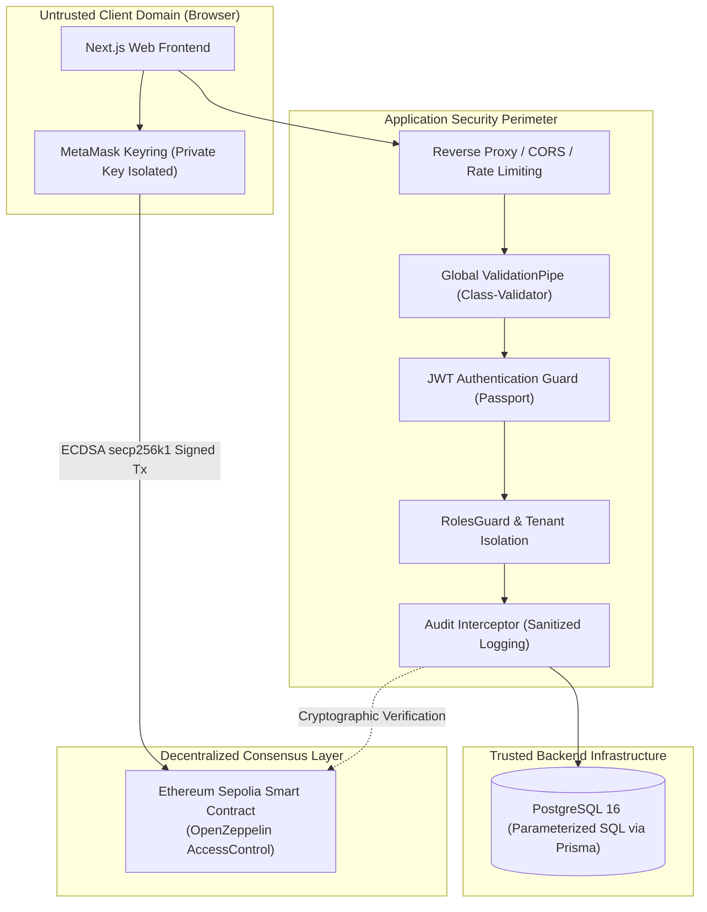

# Security Controls & Policy

This document details the security architecture, threat model mitigations, and compliance controls implemented across the B-MOST platform.

---

## 1. Security Architecture Summary



---

## 2. Implemented Security Controls

### 2.1 Identity, Authentication & Passwords
- **Password Storage**: Passwords are never stored in plaintext. They are hashed using **`bcryptjs`** with a strong work factor before storage in PostgreSQL.
- **JWT Authentication**: Authenticated sessions issue signed JSON Web Tokens (`HMAC-SHA256`) containing `userId`, `role`, and `organizationId`.
- **Stateless Tokens**: Tokens are verified on every protected API call using Passport JWT strategies (`JwtAuthGuard`).

### 2.2 Application RBAC & Tenant Isolation
- **Role Enforcement**: Protected routes enforce strict role checks via `@Roles(...)` and `RolesGuard`.
- **Organization Boundary Checks**: API services verify that the requesting user's `organizationId` matches the affected resource's owner or manufacturer, preventing cross-tenant data tampering.
- **Public Wallet Verification**: When an action is prepared, the API enforces that `user.walletAddress` and `organization.walletAddress` match the expected signing account.

### 2.3 Non-Custodial Client-Side Signing
- **No Private Keys on Servers**: The backend server holds **no private keys** and **no seed phrases**.
- **Disabled Server Signer**: `BlockchainService.getSigner()` explicitly throws `ServiceUnavailableException`.
- **Browser-Side Isolation**: All transactions are signed inside MetaMask using the user's private key. The private key never leaves the client's local browser vault.

### 2.4 Cryptographic Transaction & Receipt Verification
To protect the database against spoofed or replayed transactions, `POST /api/blockchain/actions/confirm` executes the following independent checks:
1. **Receipt Status**: Fetches the receipt directly from the Sepolia node and checks `receipt.status === 1`. Reverted or pending transactions are rejected.
2. **Contract Destination**: Verifies `receipt.to.toLowerCase() === CONTRACT_ADDRESS.toLowerCase()`.
3. **Signer Identity**: Verifies `receipt.from.toLowerCase() === intent.user.walletAddress.toLowerCase()`.
4. **Intent Validity**: Checks that the corresponding `BlockchainActionIntent` exists, is in `PENDING` state, and has not exceeded its 15-minute expiration window.
5. **Replay Protection**: The intent status is set to `CONFIRMED` upon completion, preventing the same transaction hash from being used to trigger duplicate state updates.

### 2.5 Smart Contract Access Control & Invariants
- **OpenZeppelin AccessControl**: Standardized role verification (`hasRole()`) protects administrative and manufacturing operations.
- **State Machine Invariants**: Contract functions strictly check valid state transitions (e.g. products must be `QUALITY_CHECKED` or `STORED` before a shipment can be created).
- **Ownership Modifiers**: Custody operations require `msg.sender == currentOwner`.

### 2.6 Input Validation & Defense-in-Depth
- **Global Validation Pipe**: `apps/api/src/main.ts` configures:
  ```typescript
  new ValidationPipe({
    whitelist: true,
    forbidNonWhitelisted: true,
    transform: true,
  })
  ```
  Any extraneous or undeclared fields in request payloads are immediately rejected with `400 Bad Request`.
- **SQL Injection Prevention**: All database queries are executed via Prisma ORM using parameterized queries, preventing SQL injection vulnerabilities.
- **Audit Logging**: Sensitive actions automatically trigger `AuditInterceptor`, recording timestamp, actor ID, action type, client IP address, and sanitized metadata.

---

## 3. Secret Management & Classification Policy

| Classification | Assets | Storage & Handling Rules |
| --- | --- | --- |
| **Public Assets** | Smart Contract Address, Contract ABI JSON, Sepolia Chain ID, Public Wallet Addresses, Transaction Hashes | Committed to git, included in documentation, exposed via `NEXT_PUBLIC_*` environment variables. |
| **Secret Credentials** | `JWT_SECRET`, Database Passwords (`DATABASE_URL`, `DIRECT_URL`), Private RPC Credentials | Kept strictly in ignored `.env` files or cloud secret vaults. **Never committed to version control.** |
| **Forbidden on Servers** | Ethereum Private Keys, Seed Phrases | **Never stored, transmitted, or accepted anywhere on B-MOST servers.** |

---

## 4. Threat Model & Known Constraints

1. **Physical Token Equivalence**: The blockchain guarantees the authenticity and provenance of the *digital ledger entry*. Physical anti-counterfeiting measures (tamper-evident packaging, holographic QR labels) must complement the digital certificate.
2. **Blockchain Latency & Network Reorganization**: Because Sepolia is a public testnet, gas price fluctuations and block inclusion times can introduce latency. The two-phase action protocol handles this gracefully with explicit receipts.
3. **Public RPC Rate Limiting**: Production or high-throughput environments should use authenticated RPC endpoints (e.g. Alchemy, Infura) rather than public community RPC nodes.
