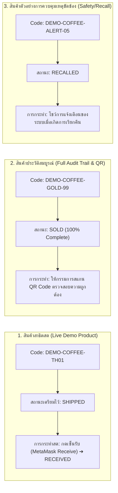

# B-MOST: System Test Cases & Presentation Dataset
**ระบบติดตามและตรวจสอบห่วงโซ่อุปทานหลายองค์กรด้วยเทคโนโลยีบล็อกเชน**

> **เอกสารคู่มือชุดข้อมูลสำหรับการทดสอบระบบ (System Test Cases) และชุดข้อมูลสำหรับใช้ในการนำเสนอ (Presentation Demo Dataset)**  
> รองรับการใช้งานร่วมกับฐานข้อมูล PostgreSQL (NestJS API), สัญญาอัจฉริยะ `SupplyChainRegistry` บน Ethereum Sepolia, และ Next.js Web Application

---

## 1. ข้อมูลโครงสร้างหลัก (Master Fixture Data)

### 1.1 ตารางข้อมูลองค์กร (Organizations)

| รหัสองค์กร (Code) | ชื่อองค์กร (Name) | ประเภท (Type) | บทบาทในระบบ | ที่อยู่กระเป๋าเงิน (Wallet Address) |
| :--- | :--- | :--- | :--- | :--- |
| `ORG-MFG-001` | Apex Tech / Doi Chang Estate | `MANUFACTURER` | ผู้ผลิตต้นน้ำ, ลงทะเบียนสินค้า, ทำ QC | Account 1: `0x0FcD93659FA339bB05A2A12Ed7000dFD714E0998` |
| `ORG-DST-001` | Global Express Logistics | `DISTRIBUTOR` | ผู้กระจายสินค้า, รับโอนกรรมสิทธิ์ Leg 1 | Account 2: `0x3f073b4f50D2B2486B632DFB4c7005FC449cED14` |
| `ORG-WRH-001` | SafeHub Central Depot | `WAREHOUSE` | คลังสินค้าส่วนกลาง, จัดเก็บ/สต็อกสินค้า | Account 2 (หรือ Account 3 กรณี 4-Hop) |
| `ORG-RTL-001` | Prime Gourmet Retail | `RETAILER` | ร้านค้าปลีก, วางจำหน่าย, บันทึกขาย (Sold) | Account 1: `0x0FcD93659FA339bB05A2A12Ed7000dFD714E0998` |
| `ORG-AUD-001` | ChainAudit Standards Bureau | `AUDITOR` | หน่วยงานตรวจสอบอิสระ, ตรวจสอบคุณภาพ | Account 1: `0x0FcD93659FA339bB05A2A12Ed7000dFD714E0998` |

### 1.2 ตารางข้อมูลผู้ใช้งานระบบ (User Accounts & Credentials)

> ทุกบัญชีทดสอบในสภาพแวดล้อม Development ใช้รหัสผ่านเริ่มต้น: **`Password123!`** (หรือ `password123`)

| บทบาท (Role) | อีเมล (Email) | องค์กรสังกัด | MetaMask Account | การใช้งานหลัก |
| :--- | :--- | :--- | :--- | :--- |
| **Super Admin** | `superadmin@bmost.io` | B-MOST Admin | Account 1 | บริหารจัดการองค์กร, ผูกกระเป๋า, ตรวจสอบภาพรวม |
| **Manufacturer** | `manufacturer@bmost.io` | `ORG-MFG-001` | Account 1 | สร้าง Draft, ลงนามบันทึกบน Blockchain, ส่งสินค้า Leg 1 |
| **Auditor** | `auditor@bmost.io` | `ORG-AUD-001` | Account 1 | ตรวจสอบคุณภาพสินค้า, อนุมัติผล QC บนเชน |
| **Distributor** | `distributor@bmost.io` | `ORG-DST-001` | Account 2 | ยืนยันการรับสินค้า (เปลี่ยน Owner), ส่งต่อสินค้า Leg 2 |
| **Warehouse** | `warehouse@bmost.io` | `ORG-WRH-001` | Account 2 | รับสินค้าเข้าจัดเก็บในคลัง (Place in Storage) |
| **Retailer** | `retailer@bmost.io` | `ORG-RTL-001` | Account 1 | รับสินค้าเข้าร้าน, บันทึกขายให้ผู้บริโภค (`markAsSold`) |

> [!IMPORTANT]
> **ข้อจำกัดเรื่อง Smart Contract Receiver Constraint**:
> ฟังก์ชัน `createShipment` ใน Smart Contract บังคับเงื่อนไข `require(receiver != msg.sender)` เพื่อป้องกันการโอนหาสตรีมกระเป๋าเดิม ดังนั้นในการทดสอบด้วย 2 บัญชี Wallet:
> **Account 1 (`0x0FcD...`) ➔ Account 2 (`0x3f07...`) ➔ Account 1 (`0x0FcD...`)**

---

## 2. ตารางชุดข้อมูลทดสอบสินค้า (Master Product Test Dataset)

### 2.1 กฎเกณฑ์และข้อกำหนดข้อมูลของสินค้า (Product Data Constraints)

| ฟิลด์ข้อมูล (Field) | ชนิดข้อมูล | เงื่อนไขความถูกต้อง (Validation Rules) | ข้อกำหนดบล็อกเชน / ฐานข้อมูล |
| :--- | :--- | :--- | :--- |
| `productCode` | String | 3–50 ตัวอักษร, Regex: `^[A-Za-z0-9_-]+$` | **Unique** ทั้งใน PostgreSQL และ Smart Contract |
| `serialNumber` | String | 3–100 ตัวอักษร | **Unique** ใน PostgreSQL |
| `name` | String | 2–150 ตัวอักษร, ห้ามว่าง (NotEmpty) | บันทึกใน Metadata และคำนวณเป็น Hash |
| `description` | String | ไม่เกิน 2,000 ตัวอักษร (Optional) | บันทึกใน Metadata |
| `category` | String | ไม่เกิน 100 ตัวอักษร (Optional) | จัดหมวดหมู่ในระบบ |
| `manufacturerId` | UUID | ต้องเป็น ID ขององค์กรประเภท `MANUFACTURER` | อัตโนมัติจาก User Token (เว้นแต่ Super Admin) |
| `currentOwnerId` | UUID | ค่าเริ่มต้นคือ `manufacturerId` | เปลี่ยนอัตโนมัติเมื่อเกิดการรับมอบ (`receiveProduct`) |
| `productHash` | String (bytes32) | `0x` + 64 ตัวอักษร Hexadecimal | ได้จาก `keccak256(metadata)` บนเชน |
| `status` | Enum (0–8) | ดูตาม State Machine | `REGISTERED` ➔ `QUALITY_CHECKED` ➔ ... ➔ `SOLD` |

### 2.2 ชุดข้อมูลทดสอบสินค้าแบ่งตามกลุ่มการใช้งาน

#### กลุ่ม A: ข้อมูลสำหรับโฟลว์ปกติ (Happy Path Test Data)

| รหัสสินค้า (`productCode`) | หมายเลขซีเรียล (`serialNumber`) | ชื่อสินค้า (`name`) | หมวดหมู่ (`category`) | สถานะเป้าหมาย | วัตถุประสงค์ในการทดสอบ |
| :--- | :--- | :--- | :--- | :--- | :--- |
| **`PRD-2026-HP-001`** | `SN-HP-90001` | Industrial Temperature Sensor T1 | Electronics / IoT | `REGISTERED` | ทดสอบการสร้าง Draft และยิงขึ้น Blockchain ครั้งแรก |
| **`PRD-2026-HP-002`** | `SN-HP-90002` | Organic Cold Brew Arabica 500ml | Food & Beverage | `QUALITY_CHECKED` | ทดสอบการส่งตรวจและผ่านการประเมินคุณภาพ (QC Pass) |
| **`PRD-2026-HP-003`** | `SN-HP-90003` | Doi Chang Geisha Micro-lot #1 | Agriculture | `SHIPPED` | ทดสอบการสร้าง Shipment ทอดที่ 1 และกด Ship |
| **`PRD-2026-HP-004`** | `SN-HP-90004` | Precision GPS Tracking Beacon v2 | Electronics / GPS | `RECEIVED` | ทดสอบการเปลี่ยนมือ (Ownership Transfer ไปยัง Distributor) |
| **`PRD-2026-HP-005`** | `SN-HP-90005` | Premium Roasted Peaberry 250g | Specialty Coffee | `SOLD` | ทดสอบการจบลูปสมบูรณ์ (ขายออกหน้าร้านสำเร็จ) |

#### กลุ่ม B: ข้อมูลทดสอบค่าขอบเขต (Boundary & Edge Cases Test Data)

| รหัสสินค้า (`productCode`) | หมายเลขซีเรียล (`serialNumber`) | ชื่อสินค้า (`name`) | หมวดหมู่ | เงื่อนไขขอบเขตที่ทดสอบ | ผลลัพธ์ที่คาดหวัง |
| :--- | :--- | :--- | :--- | :--- | :--- |
| **`A_1`** (3 ตัว) | `S-1` (3 ตัว) | `OK` (2 ตัว) | - | ค่าความยาวต่ำสุดของทุกฟิลด์ (Min Length Boundary) | บันทึกสำเร็จ (HTTP 201) |
| **`PRD-MAX-LEN-50-CHARS-TESTING-LIMIT-BOUNDARY-CHECK-01`** (50 ตัว) | `SN-MAX-LENGTH-100-CHARS-BOUNDARY-VALUE-ANALYSIS-TESTING-SYSTEM-TRACEABILITY-SERIAL-NUMBER-CHECK-SAMPLE-0001` (100 ตัว) | ชื่อยาว 150 ตัวอักษร | หมวดหมู่ยาว 100 ตัว | ค่าความยาวสูงสุดของทุกฟิลด์ (Max Length Boundary) | บันทึกสำเร็จ (HTTP 201) |
| **`PRD_TH-กาแฟดอยช้าง-01`** | `SN_ดอยช้าง_99` | กาแฟดอยช้างพิเศษ คั่วกลาง เมล็ดคัดมือ 100% | สินค้าเกษตรแปรรูป | รองรับอักขระภาษาไทย (UTF-8 Localized Content) ในชื่อและ Description | บันทึกและแสดงผลภาษาไทยได้ถูกต้อง ไม่เพี้ยน |

#### กลุ่ม C: ข้อมูลทดสอบความผิดพลาด (Negative & Validation Error Test Data)

| รหัสทดสอบ | ข้อมูลที่ป้อนเข้า (Invalid Input) | สาเหตุที่ผิดพลาด | รหัส HTTP / รหัสข้อผิดพลาดที่คาดหวัง |
| :--- | :--- | :--- | :--- |
| **TC-PRD-ERR-01** | `productCode`: `PRD-2026-HP-001` (ซ้ำกับรายการที่มีอยู่แล้ว) | Duplicate Product Code ในฐานข้อมูล | `409 Conflict` (`PRODUCT_ALREADY_EXISTS`) |
| **TC-PRD-ERR-02** | `serialNumber`: `SN-HP-90001` (ซ้ำกับรายการที่มีอยู่แล้ว) | Duplicate Serial Number | `409 Conflict` (`SERIAL_NUMBER_ALREADY_EXISTS`) |
| **TC-PRD-ERR-03** | `productCode`: `PRD@COFFEE#01!` (มีอักขระพิเศษผิดกฎ) | ไม่ตรงตาม Regex `^[A-Za-z0-9_-]+$` | `400 Bad Request` (`productCode must contain only alphanumeric characters...`) |
| **TC-PRD-ERR-04** | `productCode`: `AB` (2 ตัวอักษร) | สั้นกว่าเกณฑ์ขั้นต่ำ 3 ตัวอักษร | `400 Bad Request` (`productCode must be longer than or equal to 3 characters`) |
| **TC-PRD-ERR-05** | `name`: `""` หรือเว้นว่าง (Empty String) | ฟิลด์ `name` เป็นฟิลด์บังคับ | `400 Bad Request` (`name should not be empty`) |
| **TC-PRD-ERR-06** | ผู้ใช้ Role `DISTRIBUTOR` พยายามสร้างสินค้า | ไม่ใช่บทบาท `MANUFACTURER` | `403 Forbidden` (`FORBIDDEN_RESOURCE`) |

#### กลุ่ม D: ข้อมูลทดสอบบล็อกเชนและความปลอดภัย (Blockchain Integrity & Tamper Test Data)

| รหัสสินค้า | ข้อมูลจำลองบนเชน (On-Chain Reference) | ข้อมูลจำลองในฐานข้อมูล (Database Values) | พฤติกรรมการทดสอบ | ผลลัพธ์ที่คาดหวัง |
| :--- | :--- | :--- | :--- | :--- |
| **`PRD-BC-VERIFY-OK`** | `productHash`: `0x4a7c8e...`<br>Status: `5` (`RECEIVED`) | Metadata Hash คำนวณได้ตรงกัน | สแกนหน้า `/verify` ตรวจสอบสาธารณะ | แถบสีเขียว **"Authentic Product Verified"** |
| **`PRD-BC-TAMPER-01`** | `productHash`: `0x4a7c8e...`<br>Name: "Sensor A" | มีการแอบแก้ Name ใน PostgreSQL เป็น "Sensor Fake" | สแกนหน้า `/verify` | ระบบตรวจจับ Hash Mismatch ➔ แสดงเตือน **"Data Integrity Warning"** |
| **`PRD-BC-RECALL-99`** | `blockchainProductId`: `99`<br>Status: `8` (`RECALLED`) | Status: `RECALLED`<br>Reason: "Chemical residue" | ตรวจสอบผ่าน API และหน้าสาธารณะ | ระงับการทำธุรกรรมต่อ และแสดงป้ายสีแดงเตือนสินค้าถูกเรียกคืน |

---

### 2.3 ตารางขั้นตอนกรณีทดสอบสินค้า (Detailed Product Test Cases Matrix)

#### TC-PRD-01: การสร้าง Draft สินค้าใหม่โดยผู้ผลิต (Create Product Draft)
- **Role / Token**: `manufacturer@bmost.io` (`ORG-MFG-001`)
- **Method & Endpoint**: `POST /api/products`
- **Request Body (JSON)**:
  ```json
  {
    "productCode": "PRD-2026-HP-001",
    "serialNumber": "SN-HP-90001",
    "name": "Industrial Temperature Sensor T1",
    "description": "High-precision industrial telemetry node with -40C to 85C range",
    "category": "Electronics / IoT",
    "registerOnBlockchain": false
  }
  ```
- **ผลลัพธ์ที่คาดหวัง**:
  - HTTP Status: `201 Created`
  - คืนค่า Object ที่มี `id` (UUID), `manufacturerId` ถูกตั้งค่าตรงกับองค์กรของผู้ใช้โดยอัตโนมัติ
  - `status` เป็น `REGISTERED`, `blockchainProductId` และ `blockchainTxHash` ยังเป็น `null`

#### TC-PRD-02: การลงทะเบียนสินค้าขึ้นบน Ethereum Sepolia (Register on Blockchain)
- **Role / Token**: `manufacturer@bmost.io` พร้อม MetaMask Account 1 (`0x0FcD...0998`)
- **ขั้นตอน Two-Phase Action**:
  1. **Prepare Phase** (`POST /api/blockchain/actions/prepare`):
     ```json
     {
       "action": "REGISTER_PRODUCT",
       "entityType": "PRODUCT",
       "entityId": "<product-uuid-from-TC-PRD-01>"
     }
     ```
     ➔ คืนค่า Action Intent ID พร้อมฟังก์ชัน ABI `registerProduct(string productCode, bytes32 productHash)`
  2. **Sign Phase**: ผู้ใช้กดยืนยันเซ็นธุรกรรมบน MetaMask ด้วย Account 1
  3. **Confirm Phase** (`POST /api/blockchain/actions/confirm`):
     ```json
     {
       "actionIntentId": "<action-intent-uuid>",
       "transactionHash": "0x1234567890abcdef..."
     }
     ```
- **ผลลัพธ์ที่คาดหวัง**:
  - HTTP Status: `200 OK`
  - Backend ตรวจสอบ Transaction Receipt บน Sepolia RPC สำเร็จ
  - ฟิลด์ `blockchainProductId` ได้รับเลข On-chain ID (เช่น `1`, `2`, ...)
  - เกิด Event `ProductRegistered` บน Smart Contract

#### TC-PRD-03: การดึงข้อมูลสินค้าแบบสาธารณะผ่านรหัสสินค้า (Public Product Lookup)
- **Role**: ใครก็ได้ (Unauthenticated / Public Consumer)
- **Method & Endpoint**: `GET /api/products/public/PRD-2026-HP-001`
- **ผลลัพธ์ที่คาดหวัง**:
  - HTTP Status: `200 OK`
  - คืนค่ารายละเอียดสินค้า, ข้อมูลผู้ผลิต, ประวัติเส้นทาง (Timeline), และสถานะความถูกต้องของ Hash
  - ไม่เปิดเผยข้อมูลภายในที่ไม่เกี่ยวข้อง (เช่น Password Hash หรือ Internal User IDs)

---

### 2.4 ตัวอย่างคำสั่ง cURL สำหรับทดสอบ API สินค้า

#### 1. ล็อกอินรับ JWT Token ของ Manufacturer
```bash
curl -X POST http://localhost:4000/api/auth/login \
  -H "Content-Type: application/json" \
  -d '{
    "email": "manufacturer@bmost.io",
    "password": "Password123!"
  }'
```

#### 2. ยิงสร้างสินค้าใหม่ (Draft)
```bash
curl -X POST http://localhost:4000/api/products \
  -H "Content-Type: application/json" \
  -H "Authorization: Bearer <ACCESS_TOKEN>" \
  -d '{
    "productCode": "PRD-2026-DEMO-01",
    "serialNumber": "SN-DEMO-90001",
    "name": "Doi Chang Reserve Geisha Coffee",
    "description": "Organic specialty coffee batch 2026-A1",
    "category": "Food & Beverage"
  }'
```

#### 3. ตรวจสอบสินค้าแบบ Public (จำลอง Consumer)
```bash
curl -X GET http://localhost:4000/api/products/public/PRD-2026-DEMO-01
```

---

## 3. ชุดกรณีทดสอบระบบครบวงจร (End-to-End System Test Cases Matrix)

### TC-SYS-01: การสร้าง Draft สินค้าและลงทะเบียนบน Blockchain (Registration)
- **ประเภท**: Positive / Functional
- **ผู้กระทำ (Actor)**: `manufacturer@bmost.io` (MetaMask Account 1)
- **ข้อมูลทดสอบ (Input Data)**:
  - Product Code: `TC-PROD-2026-01`
  - Serial Number: `SN-TEST-90001`
  - Name: `High-Precision IoT Environmental Sensor v2`
  - Category: `Electronics`
  - Product Hash: `0x5f4a7c8e9b0d1e2f3a4b5c6d7e8f9a0b1c2d3e4f5a6b7c8d9e0f1a2b3c4d5e6f`
- **ขั้นตอนการทดสอบ (Test Steps)**:
  1. เข้าสู่ระบบด้วยบัญชี Manufacturer
  2. ไปที่เมนู Products (`/products/new`) กรอกข้อมูลสินค้าและกด "Save Draft"
  3. ตรวจสอบสถานะในฐานข้อมูล PostgreSQL ต้องเป็น `REGISTERED` และ `blockchainProductId` ยังเป็น null
  4. กดปุ่ม "Register on Blockchain"
  5. ตรวจสอบการจำลองธุรกรรม (Prepare Action Intent) และกดยืนยันบน MetaMask
- **ผลลัพธ์ที่คาดหวัง (Expected Results)**:
  - MetaMask ส่งธุรกรรม `registerProduct("TC-PROD-2026-01", bytes32)` สำเร็จ
  - สถานะอัปเดตเป็น `REGISTERED` พร้อมบันทึก `blockchainProductId` และ `blockchainTxHash`
  - ตรวจสอบ Event `ProductRegistered` บน Sepolia Smart Contract มีค่า Address ผู้ผลิตและผู้ครอบครองเริ่มต้นเป็น Account 1

---

### TC-SYS-02: การตรวจประเมินคุณภาพสินค้า (Quality Assurance Inspection)
- **ประเภท**: Positive & Negative Functional
- **ผู้กระทำ (Actor)**: `auditor@bmost.io` หรือ `manufacturer@bmost.io` (Account 1)
- **ชุดข้อมูลย่อย**:
  - **Case 02A (Pass)**:
    - Product Code: `TC-PROD-2026-01`
    - Inspector Name: `Piti Inspector`
    - Result: `PASSED`
    - Notes: `Calibration standards ISO-17025 met. Cryptographic key pair validated.`
  - **Case 02B (Fail)**:
    - Product Code: `TC-PROD-FAIL-02`
    - Inspector Name: `Piti Inspector`
    - Result: `FAILED`
    - Notes: `Hermetic seal leakage detected during vacuum stress test.`
- **ผลลัพธ์ที่คาดหวัง**:
  - สำหรับ Case 02A: สถานะสินค้าเปลี่ยนเป็น `QUALITY_CHECKED` พร้อมระบุข้อมูลผู้ตรวจและ Transaction Hash
  - สำหรับ Case 02B: บันทึกข้อมูลผลลัพธ์ว่า `FAILED` ในฐานข้อมูล และสินค้าไม่สามารถสร้าง Shipment ส่งต่อในสายการผลิตได้

---

### TC-SYS-03: การส่งสินค้าหลายทอดและการโอนกรรมสิทธิ์ข้ามองค์กร (Multi-Leg Logistics & Ownership Handover)
- **ประเภท**: End-to-End Business Flow
- **ขั้นตอนและชุดข้อมูล**:
  - **Leg 1 (Manufacturer ➔ Distributor)**:
    - Sender: `ORG-MFG-001` (Account 1)
    - Receiver: `ORG-DST-001` (Account 2)
    - Shipment Code: `SHIP-TC-LEG1-001`
    - Origin: `Apex Factory, Pathum Thani`
    - Destination: `Global Distribution Hub, Samut Prakan`
    - ขั้นตอน:
      1. Manufacturer สร้าง Shipment (`createShipment`) ➔ สถานะสินค้าเป็น `READY_TO_SHIP`, สถานะ Shipment เป็น `PENDING`
      2. Manufacturer กดส่ง (`shipProduct`) ➔ สถานะสินค้าและ Shipment เป็น `SHIPPED`
      3. สลับกระเป๋าเป็น Account 2, ล็อกอิน Distributor (`distributor@bmost.io`)
      4. Distributor กดยืนยันการรับ (`receiveProduct`)
    - **ผลลัพธ์ที่คาดหวัง (Atomic Handover)**:
      - Shipment เปลี่ยนเป็น `DELIVERED`
      - สินค้าเปลี่ยนเป็น `RECEIVED`
      - **Current Owner บน Smart Contract เปลี่ยนจาก Account 1 เป็น Account 2 ทันที!**
  - **Leg 2 (Distributor ➔ Retailer)**:
    - Sender: `ORG-DST-001` (Account 2)
    - Receiver: `ORG-RTL-001` (Account 1)
    - Shipment Code: `SHIP-TC-LEG2-002`
    - Origin: `Global Distribution Hub, Samut Prakan`
    - Destination: `Prime Retail Flagship, Sukhumvit Bangkok`
    - ขั้นตอน:
      1. Distributor สั่งจัดเก็บก่อน (`storeProduct`) ➔ สถานะเป็น `STORED`
      2. Distributor สร้าง Shipment ส่งต่อให้ Retailer ➔ `createShipment` & `shipProduct`
      3. สลับกระเป๋ากลับเป็น Account 1, ล็อกอิน Retailer (`retailer@bmost.io`)
      4. Retailer กดยืนยันรับมอบ (`receiveProduct`)
    - **ผลลัพธ์ที่คาดหวัง**:
      - Current Owner บน Smart Contract เปลี่ยนกลับมาเป็น Account 1 ของ Retailer อย่างถูกต้อง

---

### TC-SYS-04: การวางจำหน่ายและการบันทึกขายสินค้า (Retail Storage & Point-of-Sale)
- **ประเภท**: Positive / Terminal State
- **ผู้กระทำ (Actor)**: `retailer@bmost.io` (MetaMask Account 1)
- **ข้อมูลทดสอบ**:
  - Product Code: สินค้าจาก Leg 2 (สถานะปัจจุบัน `RECEIVED` โดย Retailer)
- **ขั้นตอนการทดสอบ**:
  1. Retailer กด "Place in Storage" (`storeProduct`) เพื่อนำขึ้นชั้นวาง ➔ สถานะเป็น `STORED`
  2. เมื่อเกิดการขายจริงให้ลูกค้า Retailer กดปุ่ม "Mark as Sold" (`markAsSold`)
  3. ยืนยันการลงนามธุรกรรมบน MetaMask
- **ผลลัพธ์ที่คาดหวัง**:
  - Smart Contract ตรวจสอบว่าผู้เรียกคือ `currentOwner`
  - สถานะสินค้าเปลี่ยนเป็น `SOLD`
  - เกิด Event `ProductSold(productId, seller, timestamp)`

---

### TC-SYS-05: การจัดการสินค้าที่มีปัญหาและการเรียกคืนฉุกเฉิน (Product Recall)
- **ประเภท**: Exception Handling / Incident Management
- **ผู้กระทำ (Actor)**: `manufacturer@bmost.io` หรือ `superadmin@bmost.io`
- **ข้อมูลทดสอบ**:
  - Product Code: `TC-PROD-RECALL-99`
  - Recall Reason: `Batch Contamination: High level of foreign particulates found in lot QA.`
- **ผลลัพธ์ที่คาดหวัง**:
  - เรียกคำสั่ง `recallProduct(productId, reason)` บน Smart Contract
  - สถานะสินค้าเปลี่ยนเป็น `RECALLED`
  - สินค้ารายการนี้จะถูกระงับการสร้าง Shipment และระงับการขายทันที

---

### TC-SYS-06: กรณีทดสอบความปลอดภัยและข้อจำกัดของระบบ (Negative & Edge Cases)

| รหัสทดสอบ | เงื่อนไขการทดสอบ (Test Condition) | ข้อมูลป้อนเข้า (Inputs) | พฤติกรรมที่คาดหวัง (Expected Behavior) | รหัสข้อผิดพลาด / สัญญาณ |
| :--- | :--- | :--- | :--- | :--- |
| **TC-SEC-01** | พยายามลงทะเบียนด้วย Product Code ซ้ำ | Code เดิมที่เคยลงทะเบียนแล้ว | ระบบปฏิเสธบน Smart Contract | `PRODUCT_ALREADY_EXISTS` |
| **TC-SEC-02** | ผู้ใช้ที่ไม่ใช่ Manufacturer พยายามลงทะเบียน | ล็อกอิน Distributor แล้วยิง `registerProduct` | Smart Contract ปฏิเสธสิทธิ์ | `UNAUTHORIZED_ACTION` |
| **TC-SEC-03** | ส่งสินค้าให้กระเป๋าตัวเอง (Self-Shipment) | Sender = Account 1, Receiver = Account 1 | Smart Contract ปฏิเสธ | `INVALID_RECEIVER` |
| **TC-SEC-04** | ข้ามขั้นตอน: พยายามกดยืนยันรับทั้งที่ยังไม่ส่ง | Shipment สถานะ `PENDING` | ปุ่มรับสินค้าปิดใช้งาน หรือ Chain ปฏิเสธ | `SHIPMENT_NOT_SHIPPED` |
| **TC-SEC-05** | ขโมยสิทธิ์รับสินค้า (Wrong Receiver) | บัญชีอื่นที่ไม่ใช่ Receiver ที่ระบุไว้พยายามเรียก `receiveProduct` | Smart Contract ตรวจสอบและยกเลิก | `UNAUTHORIZED_ACTION` |
| **TC-SEC-06** | บันทึกขายสินค้าทั้งที่ยังไม่จัดเก็บ | สินค้าสถานะ `SHIPPED` แล้วกด `markAsSold` | Smart Contract ตรวจสอบ State Machine | `INVALID_STATE` |
| **TC-SEC-07** | Intent หมดอายุ (Expired Action Intent) | สร้าง Action Intent ทิ้งไว้เกิน 15 นาที แล้วส่ง Confirm | Backend API ปฏิเสธการบันทึก | `ACTION_INTENT_EXPIRED` |

---

### TC-SYS-07: การตรวจสอบสาธารณะผ่าน QR Code (Public Verification & Tamper Detection)
- **ประเภท**: Consumer Facing / Integrity Check
- **URL**: `http://localhost:3000/verify/{productCode}` (เข้าดูได้โดยไม่ต้องเข้าสู่ระบบ)
- **ชุดข้อมูลย่อย**:
  - **Case 07A (Valid Hash)**:
    - Code: `TC-PROD-2026-01` (ข้อมูลในฐานข้อมูลตรงกับค่า Hash บนเชน)
    - แสดงผล: แถบสีเขียว **"Authentic Product Verified on Sepolia"** พร้อมไทม์ไลน์ประวัติครบถ้วน
  - **Case 07B (Tampered / Altered Data)**:
    - มีการพยายามแก้ไขข้อมูลใน Database (เช่น เปลี่ยน serialNumber หรือ description โดยไม่ผ่านบล็อกเชน)
    - แสดงผล: ระบบตรวจสอบ Hash ไม่ตรงกับ `productHash` บนบล็อกเชน ➔ แสดงคำเตือน **"Data Integrity Mismatch / Verification Warning"**

---

## 4. ชุดข้อมูลสำหรับการนำเสนอ (Presentation Demo Dataset)

สำหรับการนำเสนอ 3–5 นาที ให้เตรียมสินค้าไว้ **3 ตัวอย่าง** เพื่อครอบคลุมทั้งการสาธิตสด (Live Interaction), การตรวจสอบย้อนกลับแบบสมบูรณ์ (Full Traceability QR), และการตอบคำถามเรื่องความปลอดภัย (Recall Demonstration):



---

### 4.1 ข้อมูลสินค้าตัวอย่างที่ 1: "Hero Demo Item" (สำหรับการสาธิตสดหน้างาน)
> **วัตถุประสงค์**: ใช้สำหรับสาธิตการโอนย้ายกรรมสิทธิ์แบบเรียลไทม์ (Live Custody Handover) ผ่าน MetaMask ในช่วงเวลา 1 นาที โดยไม่ต้องเสียเวลารอทำตั้งแต่ต้นทาง

- **รหัสสินค้า (Product Code)**: `DEMO-COFFEE-TH01`
- **หมายเลขซีเรียล (Serial Number)**: `SN-GEISHA-2026-001`
- **ชื่อสินค้า (Product Name)**: `Doi Chang Single Estate Reserve Geisha (Batch A1)`
- **หมวดหมู่ (Category)**: `Agricultural Products / Specialty Coffee`
- **คำอธิบาย (Description)**: `Direct-trade micro-lot organic coffee cherries harvested at 1,500m elevation. Cold-fermented and sun-dried.`
- **Blockchain Product ID**: `1` (หรือ ID ถัดไปบน Sepolia)
- **ผู้ผลิต (Origin)**: Doi Chang Estate (`ORG-MFG-001`), Chiang Rai, Thailand
- **สถานะที่เตรียมไว้ก่อนเริ่มพรีเซนต์ (Pre-staged State)**:
  - ผ่านการลงทะเบียนบน Blockchain แล้ว (`REGISTERED`)
  - ผ่านการตรวจคุณภาพเกรด A แล้ว (`QUALITY_CHECKED`)
  - สร้าง Shipment และกดส่งแล้ว (`SHIPPED`) อยู่ระหว่างเดินทางไปศูนย์กระจายสินค้า
- **บทการสาธิตสด (Live Demo Action)**:
  1. ล็อกอินเข้าเป็น **Distributor (`distributor@bmost.io`)** ในเบราว์เซอร์
  2. ตรวจสอบกระเป๋า MetaMask เป็น **Account 2 (`0x3f07...ED14`)**
  3. ไปที่เมนู Shipments หรือหน้ารายละเอียดสินค้า ➔ กดปุ่ม **"Confirm Receipt"**
  4. หน้าต่าง MetaMask ปรากฏขึ้นเพื่อเรียกฟังก์ชัน `receiveProduct` ➔ กด **Confirm**
  5. เมื่อธุรกรรมยืนยัน สถานะสินค้าจะเปลี่ยนเป็น **`RECEIVED`** และผู้ครอบครอง (Current Owner) จะเปลี่ยนเป็น Distributor ต่อหน้าผู้ชมทันที!

---

### 4.2 ข้อมูลสินค้าตัวอย่างที่ 2: "Full Provenance Showcase" (สำหรับให้ผู้ชมสแกน QR Code)
> **วัตถุประสงค์**: แสดงเส้นทางประวัติสินค้าตั้งแต่ต้นน้ำจนถึงการขายสำเร็จ (100% Complete Lifecycle) เพื่อเปิดหน้า Public Verification และให้คณะกรรมการสแกนดูจากสมาร์ตโฟน

- **รหัสสินค้า (Product Code)**: `DEMO-COFFEE-GOLD-99`
- **หมายเลขซีเรียล (Serial Number)**: `SN-GOLD-2026-888`
- **ชื่อสินค้า (Product Name)**: `B-MOST Signature Arabica Peaberry Lot #99`
- **หมวดหมู่ (Category)**: `Food & Beverage`
- **สถานะสุดท้าย (Final Status)**: `SOLD` (วางจำหน่ายและถูกซื้อเรียบร้อยแล้ว)
- **URL สำหรับตรวจสอบ (Public Verification URL)**:
  `http://localhost:3000/verify/DEMO-COFFEE-GOLD-99`
- **ไทม์ไลน์ประวัติสินค้า (Complete Provenance Milestones)**:

| ลำดับ | กิจกรรม (Milestone Event) | ผู้กระทำ (Actor / Org) | สถานะที่ได้รับ | ข้อมูลธุรกรรมจำลอง (Mock Sepolia Hash) |
| :---: | :--- | :--- | :--- | :--- |
| 1 | **ลงทะเบียนสินค้า (Registration)** | Doi Chang Estate (`ORG-MFG-001`) | `REGISTERED` | `0x1a8f9b...3c4d` (Block #6942010) |
| 2 | **ตรวจประเมินคุณภาพ (Quality Inspection)** | ChainAudit Standards (`ORG-AUD-001`) | `QUALITY_CHECKED` | `0x2b7e8a...5f6e` (Block #6942018) |
| 3 | **จัดส่งทอดที่ 1 (Outbound Leg 1)** | Doi Chang Estate ➔ Global Logistics | `SHIPPED` | `0x3c6d7f...8a9b` (Block #6942032) |
| 4 | **รับมอบสินค้า Leg 1 (Custody Handover)** | Global Express Logistics (`ORG-DST-001`) | `RECEIVED` | `0x4d5e6a...1b2c` (Block #6942045) |
| 5 | **จัดเก็บในคลัง (Depot Storage)** | Global Logistics Hub | `STORED` | `0x5e4f3b...2c3d` (Block #6942055) |
| 6 | **จัดส่งทอดที่ 2 (Outbound Leg 2)** | Global Logistics ➔ Prime Gourmet Retail | `SHIPPED` | `0x6f3e2a...4d5e` (Block #6942070) |
| 7 | **รับมอบสินค้า Leg 2 (Retail Intake)** | Prime Gourmet Retail (`ORG-RTL-001`) | `RECEIVED` | `0x7a2d1f...6e7f` (Block #6942085) |
| 8 | **จัดแสดงสินค้าหน้าร้าน (Display)** | Prime Retail Flagship | `STORED` | `0x8b1c0e...8f9a` (Block #6942095) |
| 9 | **ขายสินค้าสำเร็จ (Point-of-Sale)** | Prime Gourmet Retail ➔ Consumer | `SOLD` | `0x9c0b9d...0a1b` (Block #6942110) |

---

### 4.3 ข้อมูลสินค้าตัวอย่างที่ 3: "Recall & Incident Response" (สำหรับกรณีศึกษาด้านความปลอดภัย)
> **วัตถุประสงค์**: แสดงความสามารถของแพลตฟอร์มในการรับมือวิกฤตความปลอดภัยในห่วงโซ่อุปทาน (Food Safety Incident)

- **รหัสสินค้า (Product Code)**: `DEMO-COFFEE-ALERT-05`
- **หมายเลขซีเรียล (Serial Number)**: `SN-RECALL-9005`
- **ชื่อสินค้า (Product Name)**: `Organic Cold Brew Concentrate 1L`
- **สถานะ (Status)**: `RECALLED` (ถูกเรียกคืน)
- **เหตุผลการเรียกคืน (Recall Reason)**:
  `"Quality audit failure: Cold-chain temperature fluctuation exceeded 8°C during Leg 1 transport. Spoilage risk identified."`
- **ข้อความสำหรับตอบคำถามกรรมการ**:
  *"เมื่อเกิดเหตุผิดปกติในห่วงโซ่อุปทาน หน่วยงานที่มีสิทธิ์สามารถสั่ง Recall สินค้าบน Smart Contract ได้ทันที ซึ่งจะระงับการกระจายสินค้าและการขายต่อทั่วทั้งระบบ พร้อมทั้งแจ้งเตือนบนหน้า Public Verification หากผู้บริโภคนำไปสแกน"*

---

## 5. ตารางคิวการนำเสนอและสคริปต์พูด 5 นาที (5-Minute Live Presentation Cue Sheet)

| เวลา (Time) | หน้าจอ / ขั้นตอน (Screen / Action) | บัญชีที่ใช้ | ข้อมูลที่แสดง (Data Displayed) | บทพูดนำเสนอ (Thai Presenter Script) |
| :---: | :--- | :--- | :--- | :--- |
| **0:00 – 0:45** | **หน้าสไลด์ภาพรวม & Dashboard** | - | ภาพรวมแนวคิด *"One Product. One Journey. Verifiable History."* | "สวัสดีครับ B-MOST คือแพลตฟอร์มติดตามห่วงโซ่อุปทานด้วยบล็อกเชน โดยสินค้า 1 ชิ้นจะมีตัวตนเดียวตลอดเส้นทาง ไม่มีการสร้างข้อมูลซ้ำซ้อนในแต่ละองค์กรครับ" |
| **0:45 – 1:30** | **หน้ารายละเอียดสินค้า (`/products`)** | Manufacturer (Account 1) | สินค้า `DEMO-COFFEE-TH01` สถานะ `SHIPPED` | "เราเตรียมสินค้ากาแฟพิเศษล็อตนี้ไว้ โดยผ่านการลงทะเบียนบน Sepolia และตรวจคุณภาพเรียบร้อยแล้ว ขณะนี้สินค้าถูกส่งออกมายังผู้กระจายสินค้าครับ" |
| **1:30 – 2:45** | **การรับสินค้าสด (`/shipments`)** | Distributor (Account 2) | กด **Confirm Receipt** ➔ ยืนยัน MetaMask | "เมื่อสินค้ามาถึงคลัง ผู้กระจายสินค้าจะใช้กระเป๋าเงินประจำองค์กรลงนามรับมอบบนเชนทันที เมื่อธุรกรรมสำเร็จ สัญญาอัจฉริยะจะเปลี่ยนสิทธิ์ความเป็นเจ้าของ (Current Owner) มาเป็น Distributor โดยอัตโนมัติครับ" |
| **2:45 – 3:45** | **หน้าการตรวจสอบย้อนกลับ (`/traceability`)** | - | เส้นทางไทม์ไลน์ของ `DEMO-COFFEE-GOLD-99` | "นี่คือหน้า Traceability ของอีกล็อตที่ผ่านกระบวนการจนถึงการจำหน่าย (SOLD) สังเกตว่าทุกลำดับเหตุการณ์มี Transaction Hash ผูกกับบล็อกจริงบน Sepolia อย่างโปร่งใส" |
| **3:45 – 4:30** | **หน้าตรวจสอบสาธารณะ (`/verify`)** | ไม่ต้องล็อกอิน | เปิดหน้าเว็บหรือแสดง QR Code ให้สแกน | "สำหรับผู้บริโภค สามารถใช้สมาร์ตโฟนสแกน QR Code บนกล่องสินค้าเพื่อดูหน้าความน่าเชื่อถือนี้ได้ทันที โดยระบบจะคำนวณ Cryptographic Hash ตรวจสอบความถูกต้องแบบ Real-time ครับ" |
| **4:30 – 5:00** | **สรุปผลและช่วงตอบข้อซักถาม (Q&A)** | - | สรุปคุณค่าของระบบ (Data Integrity & Trust) | "B-MOST ช่วยแก้ปัญหา Data Silo และข้อพิพาทเรื่องการเปลี่ยนมือสินค้าได้อย่างเบ็ดเสร็จครับ ขอขอบคุณและยินดีรับฟังคำถามครับ" |

---

## 6. ข้อมูลสถิติเชิงตัวเลขสำหรับใส่ในสไลด์นำเสนอ (Presentation Key Metrics)

| ตัวชี้วัด (Metric) | ค่าที่แสดง (Value) | คำอธิบายเพื่อสนับสนุนความน่าเชื่อถือ |
| :--- | :--- | :--- |
| **Target Blockchain Network** | Ethereum Sepolia Testnet | เชนมาตรฐานที่รองรับ Smart Contract สากล (Chain ID `11155111`) |
| **Smart Contract Address** | `0x74fd4f89b8ab7a3100b3291b7aeb43448f13c43a` | มีการ Deploy และ Verify รหัสสัญญาเรียบร้อย |
| **Average Finality Time** | ~12 – 15 วินาที | ความเร็วในการ Mined Block บน Sepolia |
| **Transaction Signing Model** | Non-Custodial (MetaMask) | กุญแจส่วนตัวอยู่ที่ผู้ใช้ 100% องค์กรไม่ต้องฝาก Private Key ไว้ที่เซิร์ฟเวอร์ |
| **Consumer Access Friction** | Zero Gas & Zero Wallet | ผู้บริโภคตรวจสอบผ่าน QR Code ได้ทันทีโดยไม่ต้องมีกระเป๋าเงินคริปโต |
| **Architecture Pattern** | Hybrid Relational + Ledger | ความเร็วระดับมิลลิวินาทีด้วย PostgreSQL ร่วมกับความมั่นคงปลอดภัยของบล็อกเชน |

---

## 7. แนวทางปฏิบัติกรณีเกิดเหตุขัดข้องหน้างาน (Demo Fallback Procedure)

1. **กรณี Sepolia RPC ช้า หรือ MetaMask Pending นาน**:
   - เปิดแท็บที่ 2 ซึ่งเตรียมหน้า `DEMO-COFFEE-GOLD-99` ที่มีประวัติธุรกรรมสมบูรณ์ไว้แล้ว
   - ชี้แจงแก่คณะกรรมการ: *"เนื่องจากเครือข่ายบล็อกเชนสาธารณะอาจมีความหน่วงตามสภาพทราฟฟิกจริง ขออนุญาตแสดงผลลัพธ์ของธุรกรรมที่ได้รับการยืนยันเรียบร้อยแล้วในล็อตคู่ขนานครับ"*
2. **กรณีอินเทอร์เน็ตบนมือถือเข้า Localhost ไม่ได้**:
   - ให้เปิดหน้า Public Verification บนแท็บเดสก์ท็อปแบบ Incognito Mode (ไม่ล็อกอิน) เพื่อพิสูจน์ว่าผู้ใช้ทั่วไปเข้าถึงข้อมูลได้จริงโดยไม่ต้องมีสิทธิ์ของระบบ
